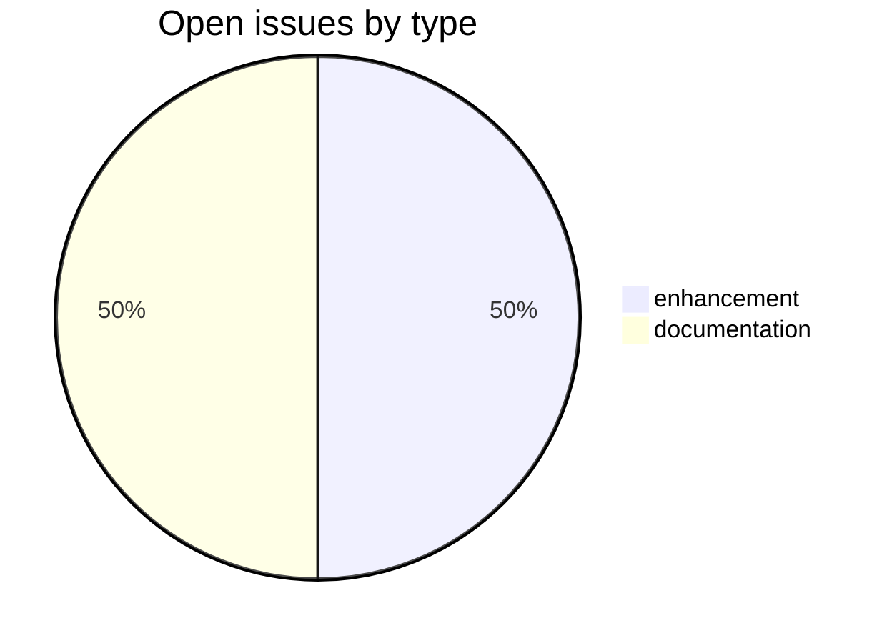
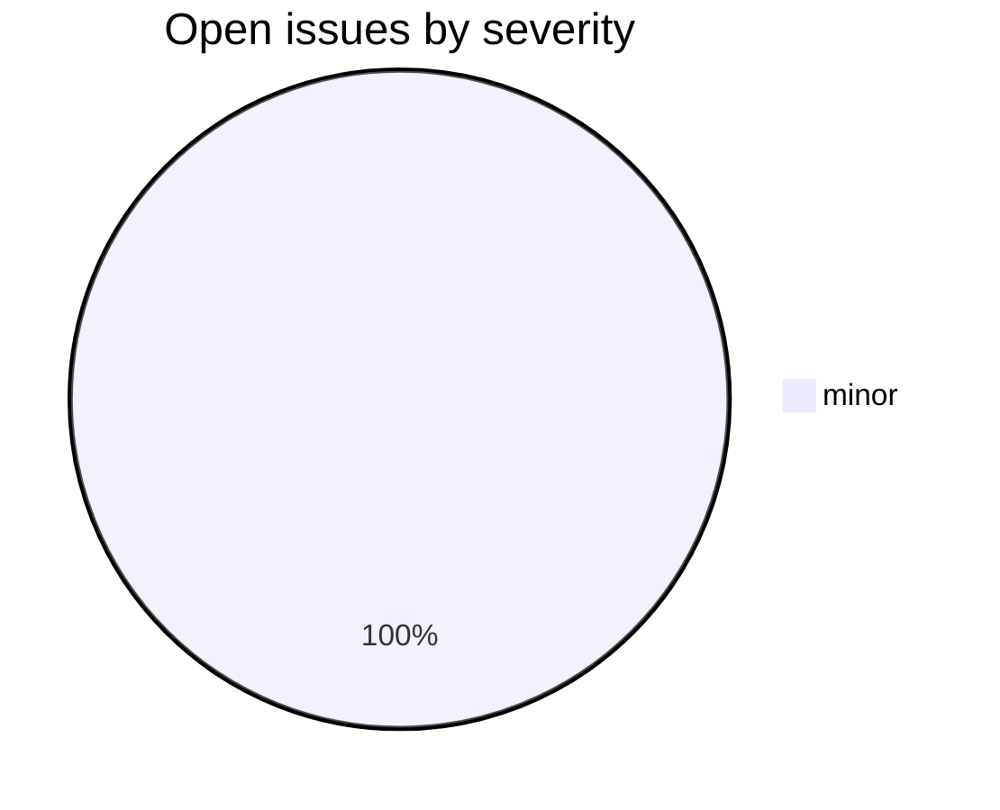

# csl-observatory

> **Live observatory for 12 years of Cologne Digital Sanskrit Lexicon (CDSL).**
> Tracking 77 repos, 5,280 issues+PRs, 9,176 commits, and 17+ contributors since 2014.

## What this is

A meta-repository that **measures the entire sanskrit-lexicon GitHub organisation** and turns 12 years of distributed work into measurable, citable, reproducible knowledge. It is intentionally limited to repositories, issues, pull requests, commits, contributors, workflows, and organization-level maintenance evidence.

## Quick links

- **[Observatory dashboard](https://sanskrit-lexicon.github.io/csl-observatory/)** — live charts (deploys after first GH Actions build)
- **[Boundary rules](docs/BOUNDARY_RULES.md)** — what belongs in the GitHub/org observatory, and what must move elsewhere
- **[Design document](docs/OBSERVATORY_DESIGN.md)** — boundary-safe architecture and KPI scope
- **[Data downloads](data/)** — every chart's source as CSV / JSON / Parquet
- **[Runbooks](runbook/)** — the issue-taxonomy procedures applied to all 63 active repos
- **[Contributor & work statistics](docs/CONTRIBUTOR_STATS.md)** — per-contributor & per-repo commits, churn, tenure, and issues (2014–2026)
- **[Improvement & optimization roadmap](docs/ROADMAP.md)** — prioritized engineering/quality roadmap for the whole ecosystem
- **[Research & practitioner layer](docs/RESEARCH_LAYER_ROADMAP.md)** — moved pointer; dictionary-structure research now lives in `csl-atlas`
- **[Decisions needed](docs/DECISIONS_NEEDED.md)** — open items blocked on a maintainer (decisions, credentials, confirmations)

## What's in this repo

| Path | Purpose |
|---|---|
| `observatory/fetch.py` | Fetches all GitHub data for 77 repos (issues, commits, PRs, metadata) |
| `observatory/transform.py` | Turns raw snapshots into time-series CSVs |
| `observatory/build_people.py` | Consolidates contributor identities from CITATION.cff + GitHub |
| `observatory/site/` | Observable Framework dashboard source |
| `data/` | Transformed time-series CSVs (snapshot 2026-05) |
| `docs/OBSERVATORY_DESIGN.md` | Boundary-safe design doc with GitHub/org KPI catalog |
| `runbook/cologne-issue-runbook.md` | 16-phase **dictionary**-repo taxonomy (35 repos) |
| `runbook/cologne-tooling-runbook.md` | 17-phase **tooling**-repo taxonomy (28 repos) |
| `.github/workflows/refresh-observatory.yml` | Monthly auto-refresh (template; needs `workflow` token scope to push) |

## Headline numbers (snapshot 2026-05)

| Metric | Value |
|---|---|
| Repos tracked | 77 |
| Issues + PRs (lifetime) | 5,280 |
| Commits since 2014 | 9,176 |
| Distinct contributors | 17 |
| Most active repo | `csl-orig` (7,458 events) |
| Peak commit year | 2021 (1,749 commits) |
| Peak issue year | 2025 (1,178 opened) |
| Dominant work type | `text-correction` (4,000+ across 12 years) |

## Refresh cadence

- **Manual**: `cd observatory && python fetch.py && python transform.py && python build_people.py`
- **Auto**: monthly via GitHub Actions (`.github/workflows/refresh-observatory.yml`)

## Report Roadmap

1. **GitHub/org observatory release** — reproducible repository, issue, PR, commit, contributor, and workflow metrics.
2. **Repository health report** — license, citation, README, template, and workflow coverage across the organization.
3. **Maintenance-process report** — taxonomy coverage, refresh bottlenecks, and cross-repo workflow evidence.

The former broad publication roadmap is preserved only as legacy reference in `docs/*LEGACY_BROAD_METRICS.md`.

## Citation

If you use these data in published work:

> Gasūns, M. et al. (2026). *CSL Observatory: 12 years of Cologne Digital Sanskrit Lexicon* [Data set]. Zenodo. DOI: pending mint.

Plus the snapshot date for reproducibility.

## Tech Stack

- **Runtime**: Python 3.11+
- **Framework**: Observable Framework (dashboard), GitHub CLI (`gh`) for data fetch
- **Build**: `npm` (Observable Framework site) + plain `python` scripts
- **Deploy**: GitHub Pages via `.github/workflows/refresh-observatory.yml`
- **External services**: GitHub REST API (org-wide data fetch)

## Issue Status

| Milestone | Open | Closed | Total |
|---|---:|---:|---:|
| API Stability | 0 | 0 | 0 |
| User Experience | 1 | 0 | 1 |
| Data Quality | 0 | 0 | 0 |
| Developer Experience | 1 | 0 | 1 |
| Community | 0 | 0 | 0 |

## Issue typology in this repo

This repo uses the **tooling-repo taxonomy** (see [runbook/cologne-tooling-runbook.md](runbook/cologne-tooling-runbook.md)).

Org-level project: **[Tooling Roadmap](https://github.com/orgs/sanskrit-lexicon/projects/9)**.

---

*Generated by the Cologne Tooling Runbook · last refreshed 2026-05-29*
