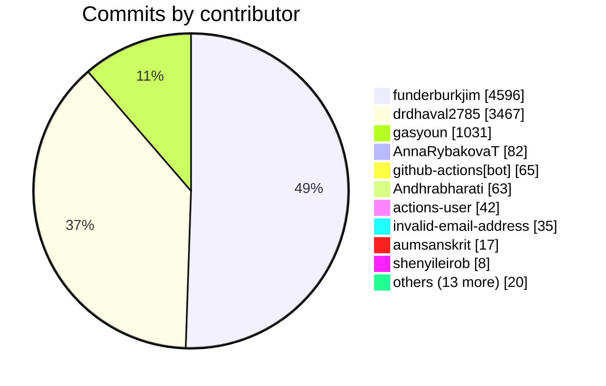

# Sanskrit Lexicon — Contributor & Work Statistics

_Generated 2026-05-30 across the **77 non-fork repositories** of the [`sanskrit-lexicon`](https://github.com/sanskrit-lexicon) org. Commit & issue data from the GitHub API; line-churn from local git for 70 repositories (binary/generated-data repos excluded — see Methodology)._

## Overview

| Metric | Value |
|---|---:|
| Repositories analyzed | 77 |
| Distinct commit authors | 23 |
| Total commits | 9,426 |
| Issues opened | 5,235 |
| Pull requests opened | 103 |
| Activity span | 2014-01 – 2026-05 |

## Commits & issues by year (org-wide)

| Year | Commits | Issues opened | PRs opened |
|---|---:|---:|---:|
| 2014 | 125 | 190 | 0 |
| 2015 | 419 | 270 | 0 |
| 2016 | 397 | 175 | 0 |
| 2017 | 276 | 268 | 0 |
| 2018 | 152 | 98 | 0 |
| 2019 | 417 | 246 | 3 |
| 2020 | 630 | 470 | 1 |
| 2021 | 1,706 | 637 | 11 |
| 2022 | 707 | 451 | 6 |
| 2023 | 580 | 534 | 4 |
| 2024 | 620 | 372 | 9 |
| 2025 | 872 | 1,169 | 2 |
| 2026 | 2,525 | 355 | 67 |

## Commit-activity grid (commits per month)

| Year | Jan | Feb | Mar | Apr | May | Jun | Jul | Aug | Sep | Oct | Nov | Dec | Total |
|---|---:|---:|---:|---:|---:|---:|---:|---:|---:|---:|---:|---:|---:|
| 2014 | 15 | 1 | 3 | 0 | 0 | 0 | 8 | 16 | 10 | 27 | 18 | 27 | 125 |
| 2015 | 17 | 22 | 18 | 21 | 13 | 11 | 4 | 4 | 8 | 7 | 95 | 199 | 419 |
| 2016 | 94 | 25 | 8 | 63 | 14 | 25 | 26 | 10 | 8 | 97 | 16 | 11 | 397 |
| 2017 | 11 | 15 | 30 | 107 | 15 | 13 | 10 | 19 | 25 | 13 | 6 | 12 | 276 |
| 2018 | 8 | 6 | 4 | 5 | 0 | 1 | 3 | 20 | 15 | 37 | 31 | 22 | 152 |
| 2019 | 43 | 23 | 0 | 0 | 0 | 8 | 60 | 46 | 11 | 35 | 56 | 135 | 417 |
| 2020 | 80 | 80 | 104 | 51 | 57 | 39 | 39 | 7 | 5 | 48 | 53 | 67 | 630 |
| 2021 | 183 | 122 | 126 | 81 | 51 | 47 | 54 | 220 | 371 | 331 | 8 | 112 | 1706 |
| 2022 | 57 | 125 | 37 | 25 | 63 | 40 | 24 | 34 | 115 | 116 | 18 | 53 | 707 |
| 2023 | 66 | 75 | 49 | 35 | 13 | 90 | 31 | 35 | 32 | 24 | 46 | 84 | 580 |
| 2024 | 133 | 40 | 31 | 33 | 22 | 90 | 32 | 47 | 49 | 69 | 32 | 42 | 620 |
| 2025 | 13 | 93 | 205 | 56 | 68 | 44 | 101 | 76 | 49 | 60 | 51 | 56 | 872 |
| 2026 | 45 | 174 | 198 | 660 | 1448 | 0 | 0 | 0 | 0 | 0 | 0 | 0 | 2525 |

## Contributor leaderboard (all-time, by commits)

| Contributor | Commits | Repos | First | Last | Active months |
|---|---:|---:|---|---|---:|
| funderburkjim | 4,596 | 57 | 2014-01 | 2026-05 | 142 |
| drdhaval2785 | 3,467 | 39 | 2015-11 | 2026-05 | 58 |
| gasyoun | 1,031 | 77 | 2014-01 | 2026-05 | 28 |
| AnnaRybakovaT | 82 | 11 | 2020-12 | 2023-06 | 15 |
| github-actions[bot] | 65 | 3 | 2026-03 | 2026-05 | 3 |
| Andhrabharati | 63 | 3 | 2021-01 | 2023-04 | 9 |
| actions-user | 42 | 4 | 2026-04 | 2026-05 | 2 |
| invalid-email-address | 35 | 8 | 2019-10 | 2021-09 | 10 |
| aumsanskrit | 17 | 1 | 2024-01 | 2024-01 | 1 |
| shenyileirob | 8 | 1 | 2024-01 | 2025-11 | 3 |
| DmitriSKT | 3 | 1 | 2017-05 | 2017-11 | 2 |
| cfr-auto-updater *(no GH acct)* | 3 | 1 | 2025-04 | 2025-04 | 1 |
| Haqob | 2 | 1 | 2020-08 | 2020-09 | 2 |
| YevgenJohn | 2 | 2 | 2019-10 | 2019-10 | 1 |
| vvasuki | 2 | 2 | 2021-10 | 2021-10 | 1 |
| maltenth | 1 | 1 | 2021-09 | 2021-09 | 1 |
| System Administrator *(no GH acct)* | 1 | 1 | 2023-04 | 2023-04 | 1 |
| Shalu411 *(no GH acct)* | 1 | 1 | 2021-01 | 2021-01 | 1 |
| github-actions[Cologne-Bot] *(no GH acct)* | 1 | 1 | 2026-03 | 2026-03 | 1 |
| adminlip | 1 | 1 | 2026-05 | 2026-05 | 1 |
| Krishna Chaitanya *(no GH acct)* | 1 | 1 | 2023-10 | 2023-10 | 1 |
| sanskritisampada | 1 | 1 | 2021-01 | 2021-01 | 1 |
| sumanthegde | 1 | 1 | 2023-05 | 2023-05 | 1 |

## Contributor commits by year (top 15)

| Contributor | 2014 | 2015 | 2016 | 2017 | 2018 | 2019 | 2020 | 2021 | 2022 | 2023 | 2024 | 2025 | 2026 |
|---|---:|---:|---:|---:|---:|---:|---:|---:|---:|---:|---:|---:|---:|
| funderburkjim | 96 | 246 | 203 | 151 | 152 | 235 | 602 | 787 | 397 | 450 | 512 | 592 | 173 |
| drdhaval2785 | 0 | 163 | 179 | 120 | 0 | 172 | 15 | 820 | 266 | 93 | 88 | 271 | 1280 |
| gasyoun | 29 | 10 | 15 | 2 | 0 | 3 | 4 | 1 | 3 | 0 | 1 | 0 | 963 |
| AnnaRybakovaT | 0 | 0 | 0 | 0 | 0 | 0 | 7 | 19 | 40 | 16 | 0 | 0 | 0 |
| github-actions[bot] | 0 | 0 | 0 | 0 | 0 | 0 | 0 | 0 | 0 | 0 | 0 | 0 | 65 |
| Andhrabharati | 0 | 0 | 0 | 0 | 0 | 0 | 0 | 44 | 1 | 18 | 0 | 0 | 0 |
| actions-user | 0 | 0 | 0 | 0 | 0 | 0 | 0 | 0 | 0 | 0 | 0 | 0 | 42 |
| invalid-email-address | 0 | 0 | 0 | 0 | 0 | 5 | 0 | 30 | 0 | 0 | 0 | 0 | 0 |
| aumsanskrit | 0 | 0 | 0 | 0 | 0 | 0 | 0 | 0 | 0 | 0 | 17 | 0 | 0 |
| shenyileirob | 0 | 0 | 0 | 0 | 0 | 0 | 0 | 0 | 0 | 0 | 2 | 6 | 0 |
| DmitriSKT | 0 | 0 | 0 | 3 | 0 | 0 | 0 | 0 | 0 | 0 | 0 | 0 | 0 |
| cfr-auto-updater *(no GH acct)* | 0 | 0 | 0 | 0 | 0 | 0 | 0 | 0 | 0 | 0 | 0 | 3 | 0 |
| Haqob | 0 | 0 | 0 | 0 | 0 | 0 | 2 | 0 | 0 | 0 | 0 | 0 | 0 |
| YevgenJohn | 0 | 0 | 0 | 0 | 0 | 2 | 0 | 0 | 0 | 0 | 0 | 0 | 0 |
| vvasuki | 0 | 0 | 0 | 0 | 0 | 0 | 0 | 2 | 0 | 0 | 0 | 0 | 0 |

## Issues & PRs opened, by contributor

| Contributor | Issues | PRs |
|---|---:|---:|
| funderburkjim | 2,578 | 0 |
| drdhaval2785 | 2,039 | 3 |
| gasyoun | 351 | 21 |
| Andhrabharati | 89 | 0 |
| github-actions[bot] | 46 | 0 |
| dependabot[bot] | 0 | 43 |
| Shalu411 | 36 | 0 |
| vvasuki | 13 | 10 |
| grigoriyt1 | 21 | 0 |
| aumsanskrit | 9 | 7 |
| angalinde | 7 | 0 |
| chandrasekharanr | 5 | 0 |
| zaaf2 | 5 | 0 |
| AnnaRybakovaT | 0 | 5 |
| mbykov | 4 | 0 |
| YevgenJohn | 1 | 3 |
| shenyileirob | 1 | 3 |
| IrinaKonstant | 3 | 0 |
| sumanthegde | 1 | 2 |
| fxru | 2 | 0 |
| maltenth | 2 | 0 |
| ghost | 2 | 0 |
| adminlip | 0 | 2 |
| Azanuka2412 | 1 | 0 |
| juliagabayraeva | 1 | 0 |
| koleslena | 1 | 0 |
| JuliaNikolaeva | 1 | 0 |
| mariaiontseva | 1 | 0 |
| mahin84 | 1 | 0 |
| artforlife | 1 | 0 |
| LNS1 | 1 | 0 |
| mediabuff | 1 | 0 |
| Jazirae | 1 | 0 |
| wujastyk | 1 | 0 |
| juhnowski | 1 | 0 |
| prasaadu | 1 | 0 |
| Haqob | 0 | 1 |
| SergeA | 1 | 0 |
| curiousome | 1 | 0 |
| mzl2233 | 0 | 1 |
| kc0705 | 0 | 1 |
| vocabulista | 1 | 0 |
| parjanya | 1 | 0 |
| tempapy | 1 | 0 |
| neeleshb | 1 | 0 |
| ramasivaraman | 0 | 1 |
| artanat | 1 | 0 |

## Per-repository summary (by commits)

| Repository | Commits | Authors | First | Last | Issues | PRs |
|---|---:|---:|---|---|---:|---:|
| csl-orig | 1,977 | 10 | 2019-07 | 2026-05 | 2801 | 28 |
| csl-corrections | 832 | 5 | 2019-12 | 2026-05 | 231 | 1 |
| cologne-stardict | 719 | 4 | 2017-04 | 2026-05 | 48 | 0 |
| CORRECTIONS | 691 | 4 | 2014-09 | 2026-05 | 441 | 0 |
| csl-apidev | 520 | 5 | 2018-04 | 2026-05 | 45 | 0 |
| csl-pywork | 493 | 5 | 2019-07 | 2026-05 | 47 | 3 |
| MWS | 409 | 5 | 2014-01 | 2026-05 | 193 | 7 |
| PWG | 398 | 3 | 2014-09 | 2026-05 | 175 | 4 |
| PWK | 277 | 5 | 2014-11 | 2026-05 | 113 | 3 |
| COLOGNE | 222 | 5 | 2014-01 | 2026-05 | 456 | 2 |
| hwnorm1 | 187 | 4 | 2015-11 | 2026-05 | 20 | 0 |
| csl-app | 179 | 2 | 2026-03 | 2026-05 | 39 | 1 |
| csl-observatory | 154 | 3 | 2026-05 | 2026-05 | 2 | 6 |
| AP | 141 | 3 | 2025-07 | 2026-05 | 29 | 2 |
| VCP | 127 | 3 | 2014-01 | 2026-05 | 30 | 2 |
| LRV | 126 | 3 | 2022-09 | 2026-05 | 30 | 0 |
| alternateheadwords | 118 | 3 | 2016-10 | 2026-05 | 25 | 0 |
| csl-devanagari | 118 | 2 | 2021-09 | 2026-05 | 43 | 0 |
| csl-json | 94 | 2 | 2021-08 | 2026-05 | 9 | 0 |
| MWinflect | 89 | 2 | 2018-10 | 2026-05 | 48 | 0 |
| MD | 85 | 3 | 2020-04 | 2026-05 | 15 | 2 |
| WIL | 76 | 3 | 2014-12 | 2026-05 | 18 | 0 |
| PUI | 75 | 2 | 2026-04 | 2026-05 | 4 | 0 |
| csl-ldev | 71 | 4 | 2021-10 | 2026-05 | 9 | 12 |
| GRA | 68 | 2 | 2015-01 | 2026-05 | 38 | 2 |
| csl-inflect | 68 | 2 | 2019-11 | 2026-05 | 15 | 0 |
| AP90 | 62 | 3 | 2020-03 | 2026-05 | 30 | 2 |
| csl-lnum | 59 | 3 | 2021-10 | 2026-05 | 3 | 1 |
| SKD | 58 | 4 | 2014-07 | 2026-05 | 20 | 0 |
| csl-atlas | 57 | 1 | 2026-05 | 2026-05 | 0 | 16 |
| mw-dev | 45 | 4 | 2023-01 | 2026-05 | 23 | 0 |
| hwnorm2 | 44 | 4 | 2020-02 | 2026-05 | 5 | 0 |
| csl-newsletter | 44 | 3 | 2021-09 | 2026-05 | 2 | 0 |
| csl-doc | 41 | 3 | 2018-10 | 2026-05 | 6 | 0 |
| SCH | 40 | 2 | 2014-01 | 2026-05 | 12 | 2 |
| ApteES | 40 | 2 | 2014-07 | 2026-05 | 15 | 2 |
| sanskrit-lexicon.github.io | 40 | 3 | 2015-11 | 2026-05 | 0 | 0 |
| BEN | 36 | 4 | 2020-04 | 2026-05 | 11 | 0 |
| BHS | 33 | 3 | 2016-01 | 2026-05 | 7 | 0 |
| literarysource | 32 | 2 | 2022-02 | 2026-05 | 3 | 0 |
| BUR | 31 | 3 | 2020-04 | 2026-05 | 6 | 0 |
| temp_corrections_ap90 | 30 | 4 | 2021-01 | 2026-05 | 2 | 0 |
| temp_corrections_acc | 29 | 3 | 2021-01 | 2026-05 | 0 | 0 |
| CAE | 28 | 5 | 2020-04 | 2026-05 | 4 | 0 |
| BOP | 27 | 4 | 2022-05 | 2026-05 | 8 | 0 |
| DCS | 23 | 1 | 2014-01 | 2026-05 | 4 | 2 |
| rvlinks | 20 | 3 | 2018-08 | 2026-05 | 2 | 1 |
| temp_corrections_ae | 20 | 3 | 2021-01 | 2026-05 | 0 | 0 |
| csl-lslink | 19 | 3 | 2026-03 | 2026-05 | 1 | 0 |
| csl-santam | 18 | 2 | 2015-06 | 2026-05 | 2 | 0 |
| FRI | 18 | 2 | 2024-01 | 2026-05 | 11 | 2 |
| SHS | 18 | 3 | 2025-12 | 2026-05 | 4 | 0 |
| BOR | 15 | 2 | 2021-09 | 2026-05 | 4 | 0 |
| VEI | 14 | 3 | 2016-01 | 2026-05 | 2 | 0 |
| avlinks | 14 | 2 | 2021-04 | 2026-05 | 1 | 0 |
| KRM | 13 | 2 | 2020-03 | 2026-05 | 4 | 0 |
| csl-kale | 12 | 2 | 2019-11 | 2026-05 | 2 | 0 |
| CCS | 11 | 2 | 2020-04 | 2026-05 | 3 | 0 |
| csl-westergaard | 10 | 2 | 2019-11 | 2026-05 | 1 | 0 |
| STC | 10 | 2 | 2020-04 | 2026-05 | 3 | 0 |
| INM | 10 | 2 | 2021-12 | 2026-05 | 11 | 0 |
| ACC | 9 | 2 | 2017-05 | 2026-05 | 19 | 0 |
| MCI | 8 | 1 | 2026-05 | 2026-05 | 2 | 0 |
| GreekInSanskrit | 8 | 2 | 2015-04 | 2026-05 | 44 | 0 |
| temp_corrections_mw | 8 | 3 | 2021-04 | 2026-05 | 2 | 0 |
| AMAR | 8 | 2 | 2024-01 | 2026-05 | 1 | 0 |
| MW72 | 7 | 2 | 2014-08 | 2026-05 | 6 | 0 |
| Wil-YAT | 7 | 2 | 2015-03 | 2026-05 | 6 | 0 |
| csl-whitroot | 7 | 2 | 2019-11 | 2026-05 | 0 | 0 |
| test_cologne_push | 5 | 2 | 2023-11 | 2026-05 | 0 | 0 |
| ArabicInSanskrit | 4 | 2 | 2015-01 | 2026-05 | 16 | 0 |
| sanskrit-fonts | 4 | 2 | 2018-09 | 2026-05 | 0 | 0 |
| KNA | 4 | 1 | 2026-02 | 2026-05 | 1 | 0 |
| KOW | 4 | 1 | 2026-02 | 2026-05 | 1 | 0 |
| csl-sqlite | 4 | 2 | 2026-04 | 2026-05 | 1 | 0 |
| cologne-hugo | 3 | 2 | 2021-01 | 2026-05 | 0 | 0 |
| santamlegacy | 1 | 1 | 2026-05 | 2026-05 | 0 | 0 |

## Line churn — 70 repositories

From local `git log --numstat` across 70 repos (the 7 large binary/generated-data repos — `cologne-stardict`, `csl-devanagari`, `csl-json`, `csl-kale`, `csl-ldev`, `csl-lnum`, `csl-sqlite` — are excluded; git reports no line counts for binary files). **These line counts are dominated by bulk/auto-generated commits** (full-file digitization, regeneration, transcoding) — read them as *data volume*, not human effort.

### By contributor

| Contributor | Commits | Lines + | Lines − | File-changes |
|---|---:|---:|---:|---:|
| funderburkjim | 4,538 | 69,447,295 | 13,545,056 | 35,727 |
| drdhaval2785 | 2,353 | 47,747,829 | 7,939,500 | 11,496 |
| Andhrabharati | 58 | 5,931,962 | 1,768,467 | 389 |
| gasyoun | 957 | 3,935,798 | 69,849 | 2,594 |
| github-actions[bot] | 63 | 523,424 | 75,520 | 351 |
| AnnaRybakovaT | 74 | 71,741 | 6,700 | 148 |
| HWNORM1 BOT | 40 | 31,308 | 13,209 | 77 |
| csl-observatory-bot | 2 | 11,546 | 11,429 | 18 |
| Your Name | 29 | 11,378 | 8,883 | 58 |
| Jakob Halfmann | 2 | 2,019 | 1,593 | 56 |
| System Administrator | 1 | 1,961 | 0 | 5 |
| cfr-auto-updater | 3 | 1,457 | 0 | 3 |
| thomasincambodia | 1 | 860 | 0 | 4 |
| aumsanskrit | 12 | 50 | 48 | 15 |
| YevgenJohn | 4 | 24 | 25 | 4 |
| DmitriSKT | 3 | 33 | 2 | 3 |
| shenyileirob | 6 | 11 | 11 | 6 |
| Dhaval and Jim | 1 | 10 | 11 | 3 |
| Krishna Chaitanya | 1 | 2 | 2 | 1 |
| root | 1 | 2 | 1 | 2 |
| Shalu411 | 1 | 1 | 1 | 1 |
| adminlip | 1 | 1 | 1 | 1 |
| sanskritisampada | 1 | 1 | 0 | 1 |

### By repository

| Repository | Lines + | Lines − | File-changes |
|---|---:|---:|---:|
| ACC | 99 | 20 | 9 |
| AMAR | 31,300 | 78 | 28 |
| AP | 7,927,237 | 593,409 | 600 |
| AP90 | 2,076,634 | 39,763 | 402 |
| ApteES | 1,384,190 | 2,410 | 262 |
| ArabicInSanskrit | 22 | 0 | 4 |
| BEN | 712,283 | 40,939 | 187 |
| BHS | 221,955 | 4,218 | 207 |
| BOP | 653,081 | 83,518 | 137 |
| BOR | 244,981 | 63,251 | 31 |
| BUR | 246,736 | 205 | 189 |
| CAE | 216,338 | 21,624 | 76 |
| CCS | 38,253 | 36 | 41 |
| COLOGNE | 1,421,789 | 5,799 | 837 |
| CORRECTIONS | 14,193,654 | 3,348,608 | 8,133 |
| DCS | 79,750 | 41 | 31 |
| FRI | 167,885 | 119 | 53 |
| GRA | 323,879 | 24,618 | 553 |
| GreekInSanskrit | 136 | 10 | 11 |
| INM | 143,803 | 553 | 69 |
| KNA | 274 | 9 | 5 |
| KOW | 269 | 5 | 5 |
| KRM | 63,009 | 52 | 54 |
| LRV | 2,019,600 | 443,081 | 567 |
| MCI | 99 | 19 | 8 |
| MD | 663,421 | 3,345 | 328 |
| MW72 | 2,671,652 | 203 | 106 |
| MWS | 10,359,729 | 1,789,514 | 2,844 |
| MWinflect | 1,179,183 | 909,676 | 1,049 |
| PUI | 137,256 | 3,342 | 86 |
| PWG | 11,939,899 | 1,106,889 | 3,532 |
| PWK | 6,749,637 | 1,075,060 | 2,006 |
| SCH | 414,692 | 266,269 | 103 |
| SHS | 133,255 | 37 | 25 |
| SKD | 597,848 | 95,139 | 256 |
| STC | 47,486 | 35 | 48 |
| VCP | 13,701,469 | 2,512,689 | 2,927 |
| VEI | 8,356 | 4,248 | 17 |
| WIL | 1,447,155 | 26,798 | 507 |
| Wil-YAT | 459,661 | 3 | 37 |
| alternateheadwords | 1,799,937 | 384,030 | 466 |
| avlinks | 78,683 | 216 | 762 |
| cologne-hugo | 720 | 0 | 4 |
| csl-apidev | 805,482 | 401,847 | 2,556 |
| csl-app | 50,651 | 16,807 | 810 |
| csl-atlas | 320,053 | 5,043 | 800 |
| csl-corrections | 1,384,152 | 238,088 | 3,060 |
| csl-doc | 202,815 | 63,438 | 5,894 |
| csl-inflect | 524,567 | 17,659 | 617 |
| csl-lslink | 444 | 47 | 28 |
| csl-newsletter | 2,879 | 526 | 115 |
| csl-observatory | 826,431 | 96,409 | 367 |
| csl-orig | 16,810,218 | 7,953,619 | 2,775 |
| csl-pywork | 76,051 | 26,590 | 1,832 |
| csl-santam | 327,173 | 208 | 44 |
| csl-westergaard | 271,774 | 41 | 482 |
| csl-whitroot | 266,685 | 10 | 681 |
| hwnorm1 | 7,967,077 | 1,421,558 | 981 |
| hwnorm2 | 1,430,047 | 4,535 | 403 |
| literarysource | 11,355 | 158 | 39 |
| mw-dev | 7,469,125 | 227,738 | 415 |
| rvlinks | 271,609 | 1,698 | 1,116 |
| sanskrit-fonts | 63 | 3 | 6 |
| sanskrit-lexicon.github.io | 287,467 | 38,424 | 180 |
| santamlegacy | 9 | 0 | 1 |
| temp_corrections_acc | 736,447 | 1,984 | 52 |
| temp_corrections_ae | 659,228 | 1,448 | 37 |
| temp_corrections_ap90 | 1,571,484 | 67,130 | 55 |
| temp_corrections_mw | 888,113 | 5,422 | 9 |
| test_cologne_push | 19 | 0 | 6 |

## Methodology & caveats

- **Commits/tenure/time-series**: GitHub REST commits API (paginated, default branch) for all non-fork repos. Identity uses the linked GitHub login; unlinked commits are mapped to a known contributor by name where possible, else shown as `name:… (no GH acct)`.
- **Issues & PRs**: issues API (state=all), by *opener* and creation date; PRs identified by the `pull_request` field. Review/close/comment activity not counted.
- **Line churn**: local `git log --numstat`. With `--full-churn` (used here), repos without a full local clone are temporarily cloned to compute churn org-wide; the 7 large binary/generated-data repos are excluded (git reports no line counts for binary files). GitHub `/stats/*` churn endpoints were unavailable (HTTP 202 across the burst), so git is the source.
- Forks are excluded (their history includes upstream contributors).

*Generated by `scripts/contributor_stats.py`.*
