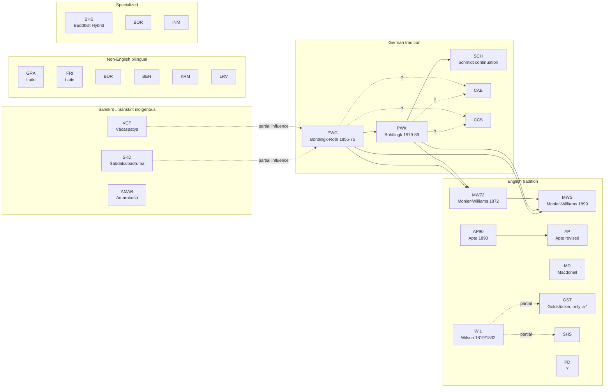

# csl-observatory — lexicography research roadmap

**Version**: 1.0 · **Date**: 2026-05-16 · **Owner**: M. Gasūns + Claude Code
**Companion to**: [`OBSERVATORY_DESIGN.md`](OBSERVATORY_DESIGN.md), [`OBSERVATORY_ROADMAP.md`](OBSERVATORY_ROADMAP.md), [`PAPER_1_OUTLINE.md`](PAPER_1_OUTLINE.md)

This is a **separate research stream** from Paper 1's *measurement framework*. Paper 1 quantifies the project; this stream quantifies the **dictionaries themselves** and reconstructs their genealogy.

It will produce **three further papers** (M, L, H), each independently submittable — plus a
**standalone methods note** on the content↔convention two-axis result (added 2026-06-03; see §6).

---

## 1. Why a separate roadmap?

The 35 Cologne dictionaries are not an undifferentiated mass. Some inherit from others — sometimes verbatim, sometimes structurally, sometimes only in citations. A handful of *primary* dictionaries (PWG, VCP, SKD) underlie an entire family of *derivative* dictionaries (MW, MW72, PWK, SCH, CAE, CCS, …).

This stream **reconstructs that genealogy computationally**, validates it against documented history, and identifies undocumented relations. Outcome: a phylogenetic tree of Sanskrit lexicography, plus the methodology to build one for any DH project with related sources.

---

## 2. Known lineage (from author's domain knowledge, 2026-05-16)

A starting graph to validate algorithmically.



### Open derivation questions to answer with data
1. **CAE / CCS**: derived from PWK or PWG? Both? Which contributed more?
2. **PD**: which dictionary is closest neighbour?
3. **English-Sanskrit family**: how similar to each other? AP, AP90, MD, MW, MW72, WIL, GST, SHS, PD form one cluster — what's the substructure?
4. **Sanskrit↔non-English bilinguals (FRI, GRA, BUR, BEN, KRM, LRV)**: are they independent traditions or do they also lean on the German Petersburger tradition?
5. **Sanskrit↔Sanskrit (VCP, SKD, AMAR)**: shared Indian commentarial tradition — what's their internal overlap?
6. **Reverse influence**: how heavy is PWG/PWK's debt to VCP and SKD specifically? Quantify.
7. **Specialized dicts** (BHS, BOR, INM, others on https://www.sanskrit-lexicon.uni-koeln.de): map their sources.
8. **csldoc** at https://www.sanskrit-lexicon.uni-koeln.de/scans/csldev/csldoc/build/index.html — is documented lineage there to use as ground truth?

---

## 3. What's countable in dictionary inter-relations

Organised by signal strength (forensic → macro).

### 3.1 Forensic signals (strongest evidence of direct copy)

| Signal | Method | Why it works |
|---|---|---|
| Shared typos / OCR errors | tokenise → identify suspect tokens → cross-dict matching | Random errors are improbable to share by chance |
| Shared idiosyncratic abbreviations | regex `[A-Z][a-z]?\.` extraction → frequency table per dict | Abbreviations are author-stylistic |
| Shared idiosyncratic citation forms | extract `<ls>` → normalise → fingerprint format | Citation conventions vary widely |
| Verbatim definition strings (post-normalisation) | per-lemma string-similarity (Levenshtein, cosine) | Direct copy detection |
| **Citation truncation patterns** | compare PWG full ref `Rv. 1.22.16` vs MW `RV.` | **Truncation reveals direction**: a dict can shorten an ancestor's ref but cannot expand a descendant's |
| Shared meaning order in polysemous entries | sequence alignment of gloss arrays | Hard to share by chance with >3 meanings |
| Shared cross-reference patterns | extract `<k1>...<k1>` recurrences → graph isomorphism | Internal links are structural |

### 3.2 Lemma-level (macro coverage)

| Signal | Method | Output |
|---|---|---|
| Lemma overlap (Jaccard) per pair | set intersection / union, all 35×35 pairs | 35×35 heatmap |
| Lemma exclusivity per dict | set difference vs union of others | per-dict bar chart |
| Coverage tier histogram | count lemmas appearing in N dicts (N=1..35) | histogram |
| UpSet plot (multi-set Venn for top combinations) | UpSet algorithm on lemma sets | UpSet plot |

### 3.3 Entry-level (micro structure)

| Signal | Method | Output |
|---|---|---|
| Mean/median definition length per dict | char count per `<L>...<LEND>` block | distribution + bar |
| Polysemy depth (meanings per entry) | count numbered glosses or `;`-separated senses | distribution |
| Citation density (refs per entry) | count `<ls>` per entry | distribution |
| Cross-reference density (refs per entry) | count internal `<k1>` mentions | distribution |
| Etymology depth (lines/chars of etym per entry) | regex for etym markers | distribution |
| Variant headword count (`<k2>`) | count `<k2>` per entry | distribution |
| Grammatical-info richness | count gender/class/derivation markers | per-dict feature matrix |

### 3.4 Cross-language alignment

| Signal | Method | Output |
|---|---|---|
| Translation table per shared lemma | extract gloss → align by language | wide table |
| Concept drift score | translate all to English (LLM/dict), compute cosine across translations | per-pair drift map |
| Citation-set similarity (language-neutral) | compare `<ls>` sets ignoring gloss text | clean cross-language signal |

### 3.5 Genealogical / phylogenetic

| Signal | Method | Output |
|---|---|---|
| Pairwise unified inheritance score | weighted sum of forensic + entry + macro signals | 35×35 score matrix |
| Cladogram (phylogenetic tree) | UPGMA / neighbour-joining on inheritance distance | dendrogram |
| Bayesian directionality model | for each pair: P(A→B), P(B→A), P(both←C); priors from publication dates | directed graph |
| Stratigraphic plot | place each dict on vertical time axis with derivation arrows | Gantt-like |

---

## 4. Method: unified inheritance score (per author decision)

The headline computation. For each ordered pair (A, B):

```
inheritance_score(A → B) = w1 * forensic_evidence(A→B)
                         + w2 * entry_similarity(A, B) * recency_penalty(A, B)
                         + w3 * lemma_overlap(A, B)
                         + w4 * citation_truncation_evidence(A→B)
                         + w5 * meaning_order_preservation(A, B)
```

Where:
- `forensic_evidence(A→B)`: count of (typo, abbreviation, citation form) shared between A and B that are rare/unique. Weight by rarity.
- `entry_similarity(A, B)`: mean string similarity for shared lemmas (post-normalisation).
- `recency_penalty(A, B)`: B published after A → no penalty; A published after B → strong penalty (B can't inherit from A if A is younger).
- `lemma_overlap(A, B)`: Jaccard.
- `citation_truncation_evidence(A→B)`: count of citations where A is more specific than B (PWG full ref → MW abbreviated). Truncation is one-directional evidence.
- `meaning_order_preservation(A, B)`: Spearman correlation of meaning indices for shared polysemous entries.

Weights `w1..w5` calibrated against the **known** lineage (PWG→PWK, MW72→MW, AP90→AP) — supervised tuning. Rest of derivation graph is then predicted; novel high-score edges are the discoveries.

### Bayesian extension

For each candidate edge A → B with score s:
```
P(A → B | s) = s / (s + s' + ε)
```
where s' is the reverse-direction score and ε accounts for "both ← common ancestor".

Output: directed acyclic graph (DAG) with edge weights = posterior probabilities.

---

## 5. Phasing

Each phase is independently shippable; each produces dashboard pages and paper material.

### Phase L1 — Source collection + corpus prep (3-5 days)
- Clone all 35 dictionaries (depth=1; ~1 GB total)
- Parse each into a normalised JSONL: `{repo, lemma, lemma_iast, glosses[], citations[], cross_refs[], etymology, body_chars}`
- Output: `data/dict_corpus.jsonl` (estimated ~600,000 entries)
- Validate: per-dict counts vs known headword totals

### Phase L2 — Macro lemma analysis (2-3 days)
- 35×35 Jaccard heatmap
- Lemma exclusivity per dict
- Coverage-tier histogram
- UpSet plot for top combinations
- New dashboard page: `/lexicography/macro.md`
- **Paper M Section**: Methods §3 (lemma-set comparison), Results §4.1

### Phase L3 — Forensic analysis (1-2 weeks, hardest)
- Build typo / abbreviation / unusual-citation extractor
- Run pairwise rarity-weighted shared-anomaly count
- Citation truncation analysis (PWG ↔ MW especially)
- New dashboard page: `/lexicography/forensic.md`
- **Paper M Section**: §4.2 (forensic signals); **Paper H Section**: §5 (PWG → MW textual evidence)

### Phase L4 — Entry similarity within language families (1 week)
- Process each language family separately first:
  - **German group**: PWG, PWK, SCH, CAE, CCS
  - **English group**: WIL, MW72, MW, AP90, AP, MD, GST, SHS, PD
  - **Sanskrit↔Sanskrit**: VCP, SKD, AMAR
  - **Latin / other bilinguals**: FRI, GRA, BUR, BEN, KRM, LRV
- For each shared lemma: definition-string similarity matrix
- New dashboard pages: `/lexicography/german.md`, `/english.md`, `/sanskrit-sanskrit.md`, `/other.md`
- **Paper L Section**: §3 (per-family analysis)

### Phase L5 — Cross-language Sanskrit-headword comparison (3-5 days)
- Compare across families using language-neutral signals:
  - Lemma sets (fully neutral)
  - Citation sets (fully neutral — `<ls>` references)
  - Cross-reference structure (fully neutral)
- Detect: do non-German bilinguals lean on German tradition or independent?
- **Paper L Section**: §4 (cross-family analysis)

### Phase L6 — Citation-set inheritance (2-3 days, the user's lateral idea)
- Build per-dict citation index: every `<ls>` reference normalised
- Truncation analysis: PWG `Rv. 1.22.16` vs MW `RV.` — measure information-loss direction
- Citation-set Jaccard, language-neutral
- New chart: citation-truncation Sankey
- **Paper M Section**: §4.3 (citation-evidence)

### Phase L7 — Translation alignment (the final initial step, 1-2 weeks)
- Translate all glosses to English using a combination of:
  - Bilingual dictionaries (de↔en, la↔en, sa↔en for VCP/SKD)
  - LLM-assisted translation (with confidence scoring)
- Per-shared-lemma cross-translation cosine similarity
- Detect concept drift across languages
- **Paper L Section**: §5 (translation-aligned analysis); **Paper H**: §6 (concept evolution across editions)

### Phase L8 — Phylogenetic synthesis (1 week)
- Aggregate signals into unified inheritance score (§4)
- Calibrate weights against known lineage
- Build cladogram
- Bayesian directional model
- Cross-validation: hold out a known edge, predict it back
- New dashboard page: `/lexicography/phylogeny.md`
- **Paper H**: §7 (the genealogy)

### Phase L9 — Specialized dictionaries survey (3-5 days)
- Inventory specialized dicts at https://www.sanskrit-lexicon.uni-koeln.de
- Parse csldoc at https://www.sanskrit-lexicon.uni-koeln.de/scans/csldev/csldoc/build/index.html for documented lineage (use as ground truth)
- BHS, BOR, INM, others — apply Phase L2-L8 methods to specialized subset
- **Paper L**: §6 (specialized dictionaries appendix); **Paper H**: §8 (specialized lineage)

### Phase L10 — Three deliverables build (per author decision: all three)
- **Dashboard section**: `/lexicography/` — already accumulated through L1-L9
- **Companion site**: `lexicography.sanskrit-lexicon.github.io` — separate Observable project, focused storytelling
- **Interactive explorer**: pick any 2 dicts → side-by-side entry view + similarity score + shared-lemma list

---

## 6. The three papers

### Paper M — Methodological
**Title**: *Computational stemmatics for digital lexicography: a multi-signal framework for reconstructing dictionary genealogy*

Audience: DH methodology venues (Digital Scholarship in the Humanities, Journal of Cultural Analytics, ACL DH workshops).

Contribution: the unified inheritance score (§4) as a reusable method. Worked example on CDSL.

Sections:
1. Introduction — the genealogy problem in lexicography
2. Related work — manual stemmatics, computational philology, biological phylogenetics
3. Method — unified inheritance score (this doc's §4)
4. Validation — recovery of known CDSL edges
5. Discoveries — predicted novel edges
6. Discussion — generalisability beyond Sanskrit
7. Conclusion

### Paper L — Linguistic
**Title**: *35 dictionaries, one Sanskrit: a computational survey of cross-dictionary lexical coverage*

Audience: Sanskrit lexicography venues (WSC main track), comparative lexicology journals.

Contribution: empirical map of how Sanskrit vocabulary is distributed across dictionaries — coverage gaps, regional bias, register coverage, semantic field bias.

Sections:
1. Introduction — what is "the Sanskrit lexicon"?
2. Corpus — the 35 dictionaries, their scopes
3. Per-family analysis — German, English, non-English bilingual, Sanskrit↔Sanskrit
4. Cross-family analysis — overlap and exclusivity
5. Translation alignment — concept drift
6. Specialized dictionaries — niche coverage
7. Discussion — what gaps remain; recommendations for future digitisation

### Standalone methods note (NEW, decision 2026-06-03 #3 — "both")
**Working title**: *Two axes of descent: separating content-inheritance from convention-inheritance in digital dictionary genealogy*

A short, self-contained methods paper built on Phase L0 + L0.7: the convention fingerprint
and the content↔convention **reformatting residual** as a general DH instrument (any corpus
of related editions). Reuses the same result as **Paper H §5** ([`articles/paper_H_convention_vs_content_lineage.md`](articles/paper_H_convention_vs_content_lineage.md)).
**Add to [`PUBLICATIONS.md`](PUBLICATIONS.md) as article 16+.** Venue: a DH methods venue (DSH / *Journal of Cultural Analytics*).

### Paper H — Historical
**Title**: *From Petersburg to Cologne: 170 years of Sanskrit lexicography traced through computational stemmatics*

Audience: history of linguistics venues (Historiographia Linguistica), Sanskrit philology venues, WSC.

Contribution: a verified, computationally-derived genealogy of major Sanskrit dictionaries 1819-2025 with quantified inheritance strengths.

Sections:
1. Introduction — narrative of CDSL family history
2. The Petersburg axis — PWG → PWK lineage with quantified copy patterns
3. The English transmission — Wilson, MW72, MW, Apte family
4. The Sanskrit↔Sanskrit substrate — what PWG/PWK owe to VCP and SKD
5. Textual evidence — citation truncation as direction-of-flow proof
6. Concept evolution across editions — translation-alignment view
7. The genealogy reconstructed — the phylogenetic tree
8. Specialized lineage
9. Discussion — what the data confirms, what it overturns

---

## 7. Outputs and their relation

| Deliverable | Lives at | Audience |
|---|---|---|
| Dashboard `/lexicography/` section | sanskrit-lexicon.github.io/csl-observatory/lexicography | Researchers, casual visitors |
| Companion site | lexicography.sanskrit-lexicon.github.io | Lexicography deep-divers |
| Interactive explorer | (in companion site) | Comparative scholars, students |
| Paper M | DH methodology journal | DH methodologists |
| Paper L | WSC + lexicography journal | Sanskrit lexicographers |
| Paper H | History-of-linguistics journal + WSC | Historians of philology |
| Public data (`/data/` URLs) | with each chart | Anyone reproducing or extending |

---

## 8. Drafting order suggestion

1. Phase L1 (corpus prep) — foundation for everything
2. Phase L2 (macro lemma) — quick wins, dashboard-able immediately
3. Phase L4 (per-family) — Paper L's spine, **start here for fastest paper draft**
4. Phase L3 (forensic) — Paper M's spine, slower but foundational
5. Phase L6 (citations) — quick add, validates inheritance signals
6. Phase L8 (phylogeny) — synthesises everything
7. Phases L5, L7, L9 — finish remaining angles
8. Phase L10 — productise as 3 deliverables
9. Three papers drafted in parallel, finalised in order: L → M → H

---

---

## 9. Canonical dictionary inventory (per Patel 2016 + extensions)

Source: Patel, D. (2016). *Normalizing headwords of Cologne digital dictionaries*.
Saved at: [csl-corrections/Normalizing_headwords_of_Cologne_digital.pdf](https://github.com/sanskrit-lexicon/csl-corrections/blob/master/Normalizing_headwords_of_Cologne_digital.pdf)

Full CSV at [`data/dictionary_inventory.csv`](../data/dictionary_inventory.csv).

**Key insights from this inventory**:

- **PWG (1855) is the oldest German Sanskrit-Wörterbuch in the family** — and the oldest non-indigenous source after WIL (1832).
- **SKD (1822) is the oldest indigenous Sanskrit-Sanskrit dict** — predates everything in the German tradition.
- **PD (1976) = An Encyclopedic Dictionary of Sanskrit on Historical Principles** (Deccan College, Pune) — major modern Sanskrit lexicographical work. **Included 2026-05-31** (M.G.): its `a-` volumes are the *whole practical dictionary* — the remaining letters are not expected in any foreseeable timeframe — so PD-as-it-stands is complete for analysis. PD distinct files are now being added in `csl-pywork`.
- **CCS and CAE are sister dicts by the same author** (Cappeller, 1887 German + 1891 English) — testing this pair is a perfect baseline for "near-identical-content, different-language" comparison.
- **STC and BUR are French**; **GRA, CCS, PW, PWG, SCH are German**; **MWE, AE, BOR are English-Sanskrit (reverse)** — the language structure of the CDSL family is now explicit.
- **Specialised dicts** include: GRA (Rigveda), INM (MBh-names), MCI (MBh-cultural), VEI (Vedic), KRM (verbs), PUI (Purāṇa), SNP (plants), PE (Purāṇa encyclopaedia), IEG (epigraphy), PGN (Gupta inscriptions), BHS (Buddhist Hybrid).
- **Dict codes identified (2026-05-31, M.G.)**: FRI = Frish (Sanskrit Reader) · KNA = Knauer · KOW = Kossowich · LRV = Vaidya, *The Standard Sanskrit-English Dictionary* (1889).
- **Cologne dicts not yet in the GitHub set**: IEG, MWE, PE, PGN, SNP, YAT (AE is now covered by the ApteES repo; PD is being ingested — see above). **Deferred to future work 2026-05-31.** *(M.G. flagged that the earlier "scan-only images" characterization is inaccurate — their actual digital status should be re-checked before any ingest.)*

### Publication-year direction-of-flow constraints

A dict published in year Y can only inherit from dicts published in years ≤ Y. This is the **temporal constraint** in the Bayesian model:

```
For pair (A, B) with publication years yA, yB:
  if yA < yB:  edge A → B is plausible; B → A is impossible
  if yA = yB:  bidirectional or common-ancestor
  if yA > yB:  edge B → A is plausible; A → B is impossible
```

This single constraint eliminates ~half the candidate edges in the 35×35 search.

### Lineage hypotheses ranked by temporal plausibility

| Candidate edge | Temporal | Documented | Forensic evidence to gather |
|---|---|---|---|
| WIL 1832 → SHS 1900 | ✓ 68y gap | likely (user) | shared lemma-set, English glosses |
| WIL 1832 → GST 1856 | ✓ 24y gap | likely (user) | first 'a-' letters only |
| SKD 1822 → PWG 1855 | ✓ 33y gap | partial (user) | Skt-Skt as PWG substrate |
| VCP 1873 ↔ PWG 1855 | reverse: PWG → VCP? | partial | PWG-knowledge in VCP commentary |
| PWG 1855 → MW72 1872 | ✓ 17y gap | known | direct copy + truncation |
| PWG 1855 → PWK 1879 | ✓ 24y gap | known | same authors, abridgement |
| PWG 1855 → CCS 1887 | ✓ 32y gap | likely (user) | Cappeller German tradition |
| PWG 1855 → CAE 1891 | ✓ 36y gap | likely (user) | Cappeller English version |
| PWK 1879 → CCS 1887 | ✓ 8y gap | likely (user) | abridged-from-abridged |
| PWG/PWK → MW 1899 | ✓ 20-44y gap | known (MW preface) | major copy with English re-gloss |
| MW72 1872 → MW 1899 | ✓ 27y gap | known | author's own expansion |
| AP90 1890 → AP 1957 | ✓ 67y gap | known | revised edition |
| PWG/PWK → SCH 1928 | ✓ 49-73y gap | likely (user) | "Nachträge" = supplements |
| PWG/PWK → STC 1932 | ✓ 53-77y gap | unknown | German-French transmission? |

The columns to be filled in by Phases L2-L8.

---

## 10. Patel's headword-normalisation conventions (the standard)

Adopted as the **default normalisation** for all parsing in Phase L1. Encoded as a Python module `observatory/lexico/normalize.py`.

### The 7 conventions and their per-dictionary fingerprints

| Convention | Variants | Standard chosen | Discriminating signal? |
|---|---|---|---|
| 1. Anusvāra before consonants | 6 options | "convert nasal+consonant to anusvāra; trailing anusvāra → m" | YES — option-1.5 vs 1.6 split is forensic |
| 2. Duplication after `r` | 2 options | "no duplication" | YES — only SKD, WIL duplicate |
| 3. Words ending with `-at` (śatṛ) | 3 options | "ending with at" | YES — clean two-cluster split |
| 4. Inflected vs uninflected | 2 options | "uninflected" | YES — only AP, AP90, SKD use inflected |
| 5. Anusvāra of verbs | 3 options | "remove anubandha, keep as anusvāra (option 5.3)" | partial |
| 6. ṛkārānta words | 3 options | "ṛ at end" | YES — clean three-cluster |
| 7. vas/yas suffixes | 4 options | "vas/yas at end" | YES — four clusters |

### The "convention fingerprint" as inheritance signal (NEW Phase L0)

**Insight**: Each dict's choice across all 7 conventions is itself a fingerprint. Dicts following the same fingerprint pattern likely share lineage. Patel's per-dict membership lists give us this fingerprint **for free**.

Example fingerprints (early single-value preview — **superseded** by the authoritative
multi-valued ingest in [`data/L0/patel2016_assignments.csv`](../data/L0/patel2016_assignments.csv)
via `s2d_patel_gold.py`; e.g. PWG's true conv-1 is `1.2+1.5`, not a single `1.5`):

| Dict | C1 | C2 | C3 | C4 | C5 | C6 | C7 |
|---|---|---|---|---|---|---|---|
| PWG | 1.5 | 2.2 | 3.2 | 4.2 | 5.2 | 6.1 | 7.4 |
| PWK | 1.5 | 2.2 | 3.2 | 4.2 | 5.2 | 6.1 | 7.4 |
| SCH | 1.5 | 2.2 | 3.2 | 4.2 | 5.2 | 6.1 | 7.4 |
| MW | 1.5 | 2.2 | 3.1 | 4.2 | 5.2 | 6.2 | 7.1 |
| MW72 | 1.6 | 2.2 | 3.1 | 4.2 | 5.2 | 6.2 | 7.1 |
| AP | 1.2 | 2.2 | 3.1 | 4.1 | 5.2 | 6.2 | 7.1 |
| AP90 | 1.1+1.5 | 2.2 | 3.1 | 4.1 | 5.3 | 6.2 | 7.1 |
| SKD | 1.6 | 2.1 | 3.3 | 4.1 | 5.1 | 6.3 | 7.3 |
| VCP | 1.6 | 2.2 | 3.1 | 4.2 | 5.1 | 6.2 | 7.1 |
| WIL | 1.5 | 2.1 | 3.1 | 4.2 | 5.2 | 6.2 | 7.1 |
| CAE | 1.5 | 2.2 | 3.2 | 4.2 | 5.2 | 6.2 | 7.4 |
| CCS | 1.5 | 2.2 | 3.2 | 4.2 | 5.2 | 6.2 | 7.4 |

**Already from this small fingerprint table:**
- **PWG = PWK = SCH** are *identical* across all 7 conventions → strongest possible lineage signal, matching the known PWG → PWK → SCH chain.
- **CAE and CCS** are nearly identical (differ only in C6) → confirms shared Cappeller authorship.
- **MW differs from PWG only in C3, C6, C7** → consistent with "borrowed but anglicised".
- **MW72 differs from MW only in C1** → consistent with same author, evolved style.
- **SKD is an outlier** (most idiosyncratic across conventions) → consistent with indigenous origin separate from German tradition.
- **AP90 → AP** shows divergence (AP90 has 1.1+1.5 while AP has 1.2; AP90 has 5.3 while AP has 5.2) → revised editor introduced normalisation changes.

### Phase L0 — Convention-fingerprint cladogram ✅ DONE 2026-06-03

Executed and validated. Scripts `scripts/L0/s2*.py` + `s3_cladogram.py`; results in
[`L0_RESULTS.md`](L0_RESULTS.md); taxonomy/concordance in [`refs/`](refs/); dashboard page
`/conventions` live; **25 dims** (7 Patel `patel2016` gold + 18 auto) × 32 dicts. **All 6
lineage families cohere**; bootstrap WIL→SHS 0.81, PWG→PW 0.79, PWG→SCH 0.70. **Headline
finding: convention-lineage ≠ content-lineage** (Paper H §5 drafted; standalone methods note
planned — decision 2026-06-03 #3 below).

### Phase L0.7 — Content↔convention residual ✅ DONE 2026-06-03

Shipped: `scripts/L0/s4_residual.py` → `data/L0/content_convention_residual.csv` (25 ranked
directed edges) + `content_convention_scatter.csv` (435 pairs); dashboard scatter + ranked
bar on `/conventions`; quantified in [`L0_RESULTS.md`](L0_RESULTS.md) §3 and Paper H §5.4.
**Result:** top reformatting residuals = CAE→MW 0.68, MD→MW 0.65, CCS→MW 0.62, WIL→YAT 0.54
(MW is the corpus's principal reformatter); faithful tail = SHS↔WIL, PWG→PW, CCS→CAE.

Operationalise the L0 finding as a quantitative instrument. For every dict pair, compute:

```
reformatting_residual(A→B) = content_containment(A→B)  [sanhw1 Jaccard/containment]
                           − convention_similarity(A,B) [1 − L0 convention distance]
```

- High residual = "absorbed the lexicon, recoded the house style" (predicts MW←PWG, YAT←WIL).
- Rank all pairs; the top residuals are the editorial-recoding events.
- Cross-plot the two axes (content vs convention) → every dict pair a point; the off-diagonal is the finding.
- Outputs: `data/L0/content_convention_residual.csv`, a scatter + ranked-table dashboard panel on `/conventions`.
- **Feeds**: the standalone methods note + Paper H §5 + Paper M §4 (two-axis inheritance model).

### Phase L0.9 — Patel's open conventions + hwnorm1 contribution ✅ DONE 2026-06-03

Shipped `scripts/L0/s2e_patel_open.py` (probe-lemma method, full-file scan):
- **dim 31 takārānta** — reproduces Patel's published महत् split at **23/23 = 100%** on the
  dicts he classified; extends to FRI/LRV. Discriminating (−ant group = Petersburg+Cappeller).
- **dim 32 sakārānta** + **dim 33 rephānta** — *newly computed* per-dict (his §TODO); near-uniform
  (`-as`/`-ar`), visarga variants only in AP/AP90/MW/SKD/STC.
- **ṛ-nipātita** — method ready, needs a curated nipātita list; documented, not yet a dim.
- `s3_cladogram.py` made dim-count-dynamic; re-run held recovery at 55% (PWG→PW → 0.806, now a
  2nd strong edge) — sakārānta/rephānta near-constant so little tree signal, as expected.
- **Contributed back to hwnorm1**: [`sanskrit-lexicon/hwnorm1#21`](https://github.com/sanskrit-lexicon/hwnorm1/issues/21)
  (one substantive issue, authored by M.G./gasyoun — comment-noise-aware). Data in
  `data/L0/patel_open_assignments.csv`; issue body archived at `refs/hwnorm1_contribution.md`.

### Phase L0-rigor — Bayesian MCMC + NJ ✅ DONE 2026-06-03

Shipped `scripts/L0/s5_bayesian.py`: NJ + UPGMA 500× character bootstrap + a **Bayesian Mk
MCMC** (2-state symmetric model, Felsenstein pruning, NNI + branch-length Metropolis, 80k
gens, MAP lnL −987.5). Comparison in `data/L0/algorithm_support_comparison.csv` +
`bayesian_report.json`; dashboard `/conventions` three-algorithm panel. **Strong edges
(PWG→PW, PWG→SCH, WIL→SHS, AP90→AP) recovered by all three; reformatted edges (MW72→MW,
WIL→YAT) low under all three ⇒ convention≠content is method-independent.** Bayesian Mk
uniquely surfaces PW→CCS (0.74) + Bopp→MW (0.65). Paper-final canonical = UPGMA point estimate
+ Bayesian posterior support. *(Optional remaining: gate on the completed dict set — LRV/FRI +
KNA/KOW/AMAR — if/when sources land.)*

---

## 11. Open questions for next round

1. ✅ **Not-yet-on-GitHub dicts** (IEG, MWE, PE, PGN, SNP, YAT; AE now = ApteES) — **deferred to future work** (2026-05-31). The "scan-only" label was flagged inaccurate by M.G.; re-check their digital status before any ingest.
2. ✅ **Add PD** — **yes, included** (2026-05-31): its `a-` volumes are the whole practical dictionary; PD distinct files are being added in `csl-pywork`.
3. ✅ **Phase L0** — executed (`scripts/L0/`, `data/L0/`; see RESEARCH_LAYER_ROADMAP §0).
4. **Update CITATION.cff data**: auto-populate year+author per repo from the inventory CSV. *(Partially done — the documented + M3 repos have enriched CITATION.cff; a full-org sweep remains.)*
5. ✅ **Identify FRI / KNA / KOW / LRV** — resolved (2026-05-31): Frish / Knauer / Kossowich / Vaidya.
6. ✅ **Translation in L7** — resolved: **anchor on Sanskrit** (SLP1 fingerprints), no gloss translation (RESEARCH_LAYER_ROADMAP §5.1).
7. ✅ **Phylogenetic algorithm**: UPGMA + Neighbor-Joining + Bayesian — **all three confirmed 2026-06-03**; L0 shipped bootstrap-consensus UPGMA, full NJ-posterior + Bayesian MCMC queued as **Phase L0-rigor** (§10).
8. **Authorship of Papers M, L, H**: confirmed M. Gasūns + named CDSL maintainers + Claude with disclosure.

### Decisions captured 2026-06-03 (post-L0)

1. ✅ **Next build = Phase L0.7** content↔convention reformatting residual (§10).
2. ✅ **Patel's open conventions** (mahat-type/sakārānta/rephānta/ṛ-nipātita) → operationalise as dims 31+ **and contribute back to `hwnorm1`** (Phase L0.9, §10).
3. ✅ **Convention-vs-content finding → both** a standalone methods note (article 16+ in PUBLICATIONS) **and** Paper H §5.
4. ✅ **Paper-final tree rigor** → add full Bayesian MCMC + NJ-posterior (Phase L0-rigor, §10).
