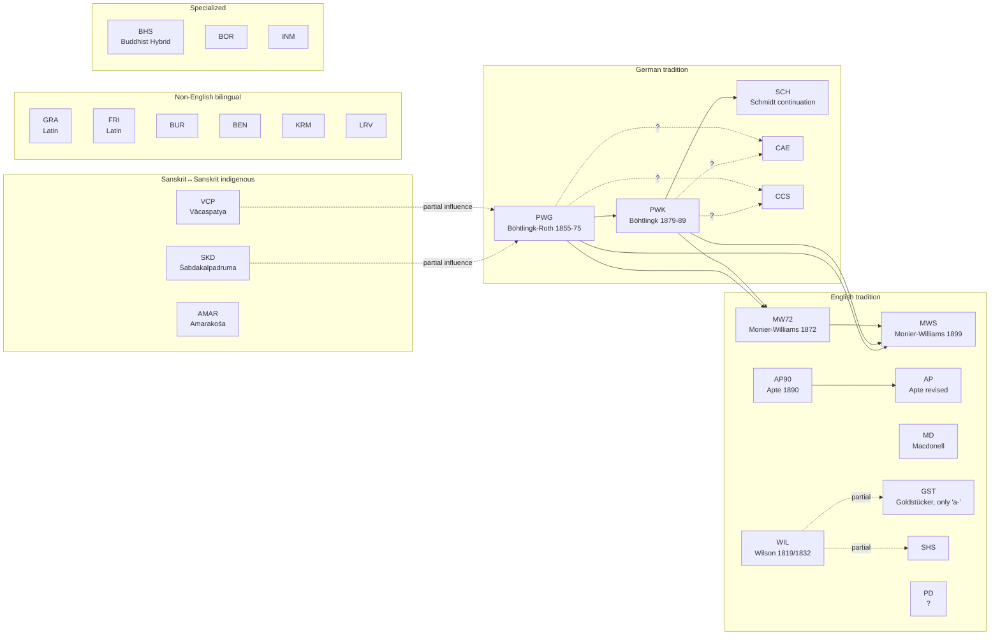

# csl-observatory — lexicography research roadmap

**Version**: 1.0 · **Date**: 2026-05-16 · **Owner**: M. Gasūns + Claude Code
**Companion to**: [`OBSERVATORY_DESIGN.md`](OBSERVATORY_DESIGN.md), [`OBSERVATORY_ROADMAP.md`](OBSERVATORY_ROADMAP.md), [`PAPER_1_OUTLINE.md`](PAPER_1_OUTLINE.md)

This is a **separate research stream** from Paper 1's *measurement framework*. Paper 1 quantifies the project; this stream quantifies the **dictionaries themselves** and reconstructs their genealogy.

It will produce **three further papers**, each independently submittable.

---

## 1. Why a separate roadmap?

The 35 Cologne dictionaries are not an undifferentiated mass. Some inherit from others — sometimes verbatim, sometimes structurally, sometimes only in citations. A handful of *primary* dictionaries (PWG, VCP, SKD) underlie an entire family of *derivative* dictionaries (MW, MW72, PWK, SCH, CAE, CCS, …).

This stream **reconstructs that genealogy computationally**, validates it against documented history, and identifies undocumented relations. Outcome: a phylogenetic tree of Sanskrit lexicography, plus the methodology to build one for any DH project with related sources.

---

## 2. Known lineage (from author's domain knowledge, 2026-05-16)

A starting graph to validate algorithmically.



### Open derivation questions to answer with data
1. **CAE / CCS**: derived from PWK or PWG? Both? Which contributed more?
2. **PD**: which dictionary is closest neighbour?
3. **English-Sanskrit family**: how similar to each other? AP, AP90, MD, MW, MW72, WIL, GST, SHS, PD form one cluster — what's the substructure?
4. **Sanskrit↔non-English bilinguals (FRI, GRA, BUR, BEN, KRM, LRV)**: are they independent traditions or do they also lean on the German Petersburger tradition?
5. **Sanskrit↔Sanskrit (VCP, SKD, AMAR)**: shared Indian commentarial tradition — what's their internal overlap?
6. **Reverse influence**: how heavy is PWG/PWK's debt to VCP and SKD specifically? Quantify.
7. **Specialized dicts** (BHS, BOR, INM, others on https://www.sanskrit-lexicon.uni-koeln.de): map their sources.
8. **csldoc** at https://www.sanskrit-lexicon.uni-koeln.de/scans/csldev/csldoc/build/index.html — is documented lineage there to use as ground truth?

---

## 3. What's countable in dictionary inter-relations

Organised by signal strength (forensic → macro).

### 3.1 Forensic signals (strongest evidence of direct copy)

| Signal | Method | Why it works |
|---|---|---|
| Shared typos / OCR errors | tokenise → identify suspect tokens → cross-dict matching | Random errors are improbable to share by chance |
| Shared idiosyncratic abbreviations | regex `[A-Z][a-z]?\.` extraction → frequency table per dict | Abbreviations are author-stylistic |
| Shared idiosyncratic citation forms | extract `<ls>` → normalise → fingerprint format | Citation conventions vary widely |
| Verbatim definition strings (post-normalisation) | per-lemma string-similarity (Levenshtein, cosine) | Direct copy detection |
| **Citation truncation patterns** | compare PWG full ref `Rv. 1.22.16` vs MW `RV.` | **Truncation reveals direction**: a dict can shorten an ancestor's ref but cannot expand a descendant's |
| Shared meaning order in polysemous entries | sequence alignment of gloss arrays | Hard to share by chance with >3 meanings |
| Shared cross-reference patterns | extract `<k1>...<k1>` recurrences → graph isomorphism | Internal links are structural |

### 3.2 Lemma-level (macro coverage)

| Signal | Method | Output |
|---|---|---|
| Lemma overlap (Jaccard) per pair | set intersection / union, all 35×35 pairs | 35×35 heatmap |
| Lemma exclusivity per dict | set difference vs union of others | per-dict bar chart |
| Coverage tier histogram | count lemmas appearing in N dicts (N=1..35) | histogram |
| UpSet plot (multi-set Venn for top combinations) | UpSet algorithm on lemma sets | UpSet plot |

### 3.3 Entry-level (micro structure)

| Signal | Method | Output |
|---|---|---|
| Mean/median definition length per dict | char count per `<L>...<LEND>` block | distribution + bar |
| Polysemy depth (meanings per entry) | count numbered glosses or `;`-separated senses | distribution |
| Citation density (refs per entry) | count `<ls>` per entry | distribution |
| Cross-reference density (refs per entry) | count internal `<k1>` mentions | distribution |
| Etymology depth (lines/chars of etym per entry) | regex for etym markers | distribution |
| Variant headword count (`<k2>`) | count `<k2>` per entry | distribution |
| Grammatical-info richness | count gender/class/derivation markers | per-dict feature matrix |

### 3.4 Cross-language alignment

| Signal | Method | Output |
|---|---|---|
| Translation table per shared lemma | extract gloss → align by language | wide table |
| Concept drift score | translate all to English (LLM/dict), compute cosine across translations | per-pair drift map |
| Citation-set similarity (language-neutral) | compare `<ls>` sets ignoring gloss text | clean cross-language signal |

### 3.5 Genealogical / phylogenetic

| Signal | Method | Output |
|---|---|---|
| Pairwise unified inheritance score | weighted sum of forensic + entry + macro signals | 35×35 score matrix |
| Cladogram (phylogenetic tree) | UPGMA / neighbour-joining on inheritance distance | dendrogram |
| Bayesian directionality model | for each pair: P(A→B), P(B→A), P(both←C); priors from publication dates | directed graph |
| Stratigraphic plot | place each dict on vertical time axis with derivation arrows | Gantt-like |

---

## 4. Method: unified inheritance score (per author decision)

The headline computation. For each ordered pair (A, B):

```
inheritance_score(A → B) = w1 * forensic_evidence(A→B)
                         + w2 * entry_similarity(A, B) * recency_penalty(A, B)
                         + w3 * lemma_overlap(A, B)
                         + w4 * citation_truncation_evidence(A→B)
                         + w5 * meaning_order_preservation(A, B)
```

Where:
- `forensic_evidence(A→B)`: count of (typo, abbreviation, citation form) shared between A and B that are rare/unique. Weight by rarity.
- `entry_similarity(A, B)`: mean string similarity for shared lemmas (post-normalisation).
- `recency_penalty(A, B)`: B published after A → no penalty; A published after B → strong penalty (B can't inherit from A if A is younger).
- `lemma_overlap(A, B)`: Jaccard.
- `citation_truncation_evidence(A→B)`: count of citations where A is more specific than B (PWG full ref → MW abbreviated). Truncation is one-directional evidence.
- `meaning_order_preservation(A, B)`: Spearman correlation of meaning indices for shared polysemous entries.

Weights `w1..w5` calibrated against the **known** lineage (PWG→PWK, MW72→MW, AP90→AP) — supervised tuning. Rest of derivation graph is then predicted; novel high-score edges are the discoveries.

### Bayesian extension

For each candidate edge A → B with score s:
```
P(A → B | s) = s / (s + s' + ε)
```
where s' is the reverse-direction score and ε accounts for "both ← common ancestor".

Output: directed acyclic graph (DAG) with edge weights = posterior probabilities.

---

## 5. Phasing

Each phase is independently shippable; each produces dashboard pages and paper material.

### Phase L1 — Source collection + corpus prep (3-5 days)
- Clone all 35 dictionaries (depth=1; ~1 GB total)
- Parse each into a normalised JSONL: `{repo, lemma, lemma_iast, glosses[], citations[], cross_refs[], etymology, body_chars}`
- Output: `data/dict_corpus.jsonl` (estimated ~600,000 entries)
- Validate: per-dict counts vs known headword totals

### Phase L2 — Macro lemma analysis (2-3 days)
- 35×35 Jaccard heatmap
- Lemma exclusivity per dict
- Coverage-tier histogram
- UpSet plot for top combinations
- New dashboard page: `/lexicography/macro.md`
- **Paper M Section**: Methods §3 (lemma-set comparison), Results §4.1

### Phase L3 — Forensic analysis (1-2 weeks, hardest)
- Build typo / abbreviation / unusual-citation extractor
- Run pairwise rarity-weighted shared-anomaly count
- Citation truncation analysis (PWG ↔ MW especially)
- New dashboard page: `/lexicography/forensic.md`
- **Paper M Section**: §4.2 (forensic signals); **Paper H Section**: §5 (PWG → MW textual evidence)

### Phase L4 — Entry similarity within language families (1 week)
- Process each language family separately first:
  - **German group**: PWG, PWK, SCH, CAE, CCS
  - **English group**: WIL, MW72, MW, AP90, AP, MD, GST, SHS, PD
  - **Sanskrit↔Sanskrit**: VCP, SKD, AMAR
  - **Latin / other bilinguals**: FRI, GRA, BUR, BEN, KRM, LRV
- For each shared lemma: definition-string similarity matrix
- New dashboard pages: `/lexicography/german.md`, `/english.md`, `/sanskrit-sanskrit.md`, `/other.md`
- **Paper L Section**: §3 (per-family analysis)

### Phase L5 — Cross-language Sanskrit-headword comparison (3-5 days)
- Compare across families using language-neutral signals:
  - Lemma sets (fully neutral)
  - Citation sets (fully neutral — `<ls>` references)
  - Cross-reference structure (fully neutral)
- Detect: do non-German bilinguals lean on German tradition or independent?
- **Paper L Section**: §4 (cross-family analysis)

### Phase L6 — Citation-set inheritance (2-3 days, the user's lateral idea)
- Build per-dict citation index: every `<ls>` reference normalised
- Truncation analysis: PWG `Rv. 1.22.16` vs MW `RV.` — measure information-loss direction
- Citation-set Jaccard, language-neutral
- New chart: citation-truncation Sankey
- **Paper M Section**: §4.3 (citation-evidence)

### Phase L7 — Translation alignment (the final initial step, 1-2 weeks)
- Translate all glosses to English using a combination of:
  - Bilingual dictionaries (de↔en, la↔en, sa↔en for VCP/SKD)
  - LLM-assisted translation (with confidence scoring)
- Per-shared-lemma cross-translation cosine similarity
- Detect concept drift across languages
- **Paper L Section**: §5 (translation-aligned analysis); **Paper H**: §6 (concept evolution across editions)

### Phase L8 — Phylogenetic synthesis (1 week)
- Aggregate signals into unified inheritance score (§4)
- Calibrate weights against known lineage
- Build cladogram
- Bayesian directional model
- Cross-validation: hold out a known edge, predict it back
- New dashboard page: `/lexicography/phylogeny.md`
- **Paper H**: §7 (the genealogy)

### Phase L9 — Specialized dictionaries survey (3-5 days)
- Inventory specialized dicts at https://www.sanskrit-lexicon.uni-koeln.de
- Parse csldoc at https://www.sanskrit-lexicon.uni-koeln.de/scans/csldev/csldoc/build/index.html for documented lineage (use as ground truth)
- BHS, BOR, INM, others — apply Phase L2-L8 methods to specialized subset
- **Paper L**: §6 (specialized dictionaries appendix); **Paper H**: §8 (specialized lineage)

### Phase L10 — Three deliverables build (per author decision: all three)
- **Dashboard section**: `/lexicography/` — already accumulated through L1-L9
- **Companion site**: `lexicography.sanskrit-lexicon.github.io` — separate Observable project, focused storytelling
- **Interactive explorer**: pick any 2 dicts → side-by-side entry view + similarity score + shared-lemma list

---

## 6. The three papers

### Paper M — Methodological
**Title**: *Computational stemmatics for digital lexicography: a multi-signal framework for reconstructing dictionary genealogy*

Audience: DH methodology venues (Digital Scholarship in the Humanities, Journal of Cultural Analytics, ACL DH workshops).

Contribution: the unified inheritance score (§4) as a reusable method. Worked example on CDSL.

Sections:
1. Introduction — the genealogy problem in lexicography
2. Related work — manual stemmatics, computational philology, biological phylogenetics
3. Method — unified inheritance score (this doc's §4)
4. Validation — recovery of known CDSL edges
5. Discoveries — predicted novel edges
6. Discussion — generalisability beyond Sanskrit
7. Conclusion

### Paper L — Linguistic
**Title**: *35 dictionaries, one Sanskrit: a computational survey of cross-dictionary lexical coverage*

Audience: Sanskrit lexicography venues (WSC main track), comparative lexicology journals.

Contribution: empirical map of how Sanskrit vocabulary is distributed across dictionaries — coverage gaps, regional bias, register coverage, semantic field bias.

Sections:
1. Introduction — what is "the Sanskrit lexicon"?
2. Corpus — the 35 dictionaries, their scopes
3. Per-family analysis — German, English, non-English bilingual, Sanskrit↔Sanskrit
4. Cross-family analysis — overlap and exclusivity
5. Translation alignment — concept drift
6. Specialized dictionaries — niche coverage
7. Discussion — what gaps remain; recommendations for future digitisation

### Paper H — Historical
**Title**: *From Petersburg to Cologne: 170 years of Sanskrit lexicography traced through computational stemmatics*

Audience: history of linguistics venues (Historiographia Linguistica), Sanskrit philology venues, WSC.

Contribution: a verified, computationally-derived genealogy of major Sanskrit dictionaries 1819-2025 with quantified inheritance strengths.

Sections:
1. Introduction — narrative of CDSL family history
2. The Petersburg axis — PWG → PWK lineage with quantified copy patterns
3. The English transmission — Wilson, MW72, MW, Apte family
4. The Sanskrit↔Sanskrit substrate — what PWG/PWK owe to VCP and SKD
5. Textual evidence — citation truncation as direction-of-flow proof
6. Concept evolution across editions — translation-alignment view
7. The genealogy reconstructed — the phylogenetic tree
8. Specialized lineage
9. Discussion — what the data confirms, what it overturns

---

## 7. Outputs and their relation

| Deliverable | Lives at | Audience |
|---|---|---|
| Dashboard `/lexicography/` section | sanskrit-lexicon.github.io/csl-observatory/lexicography | Researchers, casual visitors |
| Companion site | lexicography.sanskrit-lexicon.github.io | Lexicography deep-divers |
| Interactive explorer | (in companion site) | Comparative scholars, students |
| Paper M | DH methodology journal | DH methodologists |
| Paper L | WSC + lexicography journal | Sanskrit lexicographers |
| Paper H | History-of-linguistics journal + WSC | Historians of philology |
| Public data (`/data/` URLs) | with each chart | Anyone reproducing or extending |

---

## 8. Drafting order suggestion

1. Phase L1 (corpus prep) — foundation for everything
2. Phase L2 (macro lemma) — quick wins, dashboard-able immediately
3. Phase L4 (per-family) — Paper L's spine, **start here for fastest paper draft**
4. Phase L3 (forensic) — Paper M's spine, slower but foundational
5. Phase L6 (citations) — quick add, validates inheritance signals
6. Phase L8 (phylogeny) — synthesises everything
7. Phases L5, L7, L9 — finish remaining angles
8. Phase L10 — productise as 3 deliverables
9. Three papers drafted in parallel, finalised in order: L → M → H

---

## 9. Open questions for next round

1. **Specialized dicts inventory**: do you have a curated list of specialized CDSL dicts (besides BHS, BOR, INM) or should I scrape https://www.sanskrit-lexicon.uni-koeln.de ?
2. **csldoc**: is there a single canonical doc at https://www.sanskrit-lexicon.uni-koeln.de/scans/csldev/csldoc/build/index.html that already documents lineage (so we can use it as ground truth)?
3. **PD**: what dictionary does this abbreviation stand for? (Pāli? Personal Dictionary? Prākrit?)
4. **GST and SHS**: what are the full titles? (GST = Goldstücker, presumably; SHS = ?)
5. **Translation in L7**: do you prefer the LLM-assisted route (faster, fuzzier) or the strict bilingual-dictionary route (slower, deterministic)?
6. **Phylogenetic algorithm**: UPGMA (simple, fast) vs Neighbor-Joining (better when divergence rates vary) vs Bayesian (most rigorous, slowest)? I'll default to all three with comparison if you want.
7. **For the user**: are you a co-author on Papers L and H by virtue of running the project, or is the authorship list intentionally broader?
