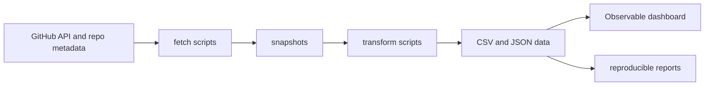

# csl-observatory Design

Date: 2026-06-04

Status: active design after boundary cleanup. This document supersedes the
former broad metrics design, now preserved as
`OBSERVATORY_DESIGN_LEGACY_BROAD_METRICS.md`.

## Mission

`csl-observatory` is the GitHub and organization observatory for the
Sanskrit-Lexicon / CDSL ecosystem.

It measures repository work, not dictionary substance. The primary objects are
repositories, issues, pull requests, commits, contributors, workflows,
repository metadata, project boards, runbooks, and maintenance processes.

## Boundary

Allowed here:

- GitHub activity across Sanskrit-Lexicon repositories.
- Repository health, license, citation, README, template, and workflow checks.
- Issue and PR taxonomy statistics.
- Contributor identity, tenure, activity, and review patterns.
- Organization-level maintenance, automation, and release-process metrics.
- Reports that explain CDSL digitisation as a GitHub/org maintenance history.

Not allowed here:

- Dictionary microstructure, source citations, headword systems, sense
  structures, lexicographic genealogy, or dictionary comparison. These belong
  in `csl-atlas`.
- TEI, OntoLex, FrAC, SHACL, RDF, and export validation implementation. These
  belong in `csl-standards`.
- DCS/corpus data or grammar dashboards. DCS belongs in
  `https://github.com/gasyoun/VisualDCS`; grammar needs a future separate repo.
- Broad publication planning that is not specifically a report about
  GitHub/org observability.
- Website usage analytics, dictionary lookup telemetry, Wikipedia backlink
  studies, or content mining unless a future human decision assigns them to a
  separate home.

## Data Sources

The active observatory pipeline may read:

- GitHub REST and GraphQL data for repositories, issues, PRs, commits,
  workflows, releases, labels, milestones, and project metadata.
- Repository files used as metadata evidence: `README`, `LICENSE`,
  `CITATION.cff`, contribution guides, issue templates, workflow files, and
  similar governance artifacts.
- Maintainer-curated identity metadata for contributors.

It must not parse dictionary entry text, corpus records, TEI/OntoLex exports,
or lookup logs as observatory source data.

## Pipeline

The dashboard remains static-built and GitHub Pages friendly. Every chart must
be reproducible from committed code plus documented snapshot inputs.

## Core Metrics

Activity:

- Issues and PRs opened, closed, merged, or still open by repo and time.
- Commit volume, churn, release cadence, and workflow activity.
- Time-to-close, time-to-first-response, and time-to-merge where measurable.

Repository Health:

- License, citation, README, template, and workflow presence.
- Stale repos, archived repos, branch defaults, and release/tag status.
- Tooling-runbook adoption and metadata completeness.

Community:

- Contributors by repo and year.
- Contributor tenure, first-touch, last-touch, and repo coverage.
- Maintainer concentration and review activity.

Organization Process:

- Runbook completion.
- Label and milestone coverage.
- Cross-repo issue references and maintenance workflows.
- Public artifact refresh tasks as repository/process evidence only.

## External Comparators

External projects such as DCS, Pandanus, Sanskrit Heritage, Perseus, or CDLI
may appear only as repository or project-level comparators. A comparison may
measure public repository openness, activity, contributor structure, license,
or release metadata. It must not import their corpus, dictionary, or content
models into this repository.

## Legacy Material

The earlier design included source mining, Matomo analytics, backlinks,
citation tracking, and a broad WSC publication program. That historical plan is
preserved in `OBSERVATORY_DESIGN_LEGACY_BROAD_METRICS.md` for reference, but it
is not the active scope.
