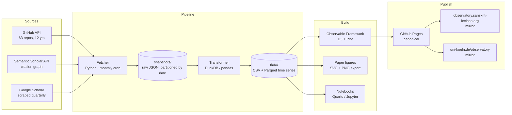

# csl-observatory — Design Document

**Version**: 1.0 · **Date**: 2026-05-15 · **Author**: M. Gasūns + Claude Code
**Target venue**: World Sanskrit Conference 2028 (long paper, multi-paper roadmap)

---

## 1. Goal

Build a single, public, auto-refreshing observatory at `sanskrit-lexicon.github.io/csl-observatory/` that turns 12 years of Cologne Digital Sanskrit Lexicon (CDSL) git activity into measurable, citable, reproducible knowledge — usable both as a live dashboard and as the empirical backbone for a sequence of WSC 2028 papers.

The observatory must:

- Aggregate stats across **all 63 sanskrit-lexicon repositories** (35 dictionary + 28 tooling).
- Cover **2014-01-01 → present** at mixed granularity (annual narrative · monthly heatmaps · daily zoom).
- Refresh **manually on demand + monthly fallback** via GitHub Actions.
- Be reproducible: anyone with the repo can re-derive every chart from raw API snapshots.
- Mirror to three locations: GitHub Pages (canonical), `observatory.sanskrit-lexicon.org` (DNS-pending), `uni-koeln.de/observatory` (Cologne web team).

---

## 2. Architecture

**Why Observable Framework**: static-built (GitHub Pages compatible), but supports rich D3 / Plot interactivity. Source files are markdown with embedded JS — diffs as nicely as a paper draft. Pre-renders all charts at build time so everything is fast and citeable.

---

## 3. Data sources & refresh

| Source | Method | Cadence | Output |
|---|---|---|---|
| GitHub REST + GraphQL | `gh api` via Python fetcher | Monthly cron + manual | `snapshots/YYYY-MM.json` per repo |
| Semantic Scholar API | `httpx` + paper IDs seeded from a curated list | Monthly | `citations/papers.json` |
| Google Scholar | manual scrape (quarterly) — `scholarly` lib for "Cologne Digital Sanskrit Lexicon" | Quarterly | `citations/scholar.csv` |

**Snapshot strategy**: append-only. Every monthly fetch writes a fresh dated file under `snapshots/`. Old snapshots are never overwritten — they are the audit trail. A reviewer can re-derive every chart from any historical state.

**Manual refresh**: `python observatory/fetch.py --since YYYY-MM-DD` — run by maintainer ahead of a presentation or draft revision.

---

## 4. KPI catalog

Organised by the **four focus areas** (all four were selected). Each KPI lists the GitHub primitive it comes from, the visualisation, and which paper consumes it.

### 4.1 Activity (Paper 1: Quantifying)

| KPI | Source | Viz | Paper |
|---|---|---|---|
| Issues opened / closed per month per repo | `issues?state=all` | Stacked area, repo-faceted | 1, 3 |
| Median time-to-close | issue events | Box plot per year | 1 |
| Throughput (closed/month, all repos) | aggregated | Single line, 144 months | 1 |
| Activity heatmap (day-of-week × hour) | issue/commit timestamps | GitHub-style calendar | 1 |
| First-issue / last-issue per repo | issues | Gantt-style swim lanes | 3 |
| Commit volume per repo per year | git log via API | Stacked bars | 1, 3 |
| PR merge rate, time-to-review | PRs API | Distribution + trend | 1 |
| Release cadence | tags / releases API | Vertical events on timeline | 3 |

### 4.2 Coverage & quality (Paper 2 + Paper 4)

| KPI | Source | Viz | Paper |
|---|---|---|---|
| Issues per type label (the 9-label taxonomy) | labels | Stacked bar over time + sankey to milestone | 2, 4 |
| % of issues with full triage (type+sev+ms) | derived | Single number + monthly trend | 2 |
| Cross-repo `cross-repo` linkages | label + body parsing | Network graph | 4 |
| "Solved → open" ratio per dictionary | issues | Per-repo bar chart | 2 |
| Code-to-data ratio (LOC of tooling vs MB of data) | tree API + repo size | Scatter | 4 |
| Roundtrip-encoding test pass rate (where measurable) | runbook Phase 14 metadata | Single line over time | 2 |

### 4.3 Community (Paper 3)

| KPI | Source | Viz | Paper |
|---|---|---|---|
| Unique contributors per year | commits + issues | Stacked area new-vs-returning | 3 |
| Bus-factor per repo (top-N contributor concentration) | commits | Per-repo gauge | 3 |
| Contributor first-touch / last-touch | commits | Histogram + retention curve | 3 |
| Geographic distribution (where ORCID / GitHub profile gives a hint) | manual mapping table | World map (D3) | 3 |
| Comment volume per issue | issue comments | Distribution per year | 3 |
| Onboarding curve: issue-to-first-PR time per new contributor | derived | Cohort retention chart | 3 |

### 4.4 Tech stack & ecosystem (Paper 4)

| KPI | Source | Viz | Paper |
|---|---|---|---|
| Languages used per repo per year | `languages` endpoint snapshot history | Stacked area | 4 |
| Tooling-runbook adoption timeline | label-set fingerprint per repo | Per-repo dot plot | 4 |
| Dependency graph between repos | code search for repo names + manual edges | Force-directed graph | 4 |
| API endpoints exposed (csl-apidev) over time | OpenAPI history if available, else README parsing | Line chart | 4 |
| Build-system evolution (Make → Hugo → Observable …) | file-presence over snapshots | Heatmap | 4 |

---

## 5. Benchmark study (full, per user request)

Comparable digital lexicography / corpus projects to benchmark CDSL against:

| Project | Domain | Why comparable |
|---|---|---|
| Thesaurus Linguae Graecae (TLG) | Greek lexicography | Closed-source counterpoint to CDSL's openness |
| Perseus Digital Library | Greek + Latin lexicon + corpus | Open. Tufts. Long-running |
| Cuneiform Digital Library Initiative (CDLI) | Sumerian / Akkadian | Open. Github-hosted. Comparable scale |
| DDBDP (Duke Databank of Documentary Papyri) | Papyrology | Long-running open project |
| Pandanus (Czech Sanskrit dict) | Sanskrit lexicography | Direct sister project |
| Sanskrit Heritage (Gérard Huet) | Sanskrit morphology | Sister project, different scope |
| Digital Corpus of Sanskrit (DCS) | Sanskrit corpus + lexicon links | Direct sibling |

Comparison axes: **openness · throughput · contributor diversity · API coverage · citation footprint · age**. Output: one matrix table + one radar chart per axis. Not a leaderboard — a positioning chart.

---

## 6. Paper roadmap (sequence the user asked for)

Each paper reuses the same data backbone; only the framing and selected charts change.

### Paper 1 — *Quantifying digital lexicography: A 12-year measurement framework for the CDSL*
Methodological. Defines the KPI catalog above, justifies the metrics, validates against the benchmark study. **Pitch**: this is the framework other DH lexicography projects can adopt.

### Paper 2 — *Community-driven correction at scale: 12 years of distributed Sanskrit lexicography*
Empirical. Uses Paper 1's framework on the CDSL itself. Focus on issue typology, throughput, contributor patterns, what worked. **Pitch**: case study + lessons.

### Paper 3 — *From rescue to reference: how the Cologne Digital Sanskrit Lexicon became infrastructure*
Historical. Narrative arc 2014 → 2028 with the activity timeline as the spine. Editorial decisions, key moments, contributor stories. **Pitch**: digital humanities history piece.

### Paper 4 — *The CDSL ecosystem: data, tools, applications*
Architectural. The cross-repo graph, the tooling stack, the API → app pipeline. **Pitch**: a model for how lexicographic data flows through a modern DH stack.

WSC 2028 long paper = **Paper 1**. Papers 2–4 follow at WSC 2028 satellite events, journals, and WSC 2031.

---

## 7. Implementation plan

| Phase | Deliverable | Est. effort | Status |
|---|---|---|---|
| 0 — Design doc | This document | done | ✓ |
| 1 — Data fetcher | `observatory/fetch.py` + first historical backfill (2014-now) | 1 week | ⏭ next |
| 2 — Data pipeline | DuckDB transformer + Parquet schema | 3 days | |
| 3 — Observable scaffold | `observatory/site/` with one page per focus area | 1 week | |
| 4 — Activity charts (Paper 1 figures) | KPIs from §4.1 rendered | 1 week | |
| 5 — Community charts (Paper 3 figures) | KPIs from §4.3 + ORCID name map | 1 week | |
| 6 — Coverage + tech-stack charts (Papers 2 + 4) | KPIs from §4.2, §4.4 | 1 week | |
| 7 — Benchmark study | Comparison table + per-project data fetches | 2 weeks | |
| 8 — Citation tracking | Semantic Scholar + Scholar quarterly job | 3 days | |
| 9 — GH Actions cron | Monthly refresh + manual `workflow_dispatch` | 1 day | |
| 10 — Mirror setup | DNS for subdomain; Cologne handover | depends on 3rd parties | |
| 11 — Paper 1 draft | Using §4.1 charts + §5 benchmark | continuous | |

Total active build effort: ~6 weeks, spread across 18 months. WSC 2028 deadline assumed late 2027 / early 2028.

---

## 8. Identity & attribution policy

- **GitHub usernames** are the canonical identifier in raw data.
- A curated `observatory/people.yaml` maps usernames → real names + ORCID + (optional) institution.
- The mapping is updated by maintainer with consent of contributors.
- Charts default to **real names where mapped, usernames otherwise**.
- Aggregated views (counts, retention curves) never expose individuals.
- A "join the people index" CONTRIBUTING note invites contributors to add themselves.

---

## 9. Risks & mitigations

| Risk | Mitigation |
|---|---|
| GitHub rate limits when backfilling 12 years × 63 repos | Snapshot once, then incremental. Cache aggressively. Use GraphQL for bulk |
| Google Scholar blocking automated scraping | Quarterly only, manual fallback, rotate user-agents, Semantic Scholar primary |
| Real-name mapping out of date | Pull request workflow on `people.yaml`; quarterly review |
| Observable Framework lock-in | All raw data is CSV/Parquet; charts are vanilla D3/Plot — re-portable |
| Cologne website mirror coordination delay | GitHub Pages is the canonical truth; mirrors are convenience |
| Paper data drift as project evolves | Every figure caption includes the snapshot date; archived snapshots cited |

---

## 10. Open questions for next round

1. Where will the **`people.yaml`** seed data come from? (existing CONTRIBUTORS files? mailing list? you'll author by hand?)
2. Do you have **Cologne website analytics** access we should plan to ingest later?
3. Should the dashboard expose a **public JSON / CSV API** for other DH projects to consume our metrics?
4. For the **benchmark study**: do you have working contacts at TLG / Perseus / CDLI to validate our comparison numbers, or should we use only public data?

---

*Next step on approval: implement Phase 1 (data fetcher + 12-year backfill).*