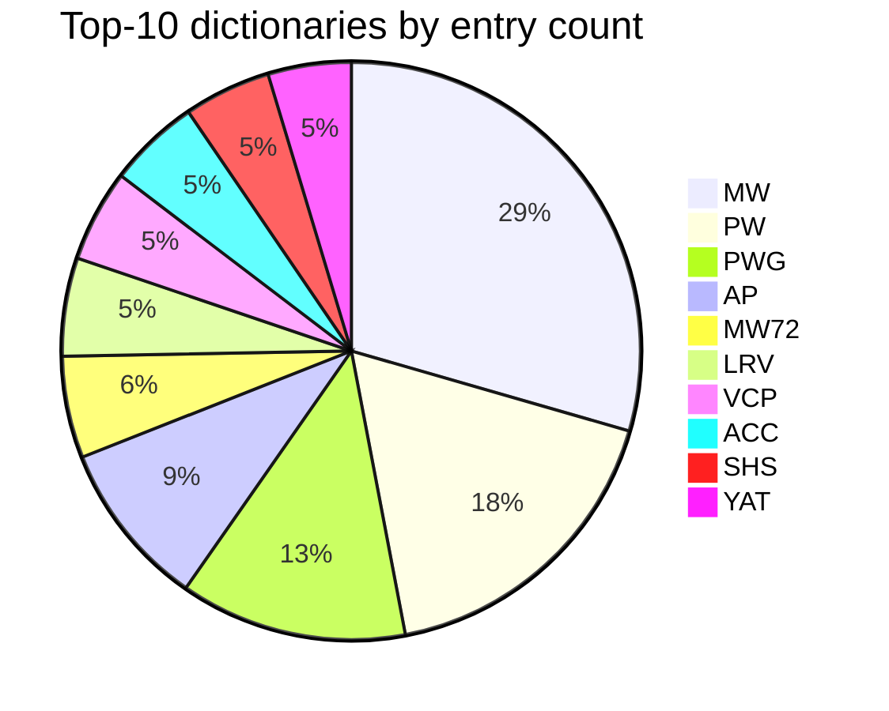

# Coverage and provenance

This report tracks **dictionary entry counts** (counted as `<L>` markers in source files), **license declarations**, and **markup integrity** (whether `<L>` and `<LEND>` markers balance) across the CDSL ecosystem. Headword counts are derived from source files in `csl-orig/v02/<dict>/<dict>.txt` by `scripts/count_headwords.py`.

## Summary

- **Dictionaries counted**: 43
- **Total entries (`<L>` markers)**: 1,495,422
- **Markup integrity**: ✓ all `<L>`/`<LEND>` markers balance

## Entry counts per dictionary

| Dict | `<L>` count | Bytes | Source file |
|---|---:|---:|---|
| **MW** | 286,558 | 50,164,660 | `csl-orig/v02/mw/mw.txt` |
| **PW** | 170,556 | 31,336,052 | `csl-orig/v02/pw/pw.txt` |
| **PWG** | 123,366 | 51,707,124 | `csl-orig/v02/pwg/pwg.txt` |
| **AP** | 90,613 | 18,445,932 | `csl-orig/v02/ap/ap.txt` |
| **MW72** | 55,388 | 17,165,090 | `csl-orig/v02/mw72/mw72.txt` |
| **LRV** | 53,441 | 7,103,308 | `csl-orig/v02/lrv/lrv.txt` |
| **VCP** | 50,135 | 25,101,554 | `csl-orig/v02/vcp/vcp.txt` |
| **ACC** | 49,822 | 8,165,272 | `csl-orig/v02/acc/acc.txt` |
| **SHS** | 47,326 | 9,240,899 | `csl-orig/v02/shs/shs.txt` |
| **YAT** | 45,206 | 5,234,709 | `csl-orig/v02/yat/yat.txt` |
| **WIL** | 44,578 | 8,817,393 | `csl-orig/v02/wil/wil.txt` |
| **SKD** | 42,531 | 22,851,362 | `csl-orig/v02/skd/skd.txt` |
| **CAE** | 40,069 | 5,274,175 | `csl-orig/v02/cae/cae.txt` |
| **AP90** | 34,882 | 11,728,560 | `csl-orig/v02/ap90/ap90.txt` |
| **MWE** | 32,378 | 8,404,811 | `csl-orig/v02/mwe/mwe.txt` |
| **CCS** | 30,010 | 3,570,845 | `csl-orig/v02/ccs/ccs.txt` |
| **SCH** | 29,125 | 4,766,113 | `csl-orig/v02/sch/sch.txt` |
| **PWKVN** | 24,976 | 3,064,754 | `csl-orig/v02/pwkvn/pwkvn.txt` |
| **BOR** | 24,609 | 5,651,555 | `csl-orig/v02/bor/bor.txt` |
| **STC** | 24,574 | 5,733,711 | `csl-orig/v02/stc/stc.txt` |
| **MD** | 20,749 | 6,180,592 | `csl-orig/v02/md/md.txt` |
| **BUR** | 19,776 | 4,832,013 | `csl-orig/v02/bur/bur.txt` |
| **BHS** | 17,839 | 7,594,921 | `csl-orig/v02/bhs/bhs.txt` |
| **PUI** | 17,512 | 3,916,209 | `csl-orig/v02/pui/pui.txt` |
| **BEN** | 17,310 | 5,781,850 | `csl-orig/v02/ben/ben.txt` |
| **GRA** | 12,785 | 6,333,655 | `csl-orig/v02/gra/gra.txt` |
| **INM** | 12,647 | 7,012,520 | `csl-orig/v02/inm/inm.txt` |
| **AE** | 11,364 | 3,414,292 | `csl-orig/v02/ae/ae.txt` |
| **BOP** | 8,961 | 2,116,921 | `csl-orig/v02/bop/bop.txt` |
| **PE** | 8,799 | 6,498,341 | `csl-orig/v02/pe/pe.txt` |
| **FRI** | 8,155 | 2,305,509 | `csl-orig/v02/fri/fri.txt` |
| **ARMH** | 7,907 | 1,346,702 | `csl-orig/v02/armh/armh.txt` |
| **IEG** | 7,907 | 1,675,107 | `csl-orig/v02/ieg/ieg.txt` |
| **GST** | 6,780 | 2,648,665 | `csl-orig/v02/gst/gst.txt` |
| **LAN** | 4,944 | 1,402,263 | `csl-orig/v02/lan/lan.txt` |
| **VEI** | 3,834 | 3,130,875 | `csl-orig/v02/vei/vei.txt` |
| **MCI** | 2,643 | 3,658,873 | `csl-orig/v02/mci/mci.txt` |
| **KRM** | 2,061 | 3,362,516 | `csl-orig/v02/krm/krm.txt` |
| **ABCH** | 1,965 | 581,805 | `csl-orig/v02/abch/abch.txt` |
| **PGN** | 485 | 828,990 | `csl-orig/v02/pgn/pgn.txt` |
| **SNP** | 453 | 294,270 | `csl-orig/v02/snp/snp.txt` |
| **ACSJ** | 240 | 50,122 | `csl-orig/v02/acsj/acsj.txt` |
| **ACPH** | 163 | 63,631 | `csl-orig/v02/acph/acph.txt` |

### Top-10 dictionaries by entry count

## License posture (per repo)

| Repo | License | Issues triaged |
|---|---|:---:|
| ACC | *(none)* | ✓ |
| AMAR | GPL-2.0 | ✓ |
| AP | NOASSERTION | ✓ |
| AP90 | GPL-3.0 | ✓ |
| ApteES | NOASSERTION | ✓ |
| ArabicInSanskrit | *(none)* | ✓ |
| BEN | *(none)* | ✓ |
| BHS | *(none)* | ✓ |
| BOP | NOASSERTION | ✓ |
| BOR | NOASSERTION | ✓ |
| BUR | NOASSERTION | ✓ |
| CAE | *(none)* | ✓ |
| CCS | *(none)* | ✓ |
| COLOGNE | NOASSERTION | ✓ |
| CORRECTIONS | *(none)* |  |
| DCS | NOASSERTION | ✓ |
| FRI | NOASSERTION | ✓ |
| GRA | NOASSERTION | ✓ |
| GreekInSanskrit | *(none)* | ✓ |
| INM | NOASSERTION | ✓ |
| KNA | *(none)* | ✓ |
| KOW | *(none)* | ✓ |
| KRM | GPL-3.0 | ✓ |
| LRV | *(none)* | ✓ |
| MCI | *(none)* | ✓ |
| MD | NOASSERTION | ✓ |
| MW72 | NOASSERTION | ✓ |
| MWS | NOASSERTION | ✓ |
| MWinflect | *(none)* | ✓ |
| PWG | NOASSERTION | ✓ |
| PWK | NOASSERTION | ✓ |
| SCH | NOASSERTION | ✓ |
| SHS | *(none)* | ✓ |
| SKD | *(none)* | ✓ |
| STC | *(none)* | ✓ |
| VCP | NOASSERTION | ✓ |
| VEI | *(none)* | ✓ |
| WIL | *(none)* | ✓ |
| Wil-YAT | NOASSERTION | ✓ |
| alternateheadwords | *(none)* | ✓ |
| avlinks | *(none)* |  |
| cologne-hugo | GPL-3.0 |  |
| cologne-stardict | MIT | ✓ |
| csl-apidev | *(none)* | ✓ |
| csl-app | GPL-3.0 | ✓ |
| csl-atlas | NOASSERTION |  |
| csl-corrections | GPL-3.0 | ✓ |
| csl-devanagari | *(none)* | ✓ |
| csl-doc | *(none)* | ✓ |
| csl-homepage | *(none)* |  |
| csl-inflect | LGPL-3.0 | ✓ |
| csl-json | *(none)* |  |
| csl-kale | GPL-3.0 | ✓ |
| csl-ldev | *(none)* | ✓ |
| csl-lnum | *(none)* | ✓ |
| csl-lslink | *(none)* | ✓ |
| csl-newsletter | *(none)* | ✓ |
| csl-observatory | GPL-3.0 | ✓ |
| csl-orig | NOASSERTION | ✓ |
| csl-pywork | NOASSERTION | ✓ |
| csl-santam | NOASSERTION |  |
| csl-sqlite | GPL-3.0 | ✓ |
| csl-websanlexicon | NOASSERTION |  |
| csl-westergaard | GPL-3.0 | ✓ |
| csl-whitroot | GPL-3.0 |  |
| hwnorm1 | *(none)* | ✓ |
| hwnorm2 | *(none)* | ✓ |
| literarysource | *(none)* | ✓ |
| mw-dev | *(none)* | ✓ |
| rvlinks | GPL-3.0 | ✓ |
| sanskrit-fonts | *(none)* |  |
| sanskrit-lexicon.github.io | *(none)* |  |
| santamlegacy | *(none)* |  |
| temp_corrections_acc | *(none)* |  |
| temp_corrections_ae | *(none)* |  |
| temp_corrections_ap90 | *(none)* |  |
| temp_corrections_mw | *(none)* |  |
| test_cologne_push | *(none)* |  |

**License coverage**: 37 of 78 repos declare a license; **41 are unlicensed** (FAIR R1.1 violation, addressed by runbook Phase 11).

