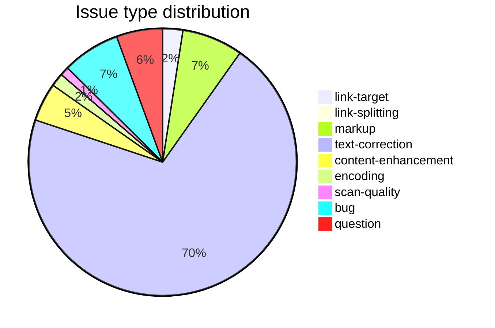

# CDSL ecosystem dashboard

**Snapshot date**: 2026-06-01 · **Fetched**: 2026-06-01T11:49:15.295382Z

## Headline numbers

| Metric | Value |
|---|---|
| Repositories in `sanskrit-lexicon` | 78 |
| Repositories with issues enabled | 78 |
| Total issues (incl. closed) | 5,365 |
| Total pull requests | 117 |
| Total commits in default branches | 5,306 |
| Distinct contributors (commit authors + issue authors) | 51 |
| Triaged repositories (taxonomy applied) | 61 |

## Issue type distribution across all triaged repos

| Type | Count | % of typed issues |
|---|---:|---:|
| `link-target` | 100 | 2.4 % |
| `link-splitting` | 9 | 0.2 % |
| `markup` | 302 | 7.3 % |
| `text-correction` | 2887 | 70.2 % |
| `content-enhancement` | 191 | 4.6 % |
| `encoding` | 66 | 1.6 % |
| `scan-quality` | 45 | 1.1 % |
| `bug` | 286 | 7.0 % |
| `question` | 229 | 5.6 % |

## Type × repository heatmap

| Type | ACC | AMAR | AP | AP90 | ApteES | ArabicInSanskrit | BEN | BHS | BOP | BOR | BUR | CAE | CCS | COLOGNE | DCS | FRI | GRA | GreekInSanskrit | INM | KNA | KOW | KRM | LRV | MCI | MD | MW72 | MWS | MWinflect | PWG | PWK | SCH | SHS | SKD | STC | VCP | VEI | WIL | Wil-YAT | alternateheadwords | cologne-stardict | csl-apidev | csl-app | csl-corrections | csl-devanagari | csl-doc | csl-inflect | csl-kale | csl-ldev | csl-lnum | csl-lslink | csl-newsletter | csl-observatory | csl-orig | csl-pywork | csl-sqlite | csl-westergaard | hwnorm1 | hwnorm2 | literarysource | mw-dev | rvlinks | total |
|---|---:|---:|---:|---:|---:|---:|---:|---:|---:|---:|---:|---:|---:|---:|---:|---:|---:|---:|---:|---:|---:|---:|---:|---:|---:|---:|---:|---:|---:|---:|---:|---:|---:|---:|---:|---:|---:|---:|---:|---:|---:|---:|---:|---:|---:|---:|---:|---:|---:|---:|---:|---:|---:|---:|---:|---:|---:|---:|---:|---:|---:|---:|
| `link-target` | 0 | 0 | 2 | 3 | 0 | 0 | 0 | 0 | 0 | 0 | 0 | 0 | 0 | 0 | 0 | 0 | 1 | 0 | 0 | 0 | 0 | 0 | 0 | 0 | 0 | 0 | 11 | 0 | 73 | 7 | 0 | 0 | 0 | 0 | 0 | 1 | 0 | 0 | 0 | 0 | 0 | 0 | 2 | 0 | 0 | 0 | 0 | 0 | 0 | 0 | 0 | 0 | 0 | 0 | 0 | 0 | 0 | 0 | 0 | 0 | 0 | **100** |
| `link-splitting` | 0 | 0 | 0 | 0 | 0 | 0 | 0 | 0 | 0 | 0 | 0 | 0 | 0 | 0 | 0 | 0 | 0 | 0 | 0 | 0 | 0 | 0 | 0 | 0 | 0 | 0 | 1 | 0 | 8 | 0 | 0 | 0 | 0 | 0 | 0 | 0 | 0 | 0 | 0 | 0 | 0 | 0 | 0 | 0 | 0 | 0 | 0 | 0 | 0 | 0 | 0 | 0 | 0 | 0 | 0 | 0 | 0 | 0 | 0 | 0 | 0 | **9** |
| `markup` | 12 | 1 | 18 | 10 | 6 | 0 | 4 | 4 | 1 | 1 | 1 | 1 | 1 | 0 | 1 | 3 | 8 | 0 | 4 | 0 | 0 | 1 | 11 | 1 | 3 | 1 | 52 | 0 | 31 | 57 | 5 | 1 | 2 | 2 | 4 | 1 | 6 | 3 | 0 | 0 | 0 | 0 | 12 | 0 | 0 | 0 | 0 | 0 | 0 | 0 | 0 | 0 | 33 | 0 | 0 | 0 | 0 | 0 | 0 | 0 | 0 | **302** |
| `text-correction` | 0 | 0 | 2 | 5 | 3 | 0 | 0 | 1 | 4 | 1 | 3 | 1 | 0 | 0 | 0 | 0 | 6 | 0 | 1 | 0 | 0 | 0 | 2 | 0 | 4 | 1 | 48 | 0 | 9 | 9 | 0 | 0 | 4 | 0 | 7 | 0 | 0 | 0 | 0 | 0 | 0 | 0 | 120 | 0 | 0 | 0 | 0 | 0 | 0 | 0 | 0 | 0 | 2656 | 0 | 0 | 0 | 0 | 0 | 0 | 0 | 0 | **2887** |
| `content-enhancement` | 2 | 0 | 2 | 6 | 2 | 0 | 3 | 2 | 1 | 0 | 2 | 2 | 1 | 0 | 1 | 5 | 14 | 0 | 3 | 1 | 1 | 3 | 3 | 0 | 6 | 0 | 29 | 0 | 18 | 23 | 4 | 1 | 5 | 1 | 7 | 0 | 10 | 1 | 0 | 0 | 0 | 0 | 7 | 0 | 0 | 0 | 0 | 0 | 0 | 0 | 0 | 0 | 25 | 0 | 0 | 0 | 0 | 0 | 0 | 0 | 0 | **191** |
| `encoding` | 1 | 0 | 2 | 4 | 0 | 0 | 2 | 0 | 1 | 1 | 0 | 0 | 0 | 0 | 0 | 1 | 3 | 0 | 1 | 0 | 0 | 0 | 0 | 0 | 1 | 2 | 10 | 0 | 11 | 1 | 2 | 1 | 2 | 0 | 1 | 0 | 0 | 2 | 0 | 0 | 0 | 0 | 13 | 0 | 0 | 0 | 0 | 0 | 0 | 0 | 0 | 0 | 4 | 0 | 0 | 0 | 0 | 0 | 0 | 0 | 0 | **66** |
| `scan-quality` | 0 | 0 | 0 | 0 | 0 | 0 | 1 | 0 | 0 | 0 | 0 | 0 | 1 | 0 | 0 | 2 | 2 | 0 | 0 | 0 | 0 | 0 | 1 | 0 | 0 | 0 | 3 | 0 | 5 | 3 | 0 | 0 | 1 | 0 | 1 | 0 | 1 | 0 | 0 | 0 | 0 | 0 | 1 | 0 | 0 | 0 | 0 | 0 | 0 | 0 | 0 | 0 | 23 | 0 | 0 | 0 | 0 | 0 | 0 | 0 | 0 | **45** |
| `bug` | 0 | 0 | 2 | 1 | 2 | 0 | 1 | 0 | 0 | 0 | 0 | 0 | 0 | 40 | 1 | 0 | 3 | 3 | 0 | 0 | 0 | 0 | 8 | 0 | 1 | 0 | 19 | 0 | 9 | 4 | 0 | 0 | 2 | 0 | 5 | 0 | 1 | 0 | 1 | 13 | 11 | 4 | 38 | 9 | 3 | 0 | 1 | 6 | 0 | 0 | 0 | 0 | 79 | 13 | 0 | 0 | 4 | 0 | 0 | 1 | 1 | **286** |
| `question` | 4 | 0 | 1 | 2 | 2 | 3 | 0 | 0 | 1 | 1 | 0 | 0 | 0 | 47 | 1 | 0 | 1 | 3 | 2 | 0 | 0 | 0 | 5 | 1 | 0 | 2 | 20 | 8 | 11 | 9 | 1 | 1 | 4 | 0 | 6 | 0 | 0 | 0 | 5 | 1 | 3 | 1 | 44 | 1 | 0 | 1 | 0 | 1 | 0 | 0 | 1 | 0 | 29 | 2 | 0 | 0 | 2 | 0 | 0 | 2 | 0 | **229** |

## Activity by year

| Year | Commits | Issues opened | Issues closed |
|---|---:|---:|---:|
| 2014 | 74 | 190 | 65 |
| 2015 | 132 | 270 | 170 |
| 2016 | 155 | 175 | 140 |
| 2017 | 89 | 268 | 130 |
| 2018 | 128 | 98 | 30 |
| 2019 | 296 | 246 | 144 |
| 2020 | 328 | 470 | 485 |
| 2021 | 703 | 639 | 485 |
| 2022 | 359 | 451 | 382 |
| 2023 | 336 | 534 | 542 |
| 2024 | 380 | 372 | 381 |
| 2025 | 612 | 1169 | 213 |
| 2026 | 1714 | 366 | 1199 |

## Top contributors (by commits)

| Real name | GitHub | Role | Commits | Repos | Span | Lines + / − |
|---|---|---|---:|---:|---|---:|
| Jim Funderburk | [@funderburkjim](https://github.com/funderburkjim) | maintainer | 2,801 | 52 | 2014-01 → 2026-06 | +49,209,629 / −4,361,878 |
| Dhaval Patel | [@drdhaval2785](https://github.com/drdhaval2785) | core | 1,291 | 28 | 2015-11 → 2026-06 | +15,437,124 / −2,470,509 |
| Mārcis Gasūns | [@gasyoun](https://github.com/gasyoun) | lead | 957 | 66 | 2014-01 → 2026-05 | +5,226,609 / −91,450 |
| Anna Rybakova | [@AnnaRybakovaT](https://github.com/AnnaRybakovaT) | occasional | 71 | 10 | 2020-12 → 2023-06 | +71,555 / −6,432 |
| GitHub Actions (bot) | [@github-actions[bot]](https://github.com/github-actions[bot]) | bot | 65 | 2 | 2026-04 → 2026-06 | +523,571 / −75,553 |
| Nagabhushana Rao | [@Andhrabharati](https://github.com/Andhrabharati) | core | 45 | 2 | 2021-01 → 2022-12 | +4,838,059 / −1,545,610 |
| (misconfigured git client) | [@you@example.com](https://github.com/you@example.com) | occasional | 30 | 5 | 2021-01 → 2021-09 | +11,395 / −8,887 |
| GitHub Actions (bot) | [@actions-user](https://github.com/actions-user) | bot | 28 | 3 | 2026-04 → 2026-06 | +23,668 / −12,780 |
| DmitriSKT | [@DmitriSKT](https://github.com/DmitriSKT) | occasional | 3 | 1 | 2017-05 → 2017-11 | +33 / −2 |
| root@localhost.localdomain | [@root@localhost.localdomain](https://github.com/root@localhost.localdomain) | occasional | 3 | 2 | 2019-10 → 2019-10 | +3 / −3 |
| Automated updater (bot) | [@cfr-auto-updater@example.com](https://github.com/cfr-auto-updater@example.com) | bot | 3 | 1 | 2025-04 → 2025-04 | +1,457 / −0 |
| Haqob | [@Haqob](https://github.com/Haqob) | occasional | 2 | 1 | 2020-08 → 2020-09 | +2,019 / −1,593 |
| dpatel3@dialog7.rrz.uni-koeln.de | [@dpatel3@dialog7.rrz.uni-koeln.de](https://github.com/dpatel3@dialog7.rrz.uni-koeln.de) | contributor | 2 | 1 | 2023-12 → 2024-01 | +121 / −0 |
| Thomas Malten | [@maltenth](https://github.com/maltenth) | core | 1 | 1 | 2021-09 → 2021-09 | +860 / −0 |
| usha.sanka@gmial.com | [@usha.sanka@gmial.com](https://github.com/usha.sanka@gmial.com) | contributor | 1 | 1 | 2021-01 → 2021-01 | +1 / −1 |
| YevgenJohn | [@YevgenJohn](https://github.com/YevgenJohn) | occasional | 1 | 1 | 2019-10 → 2019-10 | +1 / −1 |
| dependabot[bot] | [@dependabot[bot]](https://github.com/dependabot[bot]) | contributor | 1 | 1 | 2026-05 → 2026-05 | +1 / −1 |
| sanskritisampada | [@sanskritisampada](https://github.com/sanskritisampada) | occasional | 1 | 1 | 2021-01 → 2021-01 | +1 / −0 |
| IrinaKonstant | [@IrinaKonstant](https://github.com/IrinaKonstant) | contributor | 0 | 0 | - → - | +0 / −0 |
| grigoriyt1 | [@grigoriyt1](https://github.com/grigoriyt1) | contributor | 0 | 0 | - → - | +0 / −0 |

## Per-repository summary

| Repo | Commits | Issues | Open | Closed | Triaged | First | Last |
|---|---:|---:|---:|---:|:---:|---|---|
| [csl-corrections](https://github.com/sanskrit-lexicon/csl-corrections) | 850 | 238 | 22 | 216 | ✓ | 2019-12-16 | 2026-06-01 |
| [csl-apidev](https://github.com/sanskrit-lexicon/csl-apidev) | 520 | 45 | 22 | 23 | ✓ | 2018-04-17 | 2026-05-16 |
| [csl-pywork](https://github.com/sanskrit-lexicon/csl-pywork) | 494 | 50 | 10 | 40 | ✓ | 2019-07-20 | 2026-05-30 |
| [MWS](https://github.com/sanskrit-lexicon/MWS) | 409 | 193 | 35 | 158 | ✓ | 2014-01-16 | 2026-05-29 |
| [PWG](https://github.com/sanskrit-lexicon/PWG) | 400 | 175 | 65 | 110 | ✓ | 2014-09-25 | 2026-06-01 |
| [PWK](https://github.com/sanskrit-lexicon/PWK) | 277 | 113 | 40 | 73 | ✓ | 2014-11-08 | 2026-05-29 |
| [COLOGNE](https://github.com/sanskrit-lexicon/COLOGNE) | 222 | 456 | 210 | 246 | ✓ | 2014-01-14 | 2026-05-29 |
| [csl-app](https://github.com/sanskrit-lexicon/csl-app) | 179 | 39 | 3 | 36 | ✓ | 2026-03-18 | 2026-05-29 |
| [csl-observatory](https://github.com/sanskrit-lexicon/csl-observatory) | 169 | 6 | 3 | 3 | ✓ | 2026-05-07 | 2026-06-01 |
| [AP](https://github.com/sanskrit-lexicon/AP) | 141 | 30 | 12 | 18 | ✓ | 2025-07-06 | 2026-05-29 |
| [alternateheadwords](https://github.com/sanskrit-lexicon/alternateheadwords) | 118 | 25 | 19 | 6 | ✓ | 2016-10-01 | 2026-05-28 |
| [CORRECTIONS](https://github.com/sanskrit-lexicon/CORRECTIONS) | 100 | 441 | 89 | 352 |  | 2019-07-18 | 2026-05-16 |
| [MWinflect](https://github.com/sanskrit-lexicon/MWinflect) | 89 | 48 | 48 | 0 | ✓ | 2018-10-16 | 2026-05-28 |
| [MD](https://github.com/sanskrit-lexicon/MD) | 85 | 15 | 6 | 9 | ✓ | 2020-04-17 | 2026-05-29 |
| [csl-atlas](https://github.com/sanskrit-lexicon/csl-atlas) | 83 | 0 | 0 | 0 |  | 2026-05-23 | 2026-05-31 |
| [WIL](https://github.com/sanskrit-lexicon/WIL) | 76 | 18 | 14 | 4 | ✓ | 2014-12-28 | 2026-05-18 |
| [GRA](https://github.com/sanskrit-lexicon/GRA) | 68 | 38 | 10 | 28 | ✓ | 2015-01-04 | 2026-05-29 |
| [csl-inflect](https://github.com/sanskrit-lexicon/csl-inflect) | 68 | 15 | 12 | 3 | ✓ | 2019-11-27 | 2026-05-29 |
| [AP90](https://github.com/sanskrit-lexicon/AP90) | 62 | 31 | 17 | 14 | ✓ | 2020-03-14 | 2026-05-29 |
| [SKD](https://github.com/sanskrit-lexicon/SKD) | 58 | 20 | 13 | 7 | ✓ | 2014-07-19 | 2026-05-16 |
| [hwnorm2](https://github.com/sanskrit-lexicon/hwnorm2) | 45 | 5 | 4 | 1 | ✓ | 2020-02-01 | 2026-05-31 |
| [csl-newsletter](https://github.com/sanskrit-lexicon/csl-newsletter) | 44 | 2 | 2 | 0 | ✓ | 2021-09-13 | 2026-05-29 |
| [csl-doc](https://github.com/sanskrit-lexicon/csl-doc) | 41 | 6 | 2 | 4 | ✓ | 2018-10-23 | 2026-05-29 |
| [SCH](https://github.com/sanskrit-lexicon/SCH) | 40 | 12 | 4 | 8 | ✓ | 2014-01-15 | 2026-05-29 |
| [ApteES](https://github.com/sanskrit-lexicon/ApteES) | 40 | 15 | 2 | 13 | ✓ | 2014-07-15 | 2026-05-29 |
| [sanskrit-lexicon.github.io](https://github.com/sanskrit-lexicon/sanskrit-lexicon.github.io) | 40 | 0 | 0 | 0 |  | 2015-11-24 | 2026-05-29 |
| [BEN](https://github.com/sanskrit-lexicon/BEN) | 36 | 11 | 4 | 7 | ✓ | 2020-04-30 | 2026-05-16 |
| [BHS](https://github.com/sanskrit-lexicon/BHS) | 33 | 7 | 4 | 3 | ✓ | 2016-01-02 | 2026-05-16 |
| [BUR](https://github.com/sanskrit-lexicon/BUR) | 32 | 6 | 1 | 5 | ✓ | 2020-04-09 | 2026-05-30 |
| [literarysource](https://github.com/sanskrit-lexicon/literarysource) | 32 | 3 | 3 | 0 | ✓ | 2022-02-12 | 2026-05-29 |
| [temp_corrections_ap90](https://github.com/sanskrit-lexicon/temp_corrections_ap90) | 30 | 2 | 1 | 1 |  | 2021-01-13 | 2026-05-15 |
| [temp_corrections_acc](https://github.com/sanskrit-lexicon/temp_corrections_acc) | 29 | 0 | 0 | 0 |  | 2021-01-23 | 2026-05-15 |
| [CAE](https://github.com/sanskrit-lexicon/CAE) | 28 | 4 | 3 | 1 | ✓ | 2020-04-12 | 2026-05-16 |
| [BOP](https://github.com/sanskrit-lexicon/BOP) | 28 | 8 | 1 | 7 | ✓ | 2022-05-02 | 2026-05-30 |
| [DCS](https://github.com/sanskrit-lexicon/DCS) | 23 | 4 | 4 | 0 | ✓ | 2014-01-17 | 2026-05-29 |
| [rvlinks](https://github.com/sanskrit-lexicon/rvlinks) | 20 | 2 | 1 | 1 | ✓ | 2018-08-29 | 2026-05-29 |
| [temp_corrections_ae](https://github.com/sanskrit-lexicon/temp_corrections_ae) | 20 | 0 | 0 | 0 |  | 2021-01-10 | 2026-05-15 |
| [csl-lslink](https://github.com/sanskrit-lexicon/csl-lslink) | 19 | 1 | 1 | 0 | ✓ | 2026-03-31 | 2026-05-29 |
| [csl-santam](https://github.com/sanskrit-lexicon/csl-santam) | 18 | 2 | 0 | 2 |  | 2015-06-02 | 2026-05-29 |
| [FRI](https://github.com/sanskrit-lexicon/FRI) | 18 | 11 | 3 | 8 | ✓ | 2024-01-26 | 2026-05-29 |
| [SHS](https://github.com/sanskrit-lexicon/SHS) | 18 | 4 | 3 | 1 | ✓ | 2025-12-22 | 2026-05-26 |
| [BOR](https://github.com/sanskrit-lexicon/BOR) | 16 | 4 | 3 | 1 | ✓ | 2021-09-14 | 2026-05-30 |
| [VEI](https://github.com/sanskrit-lexicon/VEI) | 14 | 2 | 1 | 1 | ✓ | 2016-01-02 | 2026-05-16 |
| [KRM](https://github.com/sanskrit-lexicon/KRM) | 14 | 4 | 3 | 1 | ✓ | 2020-03-31 | 2026-05-30 |
| [avlinks](https://github.com/sanskrit-lexicon/avlinks) | 14 | 1 | 1 | 0 |  | 2021-04-08 | 2026-05-29 |
| [csl-kale](https://github.com/sanskrit-lexicon/csl-kale) | 12 | 2 | 1 | 1 | ✓ | 2019-11-09 | 2026-05-29 |
| [CCS](https://github.com/sanskrit-lexicon/CCS) | 11 | 3 | 2 | 1 | ✓ | 2020-04-15 | 2026-05-16 |
| [INM](https://github.com/sanskrit-lexicon/INM) | 11 | 11 | 3 | 8 | ✓ | 2021-12-03 | 2026-05-30 |
| [csl-westergaard](https://github.com/sanskrit-lexicon/csl-westergaard) | 10 | 1 | 1 | 0 | ✓ | 2019-11-08 | 2026-05-29 |
| [STC](https://github.com/sanskrit-lexicon/STC) | 10 | 3 | 2 | 1 | ✓ | 2020-04-19 | 2026-05-16 |
| [ACC](https://github.com/sanskrit-lexicon/ACC) | 9 | 19 | 10 | 9 | ✓ | 2017-05-28 | 2026-05-16 |
| [MW72](https://github.com/sanskrit-lexicon/MW72) | 8 | 6 | 1 | 5 | ✓ | 2014-08-24 | 2026-05-30 |
| [MCI](https://github.com/sanskrit-lexicon/MCI) | 8 | 2 | 1 | 1 | ✓ | 2026-05-15 | 2026-05-16 |
| [GreekInSanskrit](https://github.com/sanskrit-lexicon/GreekInSanskrit) | 8 | 44 | 2 | 42 | ✓ | 2015-04-15 | 2026-05-15 |
| [temp_corrections_mw](https://github.com/sanskrit-lexicon/temp_corrections_mw) | 8 | 2 | 1 | 1 |  | 2021-04-11 | 2026-05-15 |
| [AMAR](https://github.com/sanskrit-lexicon/AMAR) | 8 | 1 | 1 | 0 | ✓ | 2024-01-30 | 2026-05-29 |
| [Wil-YAT](https://github.com/sanskrit-lexicon/Wil-YAT) | 7 | 6 | 0 | 6 | ✓ | 2015-03-10 | 2026-05-15 |
| [csl-whitroot](https://github.com/sanskrit-lexicon/csl-whitroot) | 7 | 0 | 0 | 0 |  | 2019-11-08 | 2026-05-29 |
| [test_cologne_push](https://github.com/sanskrit-lexicon/test_cologne_push) | 5 | 0 | 0 | 0 |  | 2023-11-09 | 2026-05-15 |
| [ArabicInSanskrit](https://github.com/sanskrit-lexicon/ArabicInSanskrit) | 4 | 16 | 0 | 16 | ✓ | 2015-01-18 | 2026-05-15 |
| [sanskrit-fonts](https://github.com/sanskrit-lexicon/sanskrit-fonts) | 4 | 0 | 0 | 0 |  | 2018-09-05 | 2026-05-29 |
| [KNA](https://github.com/sanskrit-lexicon/KNA) | 4 | 1 | 1 | 0 | ✓ | 2026-02-21 | 2026-05-29 |
| [KOW](https://github.com/sanskrit-lexicon/KOW) | 4 | 1 | 1 | 0 | ✓ | 2026-02-21 | 2026-05-29 |
| [csl-sqlite](https://github.com/sanskrit-lexicon/csl-sqlite) | 4 | 1 | 1 | 0 | ✓ | 2026-04-08 | 2026-05-29 |
| [cologne-hugo](https://github.com/sanskrit-lexicon/cologne-hugo) | 3 | 0 | 0 | 0 |  | 2021-01-20 | 2026-05-29 |
| [santamlegacy](https://github.com/sanskrit-lexicon/santamlegacy) | 1 | 0 | 0 | 0 |  | 2026-05-15 | 2026-05-15 |
| [VCP](https://github.com/sanskrit-lexicon/VCP) | 0 | 31 | 20 | 11 | ✓ | - | - |
| [hwnorm1](https://github.com/sanskrit-lexicon/hwnorm1) | 0 | 20 | 17 | 3 | ✓ | - | - |
| [cologne-stardict](https://github.com/sanskrit-lexicon/cologne-stardict) | 0 | 48 | 3 | 45 | ✓ | - | - |
| [csl-homepage](https://github.com/sanskrit-lexicon/csl-homepage) | 0 | 0 | 0 | 0 |  | - | - |
| [csl-websanlexicon](https://github.com/sanskrit-lexicon/csl-websanlexicon) | 0 | 0 | 0 | 0 |  | - | - |
| [csl-orig](https://github.com/sanskrit-lexicon/csl-orig) | 0 | 2801 | 68 | 2733 | ✓ | - | - |
| [csl-json](https://github.com/sanskrit-lexicon/csl-json) | 0 | 9 | 0 | 9 |  | - | - |
| [csl-devanagari](https://github.com/sanskrit-lexicon/csl-devanagari) | 0 | 43 | 17 | 26 | ✓ | - | - |
| [csl-lnum](https://github.com/sanskrit-lexicon/csl-lnum) | 0 | 3 | 1 | 2 | ✓ | - | - |
| [csl-ldev](https://github.com/sanskrit-lexicon/csl-ldev) | 0 | 9 | 8 | 1 | ✓ | - | - |
| [LRV](https://github.com/sanskrit-lexicon/LRV) | 0 | 30 | 2 | 28 | ✓ | - | - |
| [mw-dev](https://github.com/sanskrit-lexicon/mw-dev) | 0 | 23 | 17 | 6 | ✓ | - | - |

---
*Generated by `scripts/render_reports.py`. Data: `data/snapshots/2026-06-01/`. License: data CC BY-SA 4.0.*
