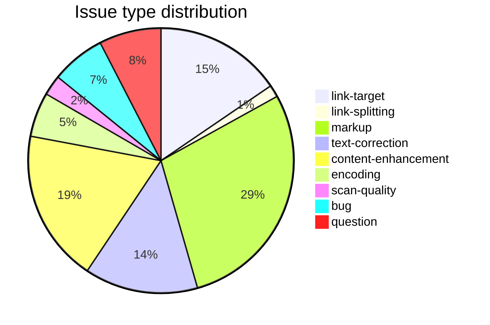

# CDSL ecosystem dashboard

**Snapshot date**: 2026-05-07 · **Fetched**: 2026-05-07T15:50:39.538564Z

## Headline numbers

| Metric | Value |
|---|---|
| Repositories in `sanskrit-lexicon` | 78 |
| Repositories with issues enabled | 78 |
| Total issues (incl. closed) | 5,172 |
| Total pull requests | 37 |
| Total commits in default branches | 3,979 |
| Distinct contributors (commit authors + issue authors) | 49 |
| Triaged repositories (taxonomy applied) | 8 |

## Issue type distribution across all triaged repos

| Type | Count | % of typed issues |
|---|---:|---:|
| `link-target` | 94 | 15.5 % |
| `link-splitting` | 9 | 1.5 % |
| `markup` | 174 | 28.6 % |
| `text-correction` | 84 | 13.8 % |
| `content-enhancement` | 113 | 18.6 % |
| `encoding` | 33 | 5.4 % |
| `scan-quality` | 15 | 2.5 % |
| `bug` | 40 | 6.6 % |
| `question` | 46 | 7.6 % |

## Type × repository heatmap

| Type | AP | AP90 | FRI | GRA | MD | MWS | PWG | PWK | total |
|---|---:|---:|---:|---:|---:|---:|---:|---:|---:|
| `link-target` | 2 | 1 | 0 | 1 | 0 | 11 | 72 | 7 | **94** |
| `link-splitting` | 0 | 0 | 0 | 0 | 0 | 1 | 8 | 0 | **9** |
| `markup` | 15 | 9 | 2 | 7 | 2 | 51 | 32 | 56 | **174** |
| `text-correction` | 2 | 5 | 0 | 6 | 4 | 48 | 10 | 9 | **84** |
| `content-enhancement` | 2 | 5 | 5 | 13 | 5 | 26 | 35 | 22 | **113** |
| `encoding` | 2 | 4 | 1 | 3 | 1 | 10 | 11 | 1 | **33** |
| `scan-quality` | 0 | 0 | 2 | 2 | 0 | 3 | 5 | 3 | **15** |
| `bug` | 2 | 1 | 0 | 3 | 1 | 19 | 10 | 4 | **40** |
| `question` | 0 | 2 | 0 | 1 | 0 | 20 | 14 | 9 | **46** |

## Activity by year

| Year | Commits | Issues opened | Issues closed |
|---|---:|---:|---:|
| 2014 | 75 | 190 | 65 |
| 2015 | 123 | 270 | 170 |
| 2016 | 160 | 175 | 140 |
| 2017 | 85 | 268 | 130 |
| 2018 | 63 | 98 | 30 |
| 2019 | 234 | 246 | 144 |
| 2020 | 255 | 470 | 485 |
| 2021 | 610 | 637 | 484 |
| 2022 | 337 | 451 | 382 |
| 2023 | 357 | 534 | 542 |
| 2024 | 309 | 372 | 381 |
| 2025 | 612 | 1169 | 213 |
| 2026 | 759 | 255 | 1122 |

## Top contributors (by commits)

| Real name | GitHub | Role | Commits | Repos | Span | Lines + / − |
|---|---|---|---:|---:|---|---:|
| Jim Funderburk | [@funderburkjim](https://github.com/funderburkjim) | maintainer | 2,415 | 53 | 2014-01 → 2026-05 | +52,717,130 / −4,102,865 |
| Dhaval Patel | [@drdhaval2785](https://github.com/drdhaval2785) | core | 1,232 | 29 | 2015-11 → 2026-05 | +23,278,470 / −3,561,196 |
| Mārcis Gasūns | [@gasyoun](https://github.com/gasyoun) | lead | 129 | 21 | 2014-01 → 2026-05 | +476,591 / −1,367 |
| Anna Rybakova | [@AnnaRybakovaT](https://github.com/AnnaRybakovaT) | occasional | 70 | 10 | 2020-12 → 2023-06 | +71,367 / −6,300 |
| GitHub Actions (bot) | [@github-actions[bot]](https://github.com/github-actions[bot]) | bot | 37 | 1 | 2026-04 → 2026-05 | +31,554 / −26,445 |
| Nagabhushana Rao | [@Andhrabharati](https://github.com/Andhrabharati) | core | 30 | 3 | 2021-03 → 2023-04 | +1,397,636 / −247,876 |
| (misconfigured git client) | [@you@example.com](https://github.com/you@example.com) | occasional | 30 | 5 | 2021-01 → 2021-09 | +11,395 / −8,887 |
| GitHub Actions (bot) | [@actions-user](https://github.com/actions-user) | bot | 21 | 2 | 2026-04 → 2026-05 | +9,985 / −285 |
| DmitriSKT | [@DmitriSKT](https://github.com/DmitriSKT) | occasional | 3 | 1 | 2017-05 → 2017-11 | +33 / −2 |
| root@localhost.localdomain | [@root@localhost.localdomain](https://github.com/root@localhost.localdomain) | occasional | 3 | 2 | 2019-10 → 2019-10 | +3 / −3 |
| Automated updater (bot) | [@cfr-auto-updater@example.com](https://github.com/cfr-auto-updater@example.com) | bot | 3 | 1 | 2025-04 → 2025-04 | +1,457 / −0 |
| Haqob | [@Haqob](https://github.com/Haqob) | occasional | 2 | 1 | 2020-08 → 2020-09 | +2,019 / −1,593 |
| Thomas Malten | [@maltenth](https://github.com/maltenth) | core | 1 | 1 | 2021-09 → 2021-09 | +860 / −0 |
| usha.sanka@gmial.com | [@usha.sanka@gmial.com](https://github.com/usha.sanka@gmial.com) | contributor | 1 | 1 | 2021-01 → 2021-01 | +1 / −1 |
| YevgenJohn | [@YevgenJohn](https://github.com/YevgenJohn) | occasional | 1 | 1 | 2019-10 → 2019-10 | +1 / −1 |
| sanskritisampada | [@sanskritisampada](https://github.com/sanskritisampada) | occasional | 1 | 1 | 2021-01 → 2021-01 | +1 / −0 |
| IrinaKonstant | [@IrinaKonstant](https://github.com/IrinaKonstant) | contributor | 0 | 0 | - → - | +0 / −0 |
| grigoriyt1 | [@grigoriyt1](https://github.com/grigoriyt1) | contributor | 0 | 0 | - → - | +0 / −0 |
| angalinde | [@angalinde](https://github.com/angalinde) | contributor | 0 | 0 | - → - | +0 / −0 |
| Azanuka2412 | [@Azanuka2412](https://github.com/Azanuka2412) | contributor | 0 | 0 | - → - | +0 / −0 |

## Per-repository summary

| Repo | Commits | Issues | Open | Closed | Triaged | First | Last |
|---|---:|---:|---:|---:|:---:|---|---|
| [csl-apidev](https://github.com/sanskrit-lexicon/csl-apidev) | 511 | 44 | 21 | 23 |  | 2018-04-17 | 2026-05-01 |
| [csl-pywork](https://github.com/sanskrit-lexicon/csl-pywork) | 455 | 42 | 4 | 38 |  | 2019-07-20 | 2026-05-05 |
| [csl-corrections](https://github.com/sanskrit-lexicon/csl-corrections) | 400 | 209 | 18 | 191 |  | 2024-10-11 | 2026-05-07 |
| [PWG](https://github.com/sanskrit-lexicon/PWG) | 370 | 169 | 63 | 106 | ✓ | 2014-09-25 | 2026-05-07 |
| [PWK](https://github.com/sanskrit-lexicon/PWK) | 257 | 111 | 40 | 71 | ✓ | 2014-11-08 | 2026-05-06 |
| [COLOGNE](https://github.com/sanskrit-lexicon/COLOGNE) | 203 | 454 | 208 | 246 |  | 2014-01-14 | 2026-05-05 |
| [MWS](https://github.com/sanskrit-lexicon/MWS) | 200 | 189 | 32 | 157 | ✓ | 2021-02-27 | 2026-05-07 |
| [csl-app](https://github.com/sanskrit-lexicon/csl-app) | 173 | 37 | 1 | 36 |  | 2026-03-18 | 2026-05-06 |
| [AP](https://github.com/sanskrit-lexicon/AP) | 127 | 26 | 11 | 15 | ✓ | 2025-07-06 | 2026-05-07 |
| [alternateheadwords](https://github.com/sanskrit-lexicon/alternateheadwords) | 111 | 25 | 19 | 6 |  | 2016-10-01 | 2021-09-23 |
| [VCP](https://github.com/sanskrit-lexicon/VCP) | 108 | 28 | 19 | 9 |  | 2014-01-22 | 2024-01-04 |
| [CORRECTIONS](https://github.com/sanskrit-lexicon/CORRECTIONS) | 100 | 441 | 89 | 352 |  | 2019-07-05 | 2026-01-27 |
| [PUI](https://github.com/sanskrit-lexicon/PUI) | 72 | 4 | 2 | 2 |  | 2026-04-05 | 2026-04-05 |
| [MD](https://github.com/sanskrit-lexicon/MD) | 68 | 13 | 5 | 8 | ✓ | 2020-04-17 | 2026-05-07 |
| [csl-inflect](https://github.com/sanskrit-lexicon/csl-inflect) | 61 | 14 | 11 | 3 |  | 2019-11-27 | 2023-07-14 |
| [SKD](https://github.com/sanskrit-lexicon/SKD) | 50 | 18 | 12 | 6 |  | 2014-07-19 | 2023-10-19 |
| [GRA](https://github.com/sanskrit-lexicon/GRA) | 50 | 36 | 9 | 27 | ✓ | 2015-01-04 | 2026-05-07 |
| [AP90](https://github.com/sanskrit-lexicon/AP90) | 43 | 27 | 15 | 12 | ✓ | 2020-03-14 | 2026-05-07 |
| [sanskrit-lexicon.github.io](https://github.com/sanskrit-lexicon/sanskrit-lexicon.github.io) | 38 | 0 | 0 | 0 |  | 2015-11-24 | 2021-02-03 |
| [mw-dev](https://github.com/sanskrit-lexicon/mw-dev) | 38 | 23 | 17 | 6 |  | 2023-01-19 | 2023-04-03 |
| [csl-newsletter](https://github.com/sanskrit-lexicon/csl-newsletter) | 37 | 2 | 2 | 0 |  | 2021-09-13 | 2023-12-09 |
| [WIL](https://github.com/sanskrit-lexicon/WIL) | 35 | 14 | 12 | 2 |  | 2014-12-28 | 2020-06-21 |
| [csl-doc](https://github.com/sanskrit-lexicon/csl-doc) | 34 | 6 | 2 | 4 |  | 2018-10-23 | 2025-09-01 |
| [hwnorm2](https://github.com/sanskrit-lexicon/hwnorm2) | 34 | 5 | 4 | 1 |  | 2020-02-01 | 2026-05-03 |
| [temp_corrections_ap90](https://github.com/sanskrit-lexicon/temp_corrections_ap90) | 29 | 2 | 1 | 1 |  | 2021-01-13 | 2022-03-02 |
| [BEN](https://github.com/sanskrit-lexicon/BEN) | 28 | 9 | 3 | 6 |  | 2020-04-30 | 2024-08-27 |
| [temp_corrections_acc](https://github.com/sanskrit-lexicon/temp_corrections_acc) | 28 | 0 | 0 | 0 |  | 2021-01-23 | 2021-09-03 |
| [BHS](https://github.com/sanskrit-lexicon/BHS) | 25 | 5 | 3 | 2 |  | 2016-01-02 | 2024-12-30 |
| [literarysource](https://github.com/sanskrit-lexicon/literarysource) | 25 | 3 | 3 | 0 |  | 2022-02-12 | 2022-02-18 |
| [BOP](https://github.com/sanskrit-lexicon/BOP) | 24 | 7 | 1 | 6 |  | 2022-05-02 | 2024-05-09 |
| [BUR](https://github.com/sanskrit-lexicon/BUR) | 22 | 5 | 1 | 4 |  | 2020-04-09 | 2024-04-01 |
| [SCH](https://github.com/sanskrit-lexicon/SCH) | 21 | 10 | 3 | 7 |  | 2014-01-15 | 2024-12-11 |
| [CAE](https://github.com/sanskrit-lexicon/CAE) | 20 | 2 | 2 | 0 |  | 2020-04-12 | 2021-01-10 |
| [temp_corrections_ae](https://github.com/sanskrit-lexicon/temp_corrections_ae) | 19 | 0 | 0 | 0 |  | 2021-01-10 | 2021-09-01 |
| [ApteES](https://github.com/sanskrit-lexicon/ApteES) | 16 | 11 | 4 | 7 |  | 2014-07-15 | 2026-05-06 |
| [csl-santam](https://github.com/sanskrit-lexicon/csl-santam) | 16 | 2 | 0 | 2 |  | 2015-06-02 | 2023-01-19 |
| [rvlinks](https://github.com/sanskrit-lexicon/rvlinks) | 13 | 2 | 1 | 1 |  | 2018-08-29 | 2020-10-20 |
| [BOR](https://github.com/sanskrit-lexicon/BOR) | 12 | 3 | 3 | 0 |  | 2021-09-14 | 2021-09-14 |
| [csl-lslink](https://github.com/sanskrit-lexicon/csl-lslink) | 11 | 1 | 1 | 0 |  | 2026-03-31 | 2026-05-02 |
| [avlinks](https://github.com/sanskrit-lexicon/avlinks) | 7 | 1 | 1 | 0 |  | 2021-04-08 | 2023-06-19 |
| [temp_corrections_mw](https://github.com/sanskrit-lexicon/temp_corrections_mw) | 7 | 2 | 1 | 1 |  | 2021-04-11 | 2021-08-12 |
| [INM](https://github.com/sanskrit-lexicon/INM) | 7 | 9 | 2 | 7 |  | 2021-12-03 | 2022-06-02 |
| [FRI](https://github.com/sanskrit-lexicon/FRI) | 7 | 10 | 3 | 7 | ✓ | 2024-01-26 | 2026-05-06 |
| [Wil-YAT](https://github.com/sanskrit-lexicon/Wil-YAT) | 6 | 5 | 0 | 5 |  | 2015-03-10 | 2015-03-14 |
| [VEI](https://github.com/sanskrit-lexicon/VEI) | 6 | 1 | 1 | 0 |  | 2016-01-02 | 2016-01-10 |
| [MW72](https://github.com/sanskrit-lexicon/MW72) | 5 | 4 | 0 | 4 |  | 2014-08-24 | 2016-11-19 |
| [csl-whitroot](https://github.com/sanskrit-lexicon/csl-whitroot) | 5 | 0 | 0 | 0 |  | 2019-11-08 | 2023-04-10 |
| [csl-kale](https://github.com/sanskrit-lexicon/csl-kale) | 5 | 2 | 1 | 1 |  | 2019-11-09 | 2023-01-04 |
| [AMAR](https://github.com/sanskrit-lexicon/AMAR) | 5 | 1 | 1 | 0 |  | 2024-01-30 | 2024-01-30 |
| [DCS](https://github.com/sanskrit-lexicon/DCS) | 4 | 4 | 4 | 0 |  | 2014-01-17 | 2014-10-19 |
| [KRM](https://github.com/sanskrit-lexicon/KRM) | 4 | 3 | 3 | 0 |  | 2020-03-31 | 2020-04-18 |
| [test_cologne_push](https://github.com/sanskrit-lexicon/test_cologne_push) | 4 | 0 | 0 | 0 |  | 2023-11-09 | 2023-11-09 |
| [ArabicInSanskrit](https://github.com/sanskrit-lexicon/ArabicInSanskrit) | 3 | 16 | 0 | 16 |  | 2015-01-18 | 2015-01-18 |
| [csl-westergaard](https://github.com/sanskrit-lexicon/csl-westergaard) | 3 | 1 | 1 | 0 |  | 2019-11-08 | 2022-11-11 |
| [CCS](https://github.com/sanskrit-lexicon/CCS) | 3 | 2 | 2 | 0 |  | 2020-04-15 | 2020-04-18 |
| [GreekInSanskrit](https://github.com/sanskrit-lexicon/GreekInSanskrit) | 2 | 44 | 2 | 42 |  | 2015-04-15 | 2015-09-09 |
| [sanskrit-fonts](https://github.com/sanskrit-lexicon/sanskrit-fonts) | 2 | 0 | 0 | 0 |  | 2018-09-05 | 2018-09-05 |
| [STC](https://github.com/sanskrit-lexicon/STC) | 2 | 2 | 2 | 0 |  | 2020-04-19 | 2020-04-19 |
| [SHS](https://github.com/sanskrit-lexicon/SHS) | 2 | 1 | 1 | 0 |  | 2025-12-22 | 2025-12-22 |
| [csl-sqlite](https://github.com/sanskrit-lexicon/csl-sqlite) | 2 | 0 | 0 | 0 |  | 2026-04-08 | 2026-04-11 |
| [ACC](https://github.com/sanskrit-lexicon/ACC) | 1 | 18 | 10 | 8 |  | 2017-05-28 | 2017-05-28 |
| [cologne-hugo](https://github.com/sanskrit-lexicon/cologne-hugo) | 1 | 0 | 0 | 0 |  | 2021-01-20 | 2021-01-20 |
| [KNA](https://github.com/sanskrit-lexicon/KNA) | 1 | 1 | 1 | 0 |  | 2026-02-21 | 2026-02-21 |
| [KOW](https://github.com/sanskrit-lexicon/KOW) | 1 | 1 | 1 | 0 |  | 2026-02-21 | 2026-02-21 |
| [MCI](https://github.com/sanskrit-lexicon/MCI) | 0 | 1 | 1 | 0 |  | - | - |
| [hwnorm1](https://github.com/sanskrit-lexicon/hwnorm1) | 0 | 19 | 16 | 3 |  | - | - |
| [cologne-stardict](https://github.com/sanskrit-lexicon/cologne-stardict) | 0 | 47 | 3 | 44 |  | - | - |
| [MWinflect](https://github.com/sanskrit-lexicon/MWinflect) | 0 | 48 | 48 | 0 |  | - | - |
| [csl-homepage](https://github.com/sanskrit-lexicon/csl-homepage) | 0 | 0 | 0 | 0 |  | - | - |
| [csl-websanlexicon](https://github.com/sanskrit-lexicon/csl-websanlexicon) | 0 | 0 | 0 | 0 |  | - | - |
| [csl-orig](https://github.com/sanskrit-lexicon/csl-orig) | 0 | 2801 | 70 | 2731 |  | - | - |
| [csl-json](https://github.com/sanskrit-lexicon/csl-json) | 0 | 9 | 0 | 9 |  | - | - |
| [csl-devanagari](https://github.com/sanskrit-lexicon/csl-devanagari) | 0 | 43 | 17 | 26 |  | - | - |
| [csl-lnum](https://github.com/sanskrit-lexicon/csl-lnum) | 0 | 3 | 1 | 2 |  | - | - |
| [csl-ldev](https://github.com/sanskrit-lexicon/csl-ldev) | 0 | 9 | 8 | 1 |  | - | - |
| [LRV](https://github.com/sanskrit-lexicon/LRV) | 0 | 28 | 4 | 24 |  | - | - |
| [santamlegacy](https://github.com/sanskrit-lexicon/santamlegacy) | 0 | 0 | 0 | 0 |  | - | - |
| [csl-observatory](https://github.com/sanskrit-lexicon/csl-observatory) | 0 | 0 | 0 | 0 |  | - | - |

---
*Generated by `scripts/render_reports.py`. Data: `data/snapshots/2026-05-07/`. License: data CC BY-SA 4.0.*
