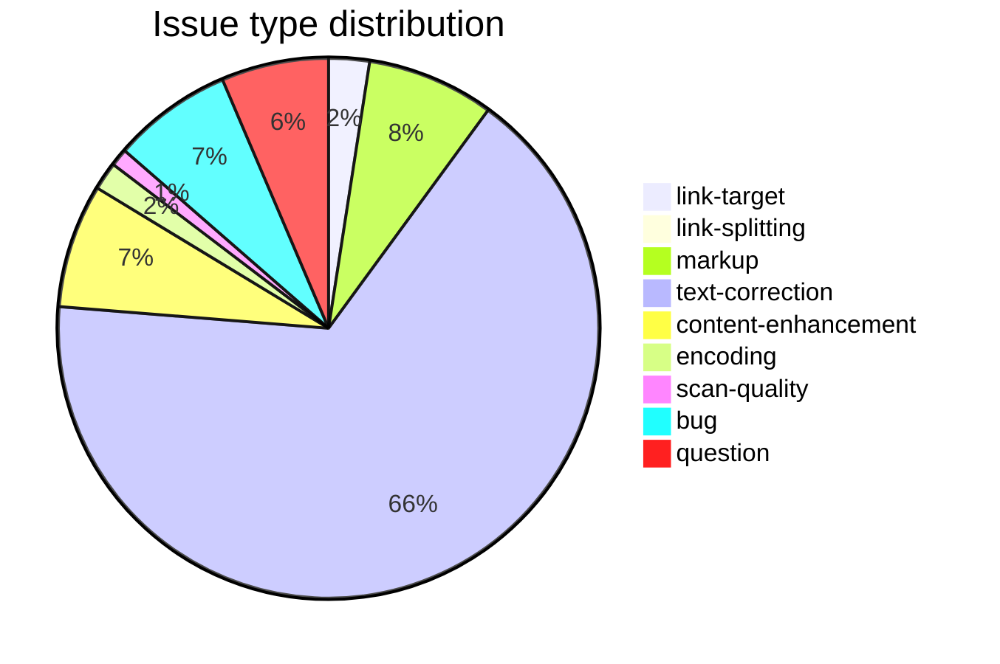

# CDSL ecosystem dashboard

**Snapshot date**: 2026-09-24 · **Fetched**: 2026-09-24T08:11:28.281108Z

## Headline numbers

| Metric | Value |
|---|---|
| Repositories in `sanskrit-lexicon` | 86 |
| Repositories with issues enabled | 86 |
| Total issues (incl. closed) | 7,821 |
| Total pull requests | 2,110 |
| Total commits in default branches | 13,317 |
| Distinct contributors (commit authors + issue authors) | 76 |
| Triaged repositories (taxonomy applied) | 63 |

## Issue type distribution across all triaged repos

| Type | Count | % of typed issues |
|---|---:|---:|
| `link-target` | 106 | 2.4 % |
| `link-splitting` | 10 | 0.2 % |
| `markup` | 331 | 7.6 % |
| `text-correction` | 2881 | 66.1 % |
| `content-enhancement` | 322 | 7.4 % |
| `encoding` | 73 | 1.7 % |
| `scan-quality` | 46 | 1.1 % |
| `bug` | 312 | 7.2 % |
| `question` | 279 | 6.4 % |

```mermaid
pie title Issue type distribution
    "link-target" : 106
    "link-splitting" : 10
    "markup" : 331
    "text-correction" : 2881
    "content-enhancement" : 322
    "encoding" : 73
    "scan-quality" : 46
    "bug" : 312
    "question" : 279
```

## Type × repository heatmap

| Type | ACC | AMAR | AP | AP90 | ApteES | ArabicInSanskrit | BEN | BHS | BOP | BOR | BUR | CAE | CCS | COLOGNE | DCS | FRI | GRA | GreekInSanskrit | IEG | INM | KNA | KOW | KRM | LRV | MCI | MD | MW72 | MWS | MWinflect | PUI | PWG | PWK | SCH | SHS | SKD | STC | VCP | VEI | WIL | Wil-YAT | alternateheadwords | cologne-stardict | csl-apidev | csl-app | csl-corrections | csl-devanagari | csl-doc | csl-inflect | csl-kale | csl-ldev | csl-lnum | csl-lslink | csl-newsletter | csl-observatory | csl-orig | csl-pywork | csl-sqlite | csl-westergaard | hwnorm1 | hwnorm2 | literarysource | mw-dev | rvlinks | total |
|---|---:|---:|---:|---:|---:|---:|---:|---:|---:|---:|---:|---:|---:|---:|---:|---:|---:|---:|---:|---:|---:|---:|---:|---:|---:|---:|---:|---:|---:|---:|---:|---:|---:|---:|---:|---:|---:|---:|---:|---:|---:|---:|---:|---:|---:|---:|---:|---:|---:|---:|---:|---:|---:|---:|---:|---:|---:|---:|---:|---:|---:|---:|---:|---:|
| `link-target` | 0 | 0 | 2 | 3 | 0 | 0 | 2 | 0 | 0 | 0 | 0 | 0 | 0 | 1 | 0 | 0 | 1 | 0 | 0 | 0 | 0 | 0 | 0 | 0 | 0 | 0 | 0 | 13 | 0 | 0 | 74 | 7 | 0 | 0 | 0 | 0 | 0 | 1 | 0 | 0 | 0 | 0 | 0 | 0 | 2 | 0 | 0 | 0 | 0 | 0 | 0 | 0 | 0 | 0 | 0 | 0 | 0 | 0 | 0 | 0 | 0 | 0 | 0 | **106** |
| `link-splitting` | 0 | 0 | 0 | 0 | 0 | 0 | 0 | 0 | 0 | 0 | 0 | 0 | 0 | 0 | 0 | 0 | 0 | 0 | 0 | 0 | 0 | 0 | 0 | 0 | 0 | 0 | 0 | 1 | 0 | 0 | 8 | 1 | 0 | 0 | 0 | 0 | 0 | 0 | 0 | 0 | 0 | 0 | 0 | 0 | 0 | 0 | 0 | 0 | 0 | 0 | 0 | 0 | 0 | 0 | 0 | 0 | 0 | 0 | 0 | 0 | 0 | 0 | 0 | **10** |
| `markup` | 12 | 1 | 20 | 10 | 6 | 0 | 12 | 4 | 1 | 1 | 1 | 1 | 1 | 9 | 1 | 3 | 8 | 0 | 0 | 4 | 0 | 0 | 1 | 11 | 1 | 3 | 1 | 54 | 0 | 0 | 38 | 57 | 5 | 1 | 2 | 2 | 4 | 1 | 6 | 3 | 0 | 0 | 0 | 0 | 11 | 0 | 0 | 0 | 0 | 0 | 0 | 0 | 0 | 0 | 35 | 0 | 0 | 0 | 0 | 0 | 0 | 0 | 0 | **331** |
| `text-correction` | 0 | 0 | 2 | 4 | 3 | 0 | 0 | 1 | 4 | 1 | 3 | 1 | 0 | 0 | 0 | 0 | 6 | 0 | 0 | 1 | 0 | 0 | 0 | 3 | 0 | 4 | 1 | 46 | 0 | 1 | 7 | 9 | 0 | 0 | 4 | 0 | 7 | 0 | 0 | 0 | 0 | 0 | 0 | 0 | 128 | 0 | 0 | 0 | 0 | 0 | 0 | 0 | 0 | 0 | 2645 | 0 | 0 | 0 | 0 | 0 | 0 | 0 | 0 | **2881** |
| `content-enhancement` | 2 | 0 | 3 | 6 | 2 | 0 | 3 | 2 | 1 | 0 | 2 | 2 | 1 | 125 | 1 | 5 | 15 | 0 | 1 | 3 | 1 | 1 | 3 | 3 | 0 | 6 | 0 | 30 | 0 | 0 | 21 | 23 | 4 | 1 | 5 | 1 | 7 | 0 | 10 | 1 | 0 | 0 | 0 | 0 | 6 | 0 | 0 | 0 | 0 | 0 | 0 | 0 | 0 | 0 | 25 | 0 | 0 | 0 | 0 | 0 | 0 | 0 | 0 | **322** |
| `encoding` | 1 | 0 | 2 | 4 | 0 | 0 | 2 | 0 | 1 | 1 | 0 | 0 | 0 | 5 | 0 | 1 | 3 | 0 | 0 | 1 | 0 | 0 | 0 | 0 | 0 | 1 | 2 | 10 | 0 | 2 | 11 | 1 | 2 | 1 | 2 | 0 | 1 | 0 | 0 | 2 | 0 | 0 | 0 | 0 | 13 | 0 | 0 | 0 | 0 | 0 | 0 | 0 | 0 | 0 | 4 | 0 | 0 | 0 | 0 | 0 | 0 | 0 | 0 | **73** |
| `scan-quality` | 0 | 0 | 0 | 0 | 0 | 0 | 1 | 0 | 0 | 0 | 0 | 0 | 1 | 1 | 0 | 2 | 2 | 0 | 0 | 0 | 0 | 0 | 0 | 1 | 0 | 0 | 0 | 3 | 0 | 0 | 5 | 3 | 0 | 0 | 1 | 0 | 1 | 0 | 1 | 0 | 0 | 0 | 0 | 0 | 1 | 0 | 0 | 0 | 0 | 0 | 0 | 0 | 0 | 0 | 23 | 0 | 0 | 0 | 0 | 0 | 0 | 0 | 0 | **46** |
| `bug` | 0 | 1 | 3 | 1 | 2 | 0 | 8 | 0 | 0 | 0 | 0 | 0 | 0 | 40 | 1 | 0 | 3 | 3 | 0 | 0 | 0 | 0 | 0 | 8 | 0 | 1 | 0 | 19 | 0 | 0 | 15 | 4 | 0 | 0 | 2 | 0 | 5 | 0 | 1 | 0 | 1 | 13 | 12 | 4 | 39 | 9 | 3 | 0 | 1 | 6 | 0 | 0 | 0 | 2 | 84 | 15 | 0 | 0 | 4 | 0 | 0 | 1 | 1 | **312** |
| `question` | 4 | 0 | 2 | 3 | 2 | 3 | 0 | 0 | 1 | 1 | 0 | 0 | 0 | 78 | 1 | 0 | 1 | 3 | 1 | 2 | 0 | 0 | 0 | 5 | 1 | 0 | 2 | 22 | 8 | 1 | 12 | 10 | 1 | 1 | 4 | 0 | 6 | 0 | 0 | 0 | 5 | 1 | 4 | 1 | 45 | 1 | 0 | 1 | 0 | 1 | 0 | 0 | 1 | 0 | 38 | 2 | 0 | 0 | 2 | 0 | 0 | 2 | 0 | **279** |

## Activity by year

| Year | Commits | Issues opened | Issues closed |
|---|---:|---:|---:|
| 2014 | 75 | 190 | 65 |
| 2015 | 168 | 271 | 170 |
| 2016 | 204 | 175 | 140 |
| 2017 | 240 | 268 | 130 |
| 2018 | 148 | 98 | 30 |
| 2019 | 417 | 246 | 144 |
| 2020 | 619 | 470 | 485 |
| 2021 | 1566 | 639 | 485 |
| 2022 | 707 | 451 | 382 |
| 2023 | 580 | 534 | 542 |
| 2024 | 620 | 372 | 381 |
| 2025 | 873 | 1169 | 213 |
| 2026 | 7100 | 828 | 1724 |

## Top contributors (by commits)

| Real name | GitHub | Role | Commits | Repos | Span | Lines + / − |
|---|---|---|---:|---:|---|---:|
| Mārcis Gasūns | [@gasyoun](https://github.com/gasyoun) | lead | 4,160 | 74 | 2014-01 → 2026-09 | +23,966,241 / −2,968,778 |
| Jim Funderburk | [@funderburkjim](https://github.com/funderburkjim) | maintainer | 2,800 | 53 | 2014-01 → 2026-09 | +47,310,548 / −4,137,226 |
| drdhaval2785@gmail.com | [@drdhaval2785@gmail.com](https://github.com/drdhaval2785@gmail.com) | contributor | 1,993 | 10 | 2015-11 → 2026-08 | +0 / −0 |
| Dhaval Patel | [@drdhaval2785](https://github.com/drdhaval2785) | core | 1,598 | 31 | 2015-11 → 2026-08 | +16,553,662 / −4,509,672 |
| funderburkjim@gmail.com | [@funderburkjim@gmail.com](https://github.com/funderburkjim@gmail.com) | contributor | 1,369 | 6 | 2014-02 → 2026-07 | +0 / −0 |
| drdhaval2785gmail.com | [@drdhaval2785gmail.com](https://github.com/drdhaval2785gmail.com) | contributor | 326 | 1 | 2026-03 → 2026-08 | +0 / −0 |
| gasyoun@users.noreply.github.com | [@gasyoun@users.noreply.github.com](https://github.com/gasyoun@users.noreply.github.com) | contributor | 303 | 10 | 2022-10 → 2026-09 | +0 / −0 |
| dependabot[bot] | [@dependabot[bot]](https://github.com/dependabot[bot]) | contributor | 219 | 71 | 2026-05 → 2026-09 | +1,180 / −603 |
| GitHub Actions (bot) | [@github-actions[bot]](https://github.com/github-actions[bot]) | bot | 164 | 2 | 2026-04 → 2026-09 | +698,577 / −85,822 |
| gasyoun@ya.ru | [@gasyoun@ya.ru](https://github.com/gasyoun@ya.ru) | contributor | 95 | 10 | 2014-01 → 2026-09 | +0 / −0 |
| Anna Rybakova | [@AnnaRybakovaT](https://github.com/AnnaRybakovaT) | occasional | 70 | 10 | 2020-12 → 2023-06 | +71,367 / −6,300 |
| GitHub Actions (bot) | [@actions-user](https://github.com/actions-user) | bot | 45 | 4 | 2026-04 → 2026-08 | +67,213 / −39,149 |
| (misconfigured git client) | [@you@example.com](https://github.com/you@example.com) | occasional | 30 | 5 | 2021-01 → 2021-09 | +11,395 / −8,887 |
| actions@github.com | [@actions@github.com](https://github.com/actions@github.com) | contributor | 25 | 1 | 2026-04 → 2026-08 | +0 / −0 |
| 49699333+dependabot[bot]@users.noreply.github.com | [@49699333+dependabot[bot]@users.noreply.github.com](https://github.com/49699333+dependabot[bot]@users.noreply.github.com) | contributor | 24 | 10 | 2026-06 → 2026-07 | +0 / −0 |
| knbrao@gmail.com | [@knbrao@gmail.com](https://github.com/knbrao@gmail.com) | contributor | 18 | 1 | 2023-02 → 2023-04 | +0 / −0 |
| srhodes@snowcrest.net | [@srhodes@snowcrest.net](https://github.com/srhodes@snowcrest.net) | contributor | 15 | 1 | 2024-01 → 2024-01 | +0 / −0 |
| 917514182@qq.com | [@917514182@qq.com](https://github.com/917514182@qq.com) | contributor | 8 | 1 | 2024-01 → 2025-11 | +0 / −0 |
| Nagabhushana Rao | [@Andhrabharati](https://github.com/Andhrabharati) | core | 7 | 2 | 2021-05 → 2022-12 | +272,014 / −3,625 |
| 74726889+AnnaRybakovaT@users.noreply.github.com | [@74726889+AnnaRybakovaT@users.noreply.github.com](https://github.com/74726889+AnnaRybakovaT@users.noreply.github.com) | contributor | 6 | 1 | 2021-01 → 2021-03 | +0 / −0 |

## Per-repository summary

| Repo | Commits | Issues | Open | Closed | Triaged | First | Last |
|---|---:|---:|---:|---:|:---:|---|---|
| [csl-orig](https://github.com/sanskrit-lexicon/csl-orig) | 2,287 | 2814 | 31 | 2783 | ✓ | 2019-07-20 | 2026-09-20 |
| [csl-corrections](https://github.com/sanskrit-lexicon/csl-corrections) | 1,115 | 347 | 57 | 290 | ✓ | 2019-12-16 | 2026-09-23 |
| [cologne-stardict](https://github.com/sanskrit-lexicon/cologne-stardict) | 873 | 48 | 3 | 45 | ✓ | 2017-04-04 | 2026-09-20 |
| [csl-apidev](https://github.com/sanskrit-lexicon/csl-apidev) | 736 | 66 | 18 | 48 | ✓ | 2018-04-17 | 2026-09-18 |
| [csl-atlas](https://github.com/sanskrit-lexicon/csl-atlas) | 671 | 64 | 4 | 60 |  | 2026-05-23 | 2026-09-24 |
| [csl-observatory](https://github.com/sanskrit-lexicon/csl-observatory) | 579 | 57 | 16 | 41 | ✓ | 2026-05-07 | 2026-09-21 |
| [csl-pywork](https://github.com/sanskrit-lexicon/csl-pywork) | 578 | 58 | 5 | 53 | ✓ | 2019-07-20 | 2026-09-18 |
| [PWG](https://github.com/sanskrit-lexicon/PWG) | 484 | 198 | 31 | 167 | ✓ | 2014-09-25 | 2026-09-20 |
| [MWS](https://github.com/sanskrit-lexicon/MWS) | 400 | 219 | 37 | 182 | ✓ | 2021-12-01 | 2026-09-24 |
| [PWK](https://github.com/sanskrit-lexicon/PWK) | 318 | 117 | 38 | 79 | ✓ | 2014-11-08 | 2026-09-15 |
| [csl-standards](https://github.com/sanskrit-lexicon/csl-standards) | 255 | 12 | 1 | 11 |  | 2026-06-04 | 2026-09-24 |
| [COLOGNE](https://github.com/sanskrit-lexicon/COLOGNE) | 245 | 471 | 187 | 284 | ✓ | 2014-01-14 | 2026-09-15 |
| [csl-guides](https://github.com/sanskrit-lexicon/csl-guides) | 220 | 37 | 3 | 34 |  | 2026-06-13 | 2026-09-18 |
| [csl-app](https://github.com/sanskrit-lexicon/csl-app) | 214 | 42 | 1 | 41 | ✓ | 2026-03-18 | 2026-09-05 |
| [hwnorm1](https://github.com/sanskrit-lexicon/hwnorm1) | 213 | 21 | 17 | 4 | ✓ | 2015-11-19 | 2026-09-06 |
| [CORRECTIONS](https://github.com/sanskrit-lexicon/CORRECTIONS) | 200 | 443 | 83 | 360 |  | 2017-05-03 | 2026-09-15 |
| [csl-devanagari](https://github.com/sanskrit-lexicon/csl-devanagari) | 185 | 43 | 13 | 30 | ✓ | 2021-09-02 | 2026-09-24 |
| [AP](https://github.com/sanskrit-lexicon/AP) | 174 | 35 | 11 | 24 | ✓ | 2025-07-06 | 2026-09-05 |
| [BEN](https://github.com/sanskrit-lexicon/BEN) | 167 | 28 | 5 | 23 | ✓ | 2020-04-30 | 2026-09-07 |
| [LRV](https://github.com/sanskrit-lexicon/LRV) | 166 | 32 | 3 | 29 | ✓ | 2022-09-20 | 2026-09-06 |
| [VCP](https://github.com/sanskrit-lexicon/VCP) | 161 | 32 | 19 | 13 | ✓ | 2014-01-21 | 2026-09-05 |
| [alternateheadwords](https://github.com/sanskrit-lexicon/alternateheadwords) | 129 | 25 | 18 | 7 | ✓ | 2016-10-01 | 2026-09-05 |
| [GRA](https://github.com/sanskrit-lexicon/GRA) | 120 | 40 | 10 | 30 | ✓ | 2015-01-04 | 2026-09-20 |
| [MWinflect](https://github.com/sanskrit-lexicon/MWinflect) | 118 | 50 | 48 | 2 | ✓ | 2018-10-16 | 2026-09-05 |
| [sanskrit-util](https://github.com/sanskrit-lexicon/sanskrit-util) | 118 | 13 | 0 | 13 |  | 2026-06-15 | 2026-09-22 |
| [MD](https://github.com/sanskrit-lexicon/MD) | 112 | 16 | 6 | 10 | ✓ | 2020-04-17 | 2026-09-05 |
| [csl-json](https://github.com/sanskrit-lexicon/csl-json) | 110 | 9 | 0 | 9 |  | 2021-08-16 | 2026-09-15 |
| [WIL](https://github.com/sanskrit-lexicon/WIL) | 102 | 19 | 13 | 6 | ✓ | 2014-12-28 | 2026-09-05 |
| [PUI](https://github.com/sanskrit-lexicon/PUI) | 94 | 4 | 2 | 2 | ✓ | 2026-04-05 | 2026-09-05 |
| [csl-inflect](https://github.com/sanskrit-lexicon/csl-inflect) | 88 | 20 | 12 | 8 | ✓ | 2019-11-27 | 2026-09-15 |
| [AP90](https://github.com/sanskrit-lexicon/AP90) | 83 | 32 | 15 | 17 | ✓ | 2020-03-14 | 2026-09-05 |
| [csl-ldev](https://github.com/sanskrit-lexicon/csl-ldev) | 83 | 9 | 7 | 2 | ✓ | 2021-10-05 | 2026-09-15 |
| [SKD](https://github.com/sanskrit-lexicon/SKD) | 82 | 20 | 11 | 9 | ✓ | 2014-07-19 | 2026-09-06 |
| [csl-lnum](https://github.com/sanskrit-lexicon/csl-lnum) | 71 | 4 | 1 | 3 | ✓ | 2021-10-02 | 2026-09-15 |
| [ApteES](https://github.com/sanskrit-lexicon/ApteES) | 70 | 17 | 2 | 15 | ✓ | 2014-07-15 | 2026-09-05 |
| [BHS](https://github.com/sanskrit-lexicon/BHS) | 69 | 8 | 4 | 4 | ✓ | 2016-01-02 | 2026-09-06 |
| [csl-newsletter](https://github.com/sanskrit-lexicon/csl-newsletter) | 68 | 4 | 2 | 2 | ✓ | 2021-09-13 | 2026-09-06 |
| [mw-dev](https://github.com/sanskrit-lexicon/mw-dev) | 68 | 23 | 17 | 6 | ✓ | 2023-01-19 | 2026-09-05 |
| [BOP](https://github.com/sanskrit-lexicon/BOP) | 66 | 9 | 1 | 8 | ✓ | 2022-05-02 | 2026-09-05 |
| [sanskrit-lexicon.github.io](https://github.com/sanskrit-lexicon/sanskrit-lexicon.github.io) | 64 | 0 | 0 | 0 |  | 2015-11-24 | 2026-09-05 |
| [SCH](https://github.com/sanskrit-lexicon/SCH) | 62 | 12 | 4 | 8 | ✓ | 2014-01-15 | 2026-09-05 |
| [hwnorm2](https://github.com/sanskrit-lexicon/hwnorm2) | 60 | 5 | 4 | 1 | ✓ | 2020-02-01 | 2026-09-05 |
| [csl-doc](https://github.com/sanskrit-lexicon/csl-doc) | 58 | 6 | 2 | 4 | ✓ | 2018-10-23 | 2026-09-05 |
| [CAE](https://github.com/sanskrit-lexicon/CAE) | 58 | 4 | 3 | 1 | ✓ | 2020-04-12 | 2026-09-06 |
| [BUR](https://github.com/sanskrit-lexicon/BUR) | 56 | 6 | 1 | 5 | ✓ | 2020-04-09 | 2026-09-18 |
| [csl-santam](https://github.com/sanskrit-lexicon/csl-santam) | 50 | 4 | 0 | 4 |  | 2015-06-02 | 2026-09-07 |
| [SHS](https://github.com/sanskrit-lexicon/SHS) | 49 | 4 | 3 | 1 | ✓ | 2025-12-22 | 2026-09-07 |
| [csl-pyutil](https://github.com/sanskrit-lexicon/csl-pyutil) | 47 | 6 | 1 | 5 |  | 2026-07-14 | 2026-09-23 |
| [BOR](https://github.com/sanskrit-lexicon/BOR) | 44 | 4 | 3 | 1 | ✓ | 2021-09-14 | 2026-09-05 |
| [KRM](https://github.com/sanskrit-lexicon/KRM) | 43 | 4 | 3 | 1 | ✓ | 2020-03-31 | 2026-09-05 |
| [VEI](https://github.com/sanskrit-lexicon/VEI) | 42 | 2 | 1 | 1 | ✓ | 2016-01-02 | 2026-09-06 |
| [INM](https://github.com/sanskrit-lexicon/INM) | 42 | 11 | 3 | 8 | ✓ | 2021-12-03 | 2026-09-05 |
| [literarysource](https://github.com/sanskrit-lexicon/literarysource) | 40 | 3 | 3 | 0 | ✓ | 2022-02-12 | 2026-09-05 |
| [temp_corrections_ap90](https://github.com/sanskrit-lexicon/temp_corrections_ap90) | 39 | 2 | 1 | 1 |  | 2021-01-13 | 2026-09-20 |
| [FRI](https://github.com/sanskrit-lexicon/FRI) | 39 | 11 | 3 | 8 | ✓ | 2024-01-26 | 2026-09-05 |
| [STC](https://github.com/sanskrit-lexicon/STC) | 37 | 3 | 2 | 1 | ✓ | 2020-04-19 | 2026-09-06 |
| [CCS](https://github.com/sanskrit-lexicon/CCS) | 36 | 3 | 2 | 1 | ✓ | 2020-04-15 | 2026-08-26 |
| [DCS](https://github.com/sanskrit-lexicon/DCS) | 35 | 4 | 4 | 0 | ✓ | 2014-01-17 | 2026-09-05 |
| [MCI](https://github.com/sanskrit-lexicon/MCI) | 35 | 2 | 1 | 1 | ✓ | 2026-05-15 | 2026-09-05 |
| [csl-lslink](https://github.com/sanskrit-lexicon/csl-lslink) | 33 | 2 | 2 | 0 | ✓ | 2026-03-31 | 2026-09-05 |
| [MW72](https://github.com/sanskrit-lexicon/MW72) | 32 | 6 | 1 | 5 | ✓ | 2014-08-24 | 2026-09-05 |
| [ACC](https://github.com/sanskrit-lexicon/ACC) | 31 | 19 | 9 | 10 | ✓ | 2017-05-28 | 2026-09-07 |
| [AMAR](https://github.com/sanskrit-lexicon/AMAR) | 28 | 3 | 2 | 1 | ✓ | 2024-01-30 | 2026-09-05 |
| [rvlinks](https://github.com/sanskrit-lexicon/rvlinks) | 27 | 2 | 1 | 1 | ✓ | 2018-08-29 | 2026-09-05 |
| [avlinks](https://github.com/sanskrit-lexicon/avlinks) | 24 | 1 | 1 | 0 |  | 2021-04-08 | 2026-09-05 |
| [csl-kale](https://github.com/sanskrit-lexicon/csl-kale) | 23 | 2 | 1 | 1 | ✓ | 2019-11-09 | 2026-09-05 |
| [Wil-YAT](https://github.com/sanskrit-lexicon/Wil-YAT) | 20 | 6 | 0 | 6 | ✓ | 2015-03-10 | 2026-09-06 |
| [csl-westergaard](https://github.com/sanskrit-lexicon/csl-westergaard) | 20 | 1 | 1 | 0 | ✓ | 2019-11-08 | 2026-09-05 |
| [KNA](https://github.com/sanskrit-lexicon/KNA) | 19 | 1 | 1 | 0 | ✓ | 2026-02-21 | 2026-09-05 |
| [KOW](https://github.com/sanskrit-lexicon/KOW) | 19 | 1 | 1 | 0 | ✓ | 2026-02-21 | 2026-09-05 |
| [csl-whitroot](https://github.com/sanskrit-lexicon/csl-whitroot) | 18 | 0 | 0 | 0 |  | 2019-11-08 | 2026-09-05 |
| [GreekInSanskrit](https://github.com/sanskrit-lexicon/GreekInSanskrit) | 17 | 44 | 1 | 43 | ✓ | 2015-04-15 | 2026-09-05 |
| [temp_corrections_mw](https://github.com/sanskrit-lexicon/temp_corrections_mw) | 17 | 2 | 1 | 1 |  | 2021-04-11 | 2026-09-20 |
| [cologne-skills](https://github.com/sanskrit-lexicon/cologne-skills) | 17 | 0 | 0 | 0 |  | 2026-06-16 | 2026-09-07 |
| [IEG](https://github.com/sanskrit-lexicon/IEG) | 14 | 2 | 1 | 1 | ✓ | 2026-06-24 | 2026-09-05 |
| [ArabicInSanskrit](https://github.com/sanskrit-lexicon/ArabicInSanskrit) | 13 | 16 | 0 | 16 | ✓ | 2015-01-18 | 2026-09-05 |
| [sanskrit-fonts](https://github.com/sanskrit-lexicon/sanskrit-fonts) | 13 | 0 | 0 | 0 |  | 2018-09-05 | 2026-09-05 |
| [PD](https://github.com/sanskrit-lexicon/PD) | 13 | 0 | 0 | 0 |  | 2026-07-21 | 2026-09-05 |
| [cologne-hugo](https://github.com/sanskrit-lexicon/cologne-hugo) | 12 | 0 | 0 | 0 |  | 2021-01-20 | 2026-09-05 |
| [csl-sqlite](https://github.com/sanskrit-lexicon/csl-sqlite) | 12 | 1 | 1 | 0 | ✓ | 2026-04-08 | 2026-09-05 |
| [csl-homepage](https://github.com/sanskrit-lexicon/csl-homepage) | 0 | 0 | 0 | 0 |  | - | - |
| [csl-websanlexicon](https://github.com/sanskrit-lexicon/csl-websanlexicon) | 0 | 0 | 0 | 0 |  | - | - |

---
*Generated by `scripts/render_reports.py`. Data: `data/snapshots/2026-09-24/`. License: data CC BY-SA 4.0.*
