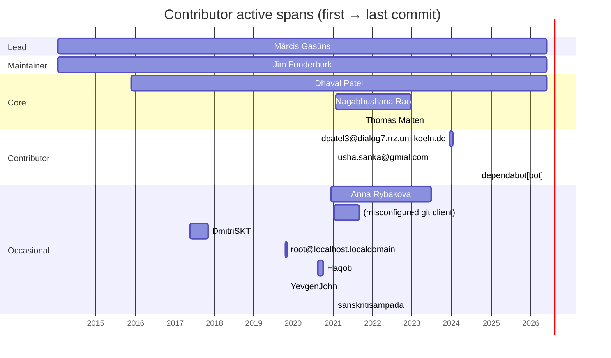

# Activity timeline

## Contributor active spans

Each bar shows a contributor's first to last commit across the ecosystem.

## Commits per year

| Year | Commits |
|---|---:|
| 2014 | 74 |
| 2015 | 132 |
| 2016 | 155 |
| 2017 | 89 |
| 2018 | 128 |
| 2019 | 296 |
| 2020 | 328 |
| 2021 | 703 |
| 2022 | 359 |
| 2023 | 336 |
| 2024 | 380 |
| 2025 | 612 |
| 2026 | 1,714 |

