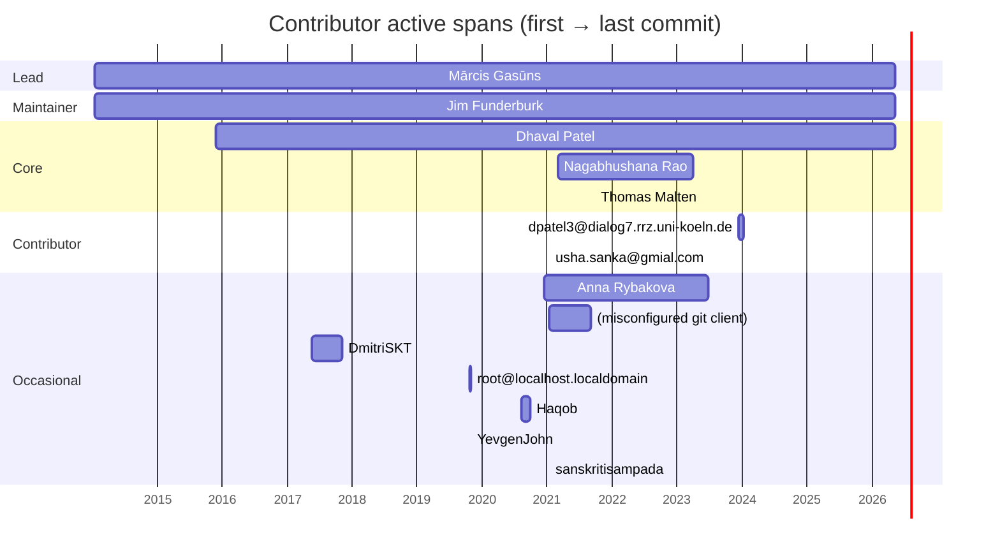

# Activity timeline

## Contributor active spans

Each bar shows a contributor's first to last commit across the ecosystem.

## Commits per year

| Year | Commits |
|---|---:|
| 2014 | 65 |
| 2015 | 115 |
| 2016 | 151 |
| 2017 | 85 |
| 2018 | 124 |
| 2019 | 304 |
| 2020 | 316 |
| 2021 | 616 |
| 2022 | 354 |
| 2023 | 371 |
| 2024 | 380 |
| 2025 | 612 |
| 2026 | 747 |

