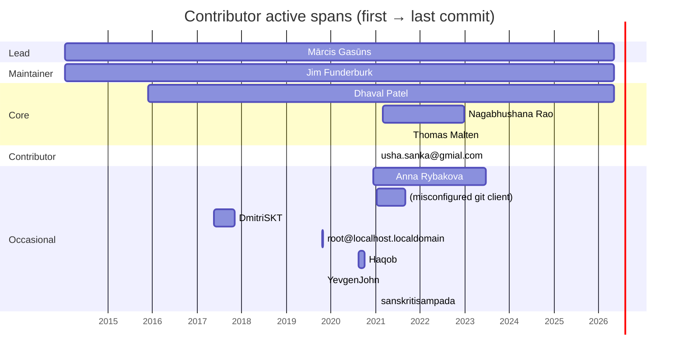

# Activity timeline

## Contributor active spans

Each bar shows a contributor's first to last commit across the ecosystem.

## Commits per year

| Year | Commits |
|---|---:|
| 2014 | 65 |
| 2015 | 123 |
| 2016 | 151 |
| 2017 | 85 |
| 2018 | 63 |
| 2019 | 234 |
| 2020 | 244 |
| 2021 | 554 |
| 2022 | 318 |
| 2023 | 319 |
| 2024 | 306 |
| 2025 | 605 |
| 2026 | 639 |

