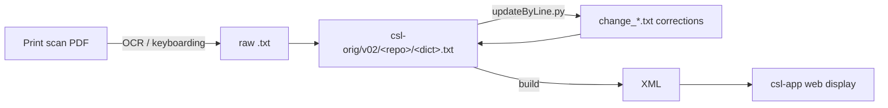

Apply the full Sanskrit Lexicon issue-taxonomy runbook to the repository given in the argument: $ARGUMENTS

The org is always `sanskrit-lexicon`. Execute all ten phases **without asking for user confirmation** except where a step is marked [ASK]. Complete all phases through commit and push.

---

## Autonomy Rules

- Execute all steps without asking for confirmation unless marked [ASK].
- Batch all [ASK] items; ask at most once per session.
- All GitHub API calls, file edits, git commits, and pushes may be executed freely.
- If a step fails transiently (5xx, timeout), retry once before continuing.
- **Windows encoding**: all Python scripts must include `sys.stdout.reconfigure(encoding='utf-8')` and `sys.stderr.reconfigure(encoding='utf-8')`, and pass `encoding='utf-8'` to `subprocess.run`. Write multi-step scripts to `.py` files rather than running inline.
- **Background execution**: for batches of 20+ API calls, write the script to a file, run it in background, then monitor with `until grep -q "DONE\|ERRORS" script.log; do sleep 10; done`.
- **Do not hardcode milestone numbers** — they vary per repo. Discover via API and build a title-keyed map.
- **After labeling completes**, always wait for the log to confirm before running project assignment — a race condition between labeling and node ID fetching causes issues to appear unlabeled.

---

## Phase 0 — Setup

```
ORG=sanskrit-lexicon
REPO=<argument>
```

Verify access:
```sh
gh api repos/$ORG/$REPO --jq '{name,description,has_issues}'
```

---

## Phase 1 — Audit

Fetch all issues (open + closed, all pages):
```sh
gh api "repos/$ORG/$REPO/issues?state=all&per_page=100" \
  --jq '[.[] | {n:.number,state:.state,labels:[.labels[].name],milestone:.milestone.title}]'
```

Also fetch existing labels and milestones:
```sh
gh api repos/$ORG/$REPO/labels --jq '[.[].name]'
gh api repos/$ORG/$REPO/milestones --jq '[.[] | {n:.number,title}]'
```

Auto-detect noise issues (titles starting with "test"/"admin"/"note"/"meta"; zero labels + zero comments + open 5+ years; tagged `invalid`/`duplicate`). Surface as [ASK] but proceed with the rest in parallel. Default: process all issues unless user confirms a skip list.

---

## Phase 2 — Create labels

### Type labels — color `0075ca`
```sh
for label in link-target link-splitting markup text-correction \
             content-enhancement encoding scan-quality bug question; do
  gh api repos/$ORG/$REPO/labels -X POST -f name="$label" -f color="0075ca" 2>/dev/null || true
  gh api repos/$ORG/$REPO/labels/$label -X PATCH -f color="0075ca" 2>/dev/null || true
done
```

### Severity labels
```sh
gh api repos/$ORG/$REPO/labels -X POST -f name="minor"  -f color="e4e669" 2>/dev/null || true
gh api repos/$ORG/$REPO/labels -X POST -f name="medium" -f color="fbca04" 2>/dev/null || true
gh api repos/$ORG/$REPO/labels -X POST -f name="hard"   -f color="d93f0b" 2>/dev/null || true
```

---

## Phase 3 — Type label assignment

Every issue gets **exactly one** type label.

**Pre-existing label collision rule**: GitHub ships `bug` and `question` as defaults applied loosely. After assigning the correct taxonomy type, delete conflicting stale defaults:
```sh
gh api repos/$ORG/$REPO/issues/$N/labels/<old-label> -X DELETE
```
Keep non-type GitHub defaults (`invalid`, `duplicate`, `wontfix`, `help wanted`).

| Label | When to apply |
|---|---|
| `link-target` | Building click-throughs from `<ls>` abbreviations to scanned PDF pages |
| `link-splitting` | Splitting combined `SOURCE N,N` refs into individual per-page links |
| `markup` | Normalising XML tag content (`<ls>`, `<lex>`, `<ab>`, etc.) |
| `text-correction` | Corrections to German/English definitions or Sanskrit headwords |
| `content-enhancement` | New material, display upgrades, structural additions beyond correction |
| `encoding` | SLP1/AS/IAST transcoding, character rendering, hyphen/dash normalisation |
| `scan-quality` | Replacing blurry, skewed, or missing scan pages |
| `bug` | Broken links, XML errors, broken download files |
| `question` | Scholarly questions requiring research before any code change |

---

## Phase 4 — Severity label assignment

Every issue gets **exactly one** severity label.

| Label | When to apply |
|---|---|
| `minor` | Targeted fix — a handful of lines or a single file |
| `medium` | Standard unit of work — one index, a batch of corrections |
| `hard` | Large effort spanning many sources, files, or dictionaries |

Defaults: `link-target`→medium, `link-splitting`→medium, `markup`/`encoding`/`bug`/`question`/`scan-quality`→minor, `content-enhancement`→medium, `text-correction`→minor. Escalate to `hard` only for very large issues.

---

## Phase 5 — Milestone setup

Create the four standard milestones (skip if they exist):
```sh
for title in "Dictionary to Book" "Digitization Quality" "Structured Data" "Major Enhancements"; do
  gh api repos/$ORG/$REPO/milestones -X POST -f title="$title" 2>/dev/null || true
done
```

Fetch the assigned numbers — they may not be 1–4 if the repo already had milestones:
```sh
gh api repos/$ORG/$REPO/milestones --jq '[.[] | {n:.number,title}]'
```

Build a title-keyed `ms_map` in the labeling script. **Never hardcode numbers.**

### Milestone → type mapping
| Milestone | Types |
|---|---|
| Dictionary to Book | `link-target`, `link-splitting` |
| Digitization Quality | `scan-quality`, `encoding`, `bug`, `text-correction` |
| Structured Data | `markup`, `question` |
| Major Enhancements | `content-enhancement` |

For multi-type issues, use priority: `link-target` > `link-splitting` > `content-enhancement` > `markup` > `text-correction` > `encoding` > `bug` > `scan-quality` > `question`.

---

## Phase 5b — Batch labeling script

Write a Python script (`<repo>_label.py`) with:
```python
import subprocess, json, sys
sys.stdout.reconfigure(encoding='utf-8')
sys.stderr.reconfigure(encoding='utf-8')

types = { <type>: [list of issue numbers], ... }
ms_map = { <type>: <milestone_number>, ... }   # built from API, title-keyed
hard_nums = set()
medium_nums = set()

total = sum(len(v) for v in types.values())
all_nums = set(n for v in types.values() for n in v)
assert total == len(all_nums) == <expected_count>

errors = []
done = 0
for t, nums in types.items():
    ms = ms_map[t]
    for n in nums:
        sev = 'hard' if n in hard_nums else ('medium' if n in medium_nums else 'minor')
        for label in [t, sev]:
            r = subprocess.run(['gh','api',f'repos/$ORG/$REPO/issues/{n}/labels',
                '-X','POST','-f',f'labels[]={label}'], capture_output=True, encoding='utf-8')
            if r.returncode != 0 and '422' not in r.stderr:
                errors.append(f'label {label} #{n}: {r.stderr[:80]}')
        r = subprocess.run(['gh','api',f'repos/$ORG/$REPO/issues/{n}',
            '-X','PATCH','-f',f'milestone={ms}'], capture_output=True, encoding='utf-8')
        if r.returncode != 0:
            errors.append(f'milestone #{n}: {r.stderr[:80]}')
        done += 1
        print(f'{done}/{total} #{n} {t}/{sev}/ms{ms}', flush=True)

print('DONE no errors.' if not errors else f'ERRORS ({len(errors)}):')
for e in errors: print(' ', e)
```

Run in background and wait for completion before proceeding to project assignment.

---

## Phase 6 — GitHub Projects assignment

Fetch org project node IDs:
```sh
gh api graphql -f query='{ organization(login:"sanskrit-lexicon") {
  projectsV2(first:20) { nodes { id number title } } } }'
```

The four standard projects are: **Dictionary to Book**, **Digitization Quality**, **Structured Data**, **Major Enhancements**. If they don't exist, [ASK] the user to create them.

Map each issue to its project via milestone, then assign using GraphQL:
```sh
gh api graphql -f query='mutation($proj:ID!,$item:ID!){addProjectV2ItemById(input:{projectId:$proj,contentId:$item}){item{id}}}' \
  -f proj=<project_node_id> -f item=<issue_node_id>
```

Fetch issue node IDs **after labeling is confirmed complete**:
```sh
gh api "repos/$ORG/$REPO/issues?state=all&per_page=100" \
  --jq '[.[] | {number:.number, nodeId:.node_id, milestone:.milestone.number}]'
```

If a node ID fails to resolve (`Could not resolve to a node`), re-fetch a fresh node ID for that issue — older-format IDs sometimes expire.

---

## Phase 7 — Verification

```python
import subprocess, json, sys
sys.stdout.reconfigure(encoding='utf-8')

type_labels = {'link-target','link-splitting','markup','text-correction',
               'content-enhancement','encoding','scan-quality','bug','question'}
sev_labels  = {'minor','medium','hard'}
ms_type_map = {'link-target':1,'link-splitting':1,'scan-quality':2,'encoding':2,
               'bug':2,'text-correction':2,'markup':3,'question':3,'content-enhancement':4}
# Adjust ms_type_map values to match the actual milestone numbers for this repo

issues = # fetch from API

missing_type=[]; missing_sev=[]; missing_ms=[]; multi_type=[]; wrong_ms=[]
for i in issues:
    n=i['number']; lbls=set(i['labels']); ms=i['milestone']
    types = lbls & type_labels
    sevs  = lbls & sev_labels
    if len(types)==0: missing_type.append(n)
    elif len(types)>1: multi_type.append((n,types))
    if len(sevs)==0: missing_sev.append(n)
    if ms is None: missing_ms.append(n)
    elif len(types)==1:
        t=list(types)[0]
        if ms_type_map.get(t) != ms: wrong_ms.append((n,t,ms))
```

**All five lists must be empty.** Fix any gaps (stale labels, wrong milestones) before proceeding. A non-zero `multi_type` always means a pre-existing default label was not removed.

---

## Phase 8 — CLAUDE.md

Create or update `CLAUDE.md` in the repo root. Include:
- Project Overview (what the repo is, its place in sanskrit-lexicon, primary input file)
- Architecture table (one row per top-level directory)
- Key commands (how to run the main pipeline scripts)
- `updateByLine.py` pattern if used
- Dependencies
- GitHub Issue Conventions section (milestones, type labels, severity labels — same across all repos)

---

## Phase 9 — README.md

Create or update `README.md`. Required sections in order:
1. Title + one-paragraph description
2. **Documentation callout (preserve-if-present)** — if the repo has an authoritative human guide (e.g. `docs/*.md` referenced from `CLAUDE.md`, or an existing `## Documentation` block in the current README), carry that link forward verbatim. **Never drop it.** Before overwriting, grep the existing README for a `## Documentation` heading and any `docs/` links and re-emit them in the regenerated file.
3. Contents table (top-level directories)
4. Timeline table (period → work, derived from git log and issue dates)
5. Projects & Milestones table with live counts + two Mermaid pie charts (closed by ms, open by ms)
6. Issue Typology — Solved and Open subsections, each a table of issues, plus a Mermaid pie chart by type
7. Labels section (type + severity tables)
8. Contributors

**All counts must be fetched live from the API** immediately before commit.

**Validate every Mermaid block** via:
```sh
gh api markdown -X POST -f text="$(printf '```mermaid\n%s\n```' '<diagram>')" -f mode="markdown"
```
Confirmed valid when the response contains `pl-k` spans inside `highlight-source-mermaid`. If not, the diagram type is unsupported — use `pie`, `flowchart`, `graph`, or `sequenceDiagram`. Never use `xychart-beta`.

---

## Phase 10 — Commit and push

```sh
cd <repo path>
git add README.md CLAUDE.md
git commit -m "docs: initial README and CLAUDE.md; full issue triage (labels, milestones, projects)

Co-Authored-By: Claude Sonnet 4.6 <noreply@anthropic.com>"
git push
```

---

## Phase 11 — Citation infrastructure

Add the academic-citation files. These are required for FORCE11 software-citation compliance and for FAIR principle F1 (persistent identifiers).

### CITATION.cff
Use the cff-version 1.2.0 format; populate `authors` from the `Contributors` section in README.md (real names + ORCID + GitHub login). License and repo URL must match the repo. Validate at `https://citation-file-format.github.io/`.

### LICENSE
If absent, add `LICENSE` (full text). For dictionary data repos: `CC BY-SA 4.0`. For tooling/code repos: `GPL-3.0`. Mixed-content repos: dual-license; document split in README.

### CHANGELOG.md
Use the [Keep a Changelog](https://keepachangelog.com/en/1.1.0/) format. First entry: `## [v1.0-triage] — <date>` with bullet points naming the runbook phases applied.

### Zenodo–GitHub integration
After the v1.0-triage tag is pushed, the maintainer flips the Zenodo toggle for the repo at `https://zenodo.org/account/settings/github/`. The next release auto-mints a DOI. Add the DOI badge to README.

---

## Phase 12 — Source bibliography block

Add a top-level `## Source` section in README naming the printed dictionary the repo digitises:

```markdown
## Source

- **Author**: Surname, First (and co-authors)
- **Title**: *Title in original orthography*
- **Publisher**: Place: Publisher
- **Year(s)**: 1855–1875
- **Volumes**: 7
- **Print pages**: ~6,000
- **Scans**: link to PDF or IIIF manifest
- **First digitisation**: institution, year
```

This satisfies Dublin Core minimum metadata and FAIR F2/F3.

---

## Phase 13 — Data dictionary + annotated example

Add a `## Data format` section in CLAUDE.md (not README — it's developer documentation) listing every markup tag with semantic role:

| Tag | Role | Example |
|---|---|---|
| `<L>NNNN` | Entry begin, with print line number | `<L>12345` |
| `<LEND>` | Entry end | |
| `<k1>headword` | Primary headword in SLP1 | `<k1>rAma` |
| `<k2>variant` | Secondary spelling | `<k2>rAma` |
| `<e>etym` | Etymology marker | `<e>1` |
| `<lex>code` | Lexical category | `<lex>m.` |
| `<ls>source` | Literary source citation | `<ls>Rv. 1.22.16` |
| `<ab>tag` | Italicised abbreviation | `<ab>m.</ab>` |
| `{#text#}` | Sanskrit text in SLP1 | `{#rAmaH#}` |
| `` | Italicised display text | `` |

Then include **one annotated example entry** (5–10 lines from the actual source file) with inline comments explaining each tag in context.

---

## Phase 14 — Encoding declaration

Add a `## Encoding` block in README naming explicitly:

- **Source encoding**: `UTF-8`, normalisation form (NFC).
- **Sanskrit transliteration**: SLP1 (in `{#…#}`), with IAST in display layer.
- **Devanagari**: rendered at display time via `transcoder`; not stored in source.
- **Round-trip status**: lossless SLP1 ↔ IAST ↔ Devanagari for all entries except those flagged in issue list.

Example:
```markdown
## Encoding
- UTF-8 NFC throughout.
- Sanskrit text in SLP1 transliteration, wrapped in `{#…#}`.
- Display layer uses IAST (ISO 15919) and Devanagari, generated via `transcoder/`.
- Round-trip verified for 99.7 % of entries; exceptions tracked in issue label `encoding`.
```

---

## Phase 15 — Pipeline DAG

Add a Mermaid flowchart to README under `## How it works` showing the actual data flow from source to display:



Customise the chain to match what the repo actually does (e.g., `verbs01/redo.sh` chain for verb-identification repos). Validate the Mermaid block via `gh api markdown -X POST` as in Phase 9.

---

## Phase 16 — Community files (one-shot, scope = org)

Drop these once into every repo via templated copy:

- `.github/ISSUE_TEMPLATE/bug.yml`, `text-correction.yml`, `markup.yml`, `link-target.yml`, `question.yml`
- `.github/PULL_REQUEST_TEMPLATE.md`
- `CONTRIBUTING.md`
- `CODE_OF_CONDUCT.md` (Contributor Covenant 2.1)
- `SECURITY.md` (one-line: report to maintainer)

Templates live in `csl-observatory/templates/` and are propagated by `scripts/propagate_templates.py`.

---

## Checklist

- [ ] All issues have exactly one type label (`multi_type == 0`)
- [ ] All issues have exactly one severity label
- [ ] All issues have a milestone
- [ ] All issues are in a project matching their milestone
- [ ] No stale pre-existing labels remain (`bug`/`question`/`enhancement` defaults removed)
- [ ] Label colors correct (`0075ca` / `e4e669` / `fbca04` / `d93f0b`)
- [ ] `CLAUDE.md` committed
- [ ] `README.md` committed with live counts and validated Mermaid charts
- [ ] Pushed to `origin/master`
