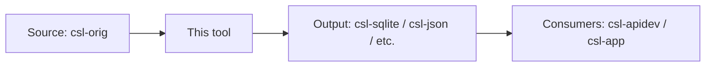
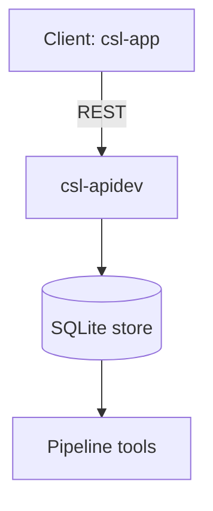

Apply the **Cologne tooling-repo taxonomy** to a non-dictionary repository given in the argument: $ARGUMENTS.

The org is `sanskrit-lexicon`. This runbook is for **infrastructure, tooling, data-pipeline, and frontend repos** — NOT for dictionary digitization repos (those use [`cologne-issue-runbook.md`](cologne-issue-runbook.md)).

Execute all phases **without asking for user confirmation** except where marked [ASK]. Complete through commit and push.

---

## Why a separate runbook?

Dictionary repos (PWG, MW, AP90, …) all do the same job: digitize a printed source and host corrections to its XML. Their issues fall into nine narrow buckets (link-target, scan-quality, encoding, …) and four milestones map cleanly onto print → digital → structured-data → enhancement.

**Tool repos are heterogeneous.** A REST API (`csl-apidev`), a SLP1→Devanagari converter (`csl-devanagari`), a flutter app (`csl-app`), an XML data store (`csl-orig`), and a build script (`cologne-stardict`) share almost nothing operationally. Forcing them into the dictionary taxonomy creates noise: a "wrong API endpoint" issue is not a "text-correction"; a "rebuild Hugo site" issue is not "scan-quality".

This runbook gives them their own taxonomy: **software-engineering categories** (bug, feature, perf, dep, infra) crossed with a **domain category** (web-frontend, data-pipeline, converter, …) so that triage across many heterogeneous repos remains tractable.

---

## Autonomy Rules

- Execute all steps without confirmation unless marked [ASK].
- Batch all [ASK] items; ask at most once per session.
- All `gh` API calls, file edits, git commits, and pushes may be executed freely.
- Retry once on transient 5xx/timeouts before continuing.
- **Windows encoding**: Python scripts must include `sys.stdout.reconfigure(encoding='utf-8')` and `sys.stderr.reconfigure(encoding='utf-8')`; pass `encoding='utf-8'` to `subprocess.run`.
- **Background execution**: for batches of 20+ API calls, write to a `.py` file, run in background, monitor with `until grep -q "DONE\|ERRORS" log; do sleep 10; done`.
- **Discover, don't hardcode**: milestone numbers and project IDs vary per repo — fetch via API and build a title-keyed map.
- After labeling completes, wait for log confirmation before running project assignment (race condition risk).

---

## Phase 0 — Setup

```
ORG=sanskrit-lexicon
REPO=<argument>
```

Verify access and capture domain metadata:
```sh
gh api repos/$ORG/$REPO --jq '{name, description, language, size, has_issues, has_wiki, default_branch}'
```

**Detect repo category** (used in Phase 2 to select label set):

| Heuristic | Category |
|---|---|
| `description` mentions "API", "REST", or PHP backend | `web-backend` |
| `description` mentions "display", "homepage", "app", "frontend" or `language=Dart/JavaScript/HTML` | `web-frontend` |
| `description` mentions "data", "corrections", "source", "sqlite", "json" | `data-store` |
| `description` mentions "convert", "transcoder", "Devanagari", "stardict", "babylon" | `converter` |
| `description` mentions "link", "lslink", "mapping" | `linking-tool` |
| `description` mentions "scan", "scanned edition" | `scanned-book` |
| `description` mentions "headword", "normalization", "inflect", "declension" | `processing-tool` |
| `description` mentions "build", "Hugo", "fonts", "newsletter" | `build-meta` |
| `name` contains `temp_`, `legacy`, or `test_` | `archive` |

Record the detected category. If ambiguous, [ASK] the user once.

---

## Phase 1 — Audit

Fetch all issues, labels, milestones:
```sh
gh api "repos/$ORG/$REPO/issues?state=all&per_page=100" \
  --jq '[.[] | {n:.number, state:.state, title:.title, labels:[.labels[].name], milestone:.milestone.title, comments:.comments, age_days:((now - (.created_at | fromdateiso8601))/86400 | floor)}]'

gh api repos/$ORG/$REPO/labels --jq '[.[].name]'
gh api repos/$ORG/$REPO/milestones --jq '[.[] | {n:.number, title}]'
```

Classify each issue (read title + first 200 chars of body for context):
- **Triagable now**: clear type from title alone
- **Needs body review**: title ambiguous — fetch body and re-classify
- **Stale**: open 3+ years, no comments, no recent activity → propose `wontfix` or close-as-stale [ASK once with full list]

**Auto-detect noise**: `test`/`admin`/`note` titles; zero labels + zero comments + open 5+ years; tagged `invalid`/`duplicate`. Surface as [ASK] but proceed with the rest in parallel.

---

## Phase 2 — Create labels

The taxonomy has **three orthogonal dimensions**: **type** (what kind of work), **severity** (how big), **domain** (what part of the stack). Every issue must end with exactly one type, exactly one severity. Domain labels are optional but strongly encouraged for cross-repo discoverability.

### Type labels (color `0e8a16` for code-quality, `0075ca` for features, `d4c5f9` for docs, `f9d0c4` for infra, `e99695` for research)

```sh
# Code Quality & Maintenance — green 0e8a16
for label in bug regression tech-debt dependency security; do
  gh api repos/$ORG/$REPO/labels -X POST -f name="$label" -f color="0e8a16" 2>/dev/null || true
  gh api repos/$ORG/$REPO/labels/$label -X PATCH -f color="0e8a16" 2>/dev/null || true
done

# Features & Enhancements — blue 0075ca
for label in feature enhancement performance; do
  gh api repos/$ORG/$REPO/labels -X POST -f name="$label" -f color="0075ca" 2>/dev/null || true
  gh api repos/$ORG/$REPO/labels/$label -X PATCH -f color="0075ca" 2>/dev/null || true
done

# Documentation — purple d4c5f9
for label in documentation docs-api; do
  gh api repos/$ORG/$REPO/labels -X POST -f name="$label" -f color="d4c5f9" 2>/dev/null || true
done

# Infrastructure & Operations — peach f9d0c4
for label in infrastructure data-pipeline cross-repo build-tooling; do
  gh api repos/$ORG/$REPO/labels -X POST -f name="$label" -f color="f9d0c4" 2>/dev/null || true
done

# Research & Discussion — pink e99695
for label in question proposal discussion; do
  gh api repos/$ORG/$REPO/labels -X POST -f name="$label" -f color="e99695" 2>/dev/null || true
done
```

### Severity labels (4 levels — one extra over dictionary repos)

```sh
gh api repos/$ORG/$REPO/labels -X POST -f name="trivial"  -f color="c2e0c6" 2>/dev/null || true
gh api repos/$ORG/$REPO/labels -X POST -f name="minor"    -f color="e4e669" 2>/dev/null || true
gh api repos/$ORG/$REPO/labels -X POST -f name="major"    -f color="fbca04" 2>/dev/null || true
gh api repos/$ORG/$REPO/labels -X POST -f name="critical" -f color="b60205" 2>/dev/null || true
```

### Domain labels (color `5319e7` — purple, scoped per repo category)

Apply the subset matching the repo's Phase 0 category:

| Repo category | Domain labels to create |
|---|---|
| `web-backend` | `domain:api`, `domain:auth`, `domain:db`, `domain:caching` |
| `web-frontend` | `domain:ui`, `domain:routing`, `domain:i18n`, `domain:rendering` |
| `data-store` | `domain:schema`, `domain:migration`, `domain:integrity`, `domain:storage` |
| `converter` | `domain:transcoding`, `domain:roundtrip`, `domain:edge-cases` |
| `linking-tool` | `domain:link-resolution`, `domain:source-mapping`, `domain:coverage` |
| `processing-tool` | `domain:morphology`, `domain:normalization`, `domain:lookup` |
| `scanned-book` | `domain:ocr`, `domain:image-quality`, `domain:metadata` |
| `build-meta` | `domain:ci`, `domain:packaging`, `domain:publishing` |
| `archive` | (skip domain labels — preserve as-is) |

```sh
# Example for web-backend
for label in api auth db caching; do
  gh api repos/$ORG/$REPO/labels -X POST -f name="domain:$label" -f color="5319e7" 2>/dev/null || true
done
```

---

## Phase 3 — Type label assignment

Every issue gets **exactly one** type label.

### Pre-existing label collision rule

GitHub ships defaults (`bug`, `enhancement`, `question`, `documentation`) that may already be assigned. Our taxonomy uses some of those names but with stricter semantics. Pattern:

1. Check existing labels: `bug`, `enhancement`, `documentation`, `question`
2. If correctly applied (matches the strict semantics below), **keep**
3. If wrong type (e.g., a feature request labeled `bug`), **delete** and reassign
4. Always **delete** legacy `enhancement` if not exactly matching our `enhancement` definition (improvement to existing capability — NOT new features)

```sh
gh api repos/$ORG/$REPO/issues/$N/labels/<old-label> -X DELETE
```

Keep these GitHub defaults: `invalid`, `duplicate`, `wontfix`, `help wanted`, `good first issue`.

### Type semantics

| Label | Apply when |
|---|---|
| `bug` | Code defect — produces wrong output, throws unexpectedly, violates a documented contract |
| `regression` | Previously working behavior, now broken (mention which version/commit if known) |
| `tech-debt` | Refactoring, dead-code removal, modernization, type-hint additions, consistency cleanup |
| `dependency` | Library upgrade, vendor swap, security patch (CVE), runtime version bump |
| `security` | CVE, credential exposure, injection vector, auth bypass — escalates severity to `major` minimum |
| `feature` | Net-new capability that didn't exist before |
| `enhancement` | Improvement to an existing capability (faster, clearer, more flexible) — NOT new |
| `performance` | Speed, memory, throughput optimization without changing behavior |
| `documentation` | Prose docs: README, CONTRIBUTING, code comments, examples |
| `docs-api` | API contract / schema / endpoint documentation specifically (separate so backend teams can filter) |
| `infrastructure` | CI/CD, deploy scripts, Docker, GitHub Actions, environment setup |
| `data-pipeline` | ETL, batch jobs, scheduled processing, cron scripts that move/transform data |
| `cross-repo` | Issue requires changes in 2+ repos — link to companion issues in body |
| `build-tooling` | Build scripts, package generation, release tooling |
| `question` | Needs research/clarification before any code change |
| `proposal` | Architecture/design proposal — use for RFC-style discussions |
| `discussion` | Open-ended; not yet a proposal |

### Disambiguation rules

- "Add Russian translation" → `feature` (new capability), not `enhancement`
- "Russian translation has typo" → `bug`
- "Russian translation flow is slow" → `performance`
- "Russian translation needs better docs" → `documentation`
- "Should we add Russian translation?" → `proposal` (decision needed first)
- "How do other dictionaries handle Russian?" → `question` (research needed first)

---

## Phase 4 — Severity assignment

Every issue gets **exactly one** severity. Tool repos use a 4-level scale (one more than dictionary repos because tooling has a wider effort range).

| Label | Apply when |
|---|---|
| `trivial` | Cosmetic (typo, whitespace, dead comment), < 1 hour, single-file diff |
| `minor` | Single function/component, well-scoped, no design decision required |
| `major` | Multiple files/modules, requires design decision, affects user-visible behavior |
| `critical` | Blocks users, data loss/corruption risk, security CVE, production outage |

### Type → default severity

Use as starting point, escalate based on description:

| Type | Default severity |
|---|---|
| `bug` | `minor` (escalate to `major` if user-blocking, `critical` if data-loss) |
| `regression` | `major` (regressions are higher impact than fresh bugs) |
| `security` | `major` minimum, `critical` if exploitable |
| `tech-debt` | `minor` |
| `dependency` | `minor` (`major` for breaking-change upgrades) |
| `feature` | `major` (new capabilities are inherently larger) |
| `enhancement` | `minor` |
| `performance` | `minor` (`major` if user-perceivable lag) |
| `documentation` / `docs-api` | `trivial` (`minor` for full new sections) |
| `infrastructure` | `minor` (`major` if blocks all deploys) |
| `data-pipeline` | `major` (data pipelines touch many records) |
| `cross-repo` | `major` minimum (coordination cost) |
| `build-tooling` | `minor` |
| `question` / `proposal` / `discussion` | `trivial` (research overhead, not implementation) |

---

## Phase 5 — Milestone setup

Tool repos use a **5-milestone framework** (one more than dictionary repos to capture the developer-experience axis):

```sh
for title in "API Stability" "User Experience" "Data Quality" "Developer Experience" "Community"; do
  gh api repos/$ORG/$REPO/milestones -X POST -f title="$title" 2>/dev/null || true
done
```

Fetch numbers (do not hardcode):
```sh
gh api repos/$ORG/$REPO/milestones --jq '[.[] | {n:.number, title}]'
```

### Type → milestone mapping

| Milestone | Types |
|---|---|
| **API Stability** | `bug` (in API), `regression`, `dependency`, `security`, `docs-api` |
| **User Experience** | `bug` (user-facing), `feature`, `enhancement`, `performance` |
| **Data Quality** | `bug` (data), `data-pipeline`, all `domain:integrity`/`domain:roundtrip` issues |
| **Developer Experience** | `tech-debt`, `infrastructure`, `build-tooling`, `documentation` |
| **Community** | `question`, `proposal`, `discussion`, `cross-repo` |

For multi-type ambiguity, priority order:
`security` > `regression` > `cross-repo` > `data-pipeline` > `bug` > `feature` > `enhancement` > `performance` > `dependency` > `infrastructure` > `tech-debt` > `build-tooling` > `documentation` > `docs-api` > `proposal` > `question` > `discussion`

---

## Phase 5b — Batch labeling script

Pattern (write to `<repo>_label.py`, run in background):

```python
import subprocess, json, sys
sys.stdout.reconfigure(encoding='utf-8')
sys.stderr.reconfigure(encoding='utf-8')

types = {
    'bug': [<issue numbers>],
    'feature': [<issue numbers>],
    # ...
}
ms_map = { 'bug': <ms_num>, 'feature': <ms_num>, ... }   # built from API
sev_overrides = { <num>: 'major', <num>: 'critical', ... }
domain_tags = { <num>: 'domain:api', ... }   # optional

total = sum(len(v) for v in types.values())
all_nums = set(n for v in types.values() for n in v)
assert total == len(all_nums) == <expected_count>

errors = []
done = 0
for t, nums in types.items():
    ms = ms_map[t]
    default_sev = {  # from Phase 4 table
        'bug':'minor','regression':'major','security':'major',
        'feature':'major','enhancement':'minor','performance':'minor',
        'tech-debt':'minor','dependency':'minor',
        'documentation':'trivial','docs-api':'trivial',
        'infrastructure':'minor','data-pipeline':'major',
        'cross-repo':'major','build-tooling':'minor',
        'question':'trivial','proposal':'trivial','discussion':'trivial',
    }.get(t, 'minor')

    for n in nums:
        sev = sev_overrides.get(n, default_sev)
        labels_to_add = [t, sev]
        if n in domain_tags:
            labels_to_add.append(domain_tags[n])

        for label in labels_to_add:
            r = subprocess.run(['gh','api',f'repos/$ORG/$REPO/issues/{n}/labels',
                '-X','POST','-f',f'labels[]={label}'], capture_output=True, encoding='utf-8')
            if r.returncode != 0 and '422' not in r.stderr:
                errors.append(f'label {label} #{n}: {r.stderr[:80]}')

        r = subprocess.run(['gh','api',f'repos/$ORG/$REPO/issues/{n}',
            '-X','PATCH','-f',f'milestone={ms}'], capture_output=True, encoding='utf-8')
        if r.returncode != 0:
            errors.append(f'milestone #{n}: {r.stderr[:80]}')
        done += 1
        print(f'{done}/{total} #{n} {t}/{sev}/ms{ms}', flush=True)

print('DONE no errors.' if not errors else f'ERRORS ({len(errors)}):')
for e in errors: print(' ', e)
```

---

## Phase 6 — GitHub Projects (org-level)

Tool repos use **two cross-repo org projects** (separate from the four dictionary projects):

- **Tooling: Stability & Quality** — for `bug`, `regression`, `security`, `dependency`, `performance` work
- **Tooling: Capabilities & Roadmap** — for `feature`, `enhancement`, `proposal`, `cross-repo` work

Discover or create:
```sh
gh api graphql -f query='{ organization(login:"sanskrit-lexicon") {
  projectsV2(first:30) { nodes { id number title } } } }'
```

If the two tooling projects don't exist, [ASK] once before creating org-level projects.

Mapping:
| Project | Types |
|---|---|
| Tooling: Stability & Quality | `bug`, `regression`, `security`, `dependency`, `performance`, `data-pipeline` |
| Tooling: Capabilities & Roadmap | `feature`, `enhancement`, `proposal`, `cross-repo`, `discussion` |
| (no project) | `tech-debt`, `documentation`, `docs-api`, `infrastructure`, `build-tooling`, `question` |

Assign via GraphQL `addProjectV2ItemById` (same pattern as dictionary runbook Phase 6).

---

## Phase 7 — Verification

```python
import subprocess, json, sys
sys.stdout.reconfigure(encoding='utf-8')

type_labels = {'bug','regression','tech-debt','dependency','security',
               'feature','enhancement','performance',
               'documentation','docs-api',
               'infrastructure','data-pipeline','cross-repo','build-tooling',
               'question','proposal','discussion'}
sev_labels  = {'trivial','minor','major','critical'}

issues = # fetch from API

missing_type=[]; missing_sev=[]; missing_ms=[]; multi_type=[]; multi_sev=[]
for i in issues:
    n=i['number']; lbls=set(i['labels']); ms=i['milestone']
    types = lbls & type_labels
    sevs  = lbls & sev_labels
    if len(types)==0: missing_type.append(n)
    elif len(types)>1: multi_type.append((n,types))
    if len(sevs)==0: missing_sev.append(n)
    elif len(sevs)>1: multi_sev.append((n,sevs))
    if ms is None and 'discussion' not in lbls: missing_ms.append(n)
    # `discussion` issues are exempt from milestone (they're open-ended)
```

**Hard gate**: `missing_type`, `missing_sev`, `multi_type`, `multi_sev` must all reach **0** before proceeding. `missing_ms` is allowed for `discussion`-tagged issues only.

A non-zero `multi_type` means a stale GitHub default (`bug`, `enhancement`, `question`, `documentation`) was not removed in Phase 3.

---

## Phase 8 — CLAUDE.md

Generate `CLAUDE.md` with sections tailored to the repo category:

- **Project Overview**: what the repo is, its place in the CDSL stack, primary inputs/outputs
- **Architecture table**: top-level directories with one-line purpose
- **Tech stack** (new for tool repos): runtime version, primary frameworks/libraries, build tool
- **Data contracts** (for `data-store`/`converter`/`linking-tool`): input format, output format, invariants
- **Local development**: how to install, run, test
- **Common commands**: build, test, deploy, lint
- **Known limitations**: documented edge cases, deferred work
- **GitHub Issue Conventions**: link to this runbook; list the type/severity/milestone framework

---

## Phase 9 — README.md

Required sections (order matters):
1. Title + one-sentence purpose
2. Status badge row (build, license, language, last commit)
3. Contents (top-level dir table)
4. **Tech stack table**: runtime, framework, db, build tool, deploy target
5. Quick start (3-5 commands to get running locally)
6. **Issue Status table** (live counts, fetched at commit time):
   ```
   | Milestone | Open | Closed | Total |
   ```
7. **Issue Typology** with two Mermaid pie charts: one by type, one by severity
8. **Issue Domains** (if domain labels used): table of domain → count
9. Labels reference (link to runbook)
10. Contributors

**Validate every Mermaid block** before commit:
```sh
gh api markdown -X POST -f text="$(printf '```mermaid\n%s\n```' '<diagram>')" -f mode="markdown"
```
Confirmed valid when response contains `pl-k` spans inside `highlight-source-mermaid`.

---

## Phase 10 — Commit and push

```sh
cd <repo path>
git add README.md CLAUDE.md
git commit -m "docs(runbook): apply tooling-repo taxonomy (types, severities, milestones, domains)

- 17 type labels across 5 categories
- 4-level severity scale
- 5 milestones (API Stability, UX, Data Quality, DevX, Community)
- Domain labels scoped to repo category
- See sanskrit-lexicon/csl-observatory runbook/cologne-tooling-runbook.md

Co-Authored-By: Claude Sonnet 4.6 <noreply@anthropic.com>"
git push
```

---

## Phase 11 — Citation

For tool repos, license is **GPL-3.0** (not CC-BY-SA, which is for data). Use cff-version 1.2.0 with `type: software`:

```yaml
cff-version: 1.2.0
type: software
title: <repo name>
message: If you use this software, please cite it.
authors:
  - family-names: <surname>
    given-names: <name>
    orcid: <if available>
license: GPL-3.0
repository-code: https://github.com/sanskrit-lexicon/<repo>
keywords:
  - sanskrit
  - lexicon
  - <repo-category>
```

---

## Phase 12 — Tech-stack reference (replaces "Source bibliography" from dictionary runbook)

Add `## Tech Stack` to README:
```markdown
## Tech Stack

- **Runtime**: <Python 3.11 / Node 20 / PHP 8.2 / etc.>
- **Framework**: <Flask / Express / Laravel / Flutter / etc.>
- **Build**: <pip / npm / composer / make / etc.>
- **Deploy**: <GitHub Pages / Heroku / VPS / etc.>
- **External services**: <PostgreSQL / Redis / MinIO / etc.>
```

---

## Phase 13 — API contract / data schema

Add `## API` or `## Data Schema` to CLAUDE.md (depending on repo category):

For `web-backend`:
```markdown
## API Endpoints

| Method | Path | Purpose |
|---|---|---|
| GET | /v1/<resource> | <description> |
```

For `data-store` / `converter`:
```markdown
## Data Schema

Input: <format, encoding, validation rules>
Output: <format, encoding, guarantees>
Invariants: <what must always hold>
```

For `linking-tool`:
```markdown
## Mapping Schema

Source identifier format: <example>
Target identifier format: <example>
Resolution algorithm: <one-paragraph summary>
```

---

## Phase 14 — Encoding & locale declaration

Tool-repo specific encoding statement:
```markdown
## Encoding

- **File encoding**: UTF-8 NFC
- **Sanskrit text**: SLP1 in code; IAST/Devanagari only at display layer (via transcoder)
- **Locale**: <en_US.UTF-8 default; ru_RU.UTF-8 for newsletter; etc.>
- **Line endings**: LF (enforced via `.gitattributes`)
```

---

## Phase 15 — Pipeline DAG

Mermaid diagram tailored to category:

For `data-pipeline`:


For `web-backend`:


Validate via `gh api markdown` (Phase 9 instructions).

---

## Phase 16 — Community files

Drop the same templated files as dictionary runbook Phase 16, **plus**:

- `.github/PULL_REQUEST_TEMPLATE.md` — tool-repo version asks for: tests run, breaking-change flag, rollback plan
- `.github/ISSUE_TEMPLATE/bug.yml` — fields for repro steps, expected vs actual, environment
- `.github/ISSUE_TEMPLATE/feature.yml` — fields for use case, success criteria, alternatives considered
- `.github/ISSUE_TEMPLATE/proposal.yml` — fields for problem, proposed solution, alternatives, scope
- `.github/CODEOWNERS` (if maintainer set is stable) — auto-assign reviewers

---

## Phase 17 — Cross-repo coordination registry (NEW for tooling)

Tool repos often have issues that span multiple repos (e.g., "schema change in csl-orig requires updates in csl-apidev and csl-app"). The `cross-repo` label is for these.

Create `CROSS_REPO_INDEX.md` in this repo enumerating:
1. Open `cross-repo` issues here and in linked repos
2. Companion issues elsewhere
3. Coordination owner (a single person responsible for keeping the linked issues in sync)

Auto-update via Phase 9 README generation script — fetch all `cross-repo` issues across the org and rebuild the index.

---

## Checklist

- [ ] Phase 0 category detected and recorded
- [ ] All 17 type labels created
- [ ] All 4 severity labels created
- [ ] Domain labels for the category created
- [ ] All issues have exactly one type label (`multi_type == 0`)
- [ ] All issues have exactly one severity label (`multi_sev == 0`)
- [ ] All non-`discussion` issues have a milestone
- [ ] Issues mapped to the appropriate org-level tooling project
- [ ] No stale GitHub-default labels remain unless intentionally kept
- [ ] `CLAUDE.md` includes Tech Stack and Data Contracts sections
- [ ] `README.md` includes live counts, two Mermaid pie charts, validated
- [ ] `CITATION.cff` uses `type: software` with GPL-3.0
- [ ] Pipeline DAG matches actual data flow
- [ ] Pushed to `origin/<default_branch>`

---

## Repo-category quick reference

| Category | Example repos | Primary milestone | Common types |
|---|---|---|---|
| `web-backend` | csl-apidev, mw-dev | API Stability | bug, security, performance, docs-api |
| `web-frontend` | csl-app, csl-websanlexicon, csl-homepage, csl-doc | User Experience | bug, feature, enhancement |
| `data-store` | csl-orig, csl-corrections, csl-sqlite, csl-pywork | Data Quality | bug, data-pipeline, tech-debt |
| `converter` | csl-devanagari, csl-json, csl-ldev, csl-lnum, cologne-stardict | Data Quality | bug, performance, data-pipeline |
| `linking-tool` | csl-lslink, alternateheadwords, avlinks, rvlinks, literarysource | Data Quality | bug, data-pipeline, cross-repo |
| `processing-tool` | hwnorm1, hwnorm2, csl-inflect, MWinflect | Data Quality | bug, performance, data-pipeline |
| `scanned-book` | csl-kale, csl-westergaard, csl-whitroot | User Experience | bug, enhancement |
| `build-meta` | cologne-hugo, sanskrit-fonts, csl-newsletter | DevX | infrastructure, build-tooling |
| `archive` | santamlegacy, temp_corrections_*, MW72 | (none) | wontfix, documentation |